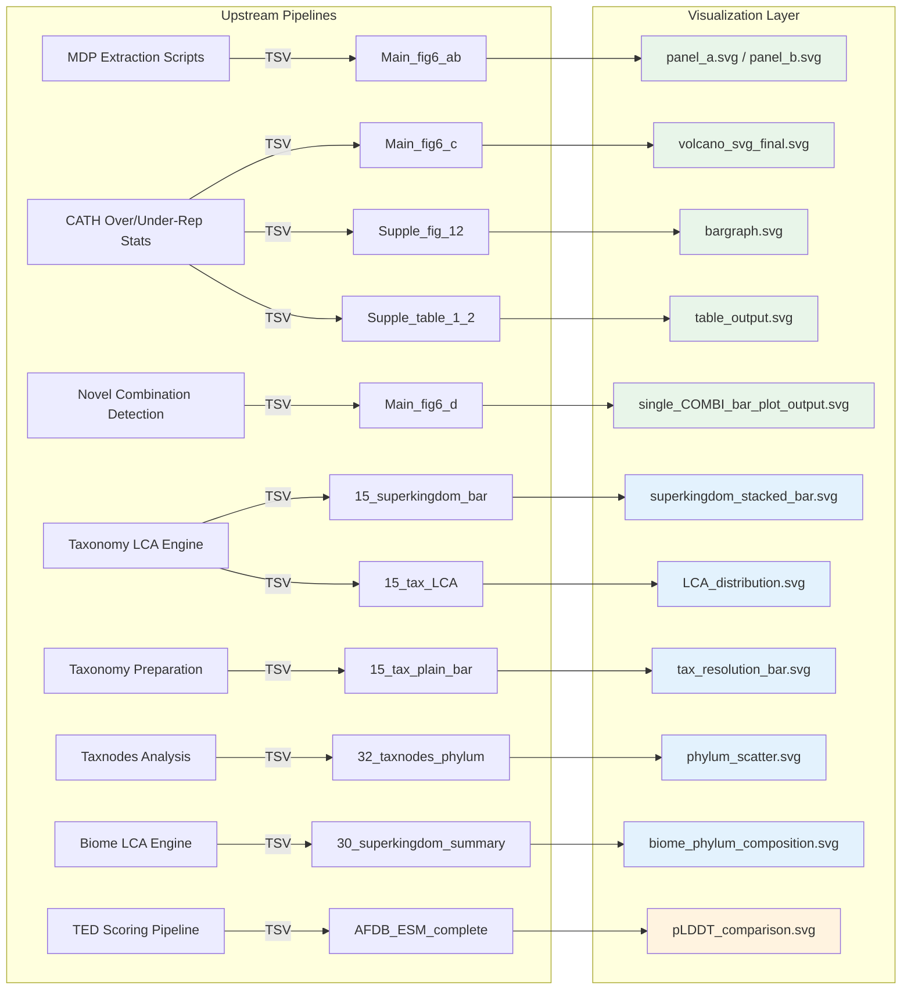

This repository encodes every published figure and supplementary table as a self-contained Jupyter notebook — a deliberate architectural choice that binds data provenance, statistical logic, and visual specification into a single executable artifact. The notebooks are not exploratory scratchpads; they are deterministic rendering pipelines that transform upstream TSV outputs into publication-ready SVG assets. Understanding their structure, input contracts, and shared conventions is essential for anyone who needs to re-run, modify, or extend the figures.

## Notebook Landscape and Organizational Architecture

The visualization notebooks are not scattered arbitrarily — they mirror the domain-level analysis modules they serve, forming a one-to-one mapping between analytical output and graphical representation. The diagram below illustrates this correspondence and data flow.

The visualization layer splits into three functional zones. **Multidomain analysis notebooks** (green) produce the main Figure 6 panels and supplementary materials for the novel domain combination analysis. **Taxonomy and biome notebooks** (blue) render superkingdom resolution distributions, phylum-level scatter plots, and biome-specific cluster compositions. **Prediction notebooks** (orange) handle pLDDT comparison tables for TED novel domains.

Sources: [Main_fig6_ab.ipynb](multidomain_analysis/visualization/Main_fig6_ab.ipynb#L1-L90), [Main_fig6_c.ipynb](multidomain_analysis/visualization/Main_fig6_c.ipynb#L1-L92), [Main_fig6_d.ipynb](multidomain_analysis/visualization/Main_fig6_d.ipynb#L1-L57), [15_superkingdom_bar.ipynb](taxonomy/15_superkingdom_bar.ipynb#L47-L100)

## Shared Technical Conventions

Every notebook in this repository adheres to a consistent set of conventions that make the collection coherent and reproducible. These conventions define the "contract" between upstream data producers and downstream visualization consumers.

**Uniform SVG output format.** All figures are rendered as SVG — not PNG or PDF. This is a deliberate choice for publication workflows where vector graphics are required for lossless scaling. Every notebook calls `plt.savefig(output, format='svg')` as its final rendering step. The output files land in the same directory as the notebook, using descriptive kebab-case names like `volcano_svg_final.svg` or `single_COMBI_bar_plot_output.svg` [Main_fig6_c.ipynb](multidomain_analysis/visualization/Main_fig6_c.ipynb#L88), [Main_fig6_d.ipynb](multidomain_analysis/visualization/Main_fig6_d.ipynb#L54).

**TSV as the universal input contract.** Upstream shell scripts and R programs emit TSV files that serve as the sole data interface to the notebooks. The notebooks never reach into databases or call external APIs; they consume files via `pd.read_csv(file_path, sep='\t')`. This decoupling means the visualization layer is purely a transformation function from TSV → SVG. The input filenames encode their column schema in the name itself — for example, `CATH_cntA_cntB_testtype_pval_padjusted_direction_log2FC_-log10p-adj_nNovelPair_meannDomain_cathname-significant.tsv` describes every column in the file [Main_fig6_c.ipynb](multidomain_analysis/visualization/Main_fig6_c.ipynb#L18), [Supple_fig_12.ipynb](multidomain_analysis/visualization/Supple_fig_12.ipynb#L20).

**Consistent Python stack.** The core rendering stack across all notebooks is pandas + matplotlib. Three notebooks extend this baseline: `Supple_fig_12.ipynb` adds seaborn for KDE plots and matplotlib's `font_manager` for custom Inter font loading [Supple_fig_12.ipynb](multidomain_analysis/visualization/Supple_fig_12.ipynb#L11-L17); `Supple_table_1_2.ipynb` introduces `svgwrite` for programmatic SVG table construction and `subprocess` for inline AWK execution [Supple_table_1_2.ipynb](multidomain_analysis/visualization/Supple_table_1_2.ipynb#L11-L33); `AFDB_ESM_complete.ipynb` adds comparison logic for AFDB vs ESM pLDDT scoring [AFDB_ESM_complete.ipynb](prediction/TED_novel_domains/AFDB_ESM_complete.ipynb#L1-L80). All notebooks target Python 3.10.x as confirmed by their kernel metadata.

> [!TIP]
> **Reproduction prerequisite**: Before executing any visualization notebook, you must have the corresponding upstream pipeline outputs present as TSV files in the expected paths. The notebooks contain hardcoded relative paths (e.g., `../data/final_figure_d/tmp/...`) that assume the full pipeline has been run to completion. See [Pipeline Architecture](4-pipeline-architecture) for the complete dependency chain.

Sources: [Main_fig6_c.ipynb](multidomain_analysis/visualization/Main_fig6_c.ipynb#L127-L148), [Supple_table_1_2.ipynb](multidomain_analysis/visualization/Supple_table_1_2.ipynb#L96-L117), [Supple_fig_12.ipynb](multidomain_analysis/visualization/Supple_fig_12.ipynb#L9-L21)

## Main Figure 6 — Multidomain Protein Composition

The main figure consists of four panels (a–d) distributed across three notebooks. Each panel isolates a single analytical question about novel multidomain proteins.

### Panel A: AFDB vs ESM Multidomain Proportions

`Main_fig6_ab.ipynb` (cell 1) renders a stacked percentage bar chart comparing the proportion of proteins with ≥2 CATH domains versus ≤1 CATH domain across AFDB (all membrane proteins) and ESM (representative sequences). The bars use a light-gray / gray color scheme with raw count annotations (e.g., `51.7M`, `0.394M`) placed directly inside each segment. The figure uses a deliberately narrow `figsize=(1.8, 5)` for compact panel layout, removes all spines and axis ticks, and outputs `panel_a.svg` [Main_fig6_ab.ipynb](multidomain_analysis/visualization/Main_fig6_ab.ipynb#L34-L89).

The key data values are hardcoded inline — AFDB contains 214M non-novel entries with 51.7M having ≥2 CATH domains, while ESM representative sequences contain 3.54M non-novel with 0.394M having ≥2 CATH domains. These values are derived from the upstream counting pipeline.

### Panel B: ESM Novel Domain Enrichment

The same notebook's second cell produces `panel_b.svg` — a stacked bar comparing ESM representative sequences against ESM membrane sequences. The gray lower segment represents non-novel domain counts (381K and 30,030K respectively), while the sky-blue upper segment shows novel domain counts (12K and 1,970K). The normalization converts raw counts to percentages within each bar for visual comparability despite the order-of-magnitude scale difference [Main_fig6_ab.ipynb](multidomain_analysis/visualization/Main_fig6_ab.ipynb#L115-L150).

### Panel C: CATH Volcano Plot

`Main_fig6_c.ipynb` produces the most analytically complex panel — a volcano plot mapping log₂ fold-change (novel vs non-novel CATH category frequency) against −log₁₀(multiplicity-corrected p-value). The plot implements **dual-encoding** of the `nNovelPair` variable: both color (viridis colormap) and marker size (scaled by `nNovelPair * 1.2`) represent the same dimension, reinforcing the visual message for readers who may have color vision deficiency [Main_fig6_c.ipynb](multidomain_analysis/visualization/Main_fig6_c.ipynb#L36-L72).

The notebook applies two filtering thresholds: a p-adjusted cutoff of 0.05 (rendered as a horizontal dashed line) and a log₂FC cutoff of ±1 (vertical dashed lines). Points falling within the |log₂FC| ≤ 1 band are forced to grey regardless of significance, visually partitioning the plot into meaningful zones. A second cell generates a standalone circle legend (`volcano_svg_final_circle-legend.svg`) that maps specific nNovelPair values (1, 25, 50, 75, 100, 113) to their corresponding color and size representations [Main_fig6_c.ipynb](multidomain_analysis/visualization/Main_fig6_c.ipynb#L100-L123).

### Panel D: Top-10 Novel CATH Combinations

`Main_fig6_d.ipynb` renders a compact horizontal bar chart of the 10 most abundant novel CATH domain pair combinations. It first extracts the top 10 lines from a pre-sorted TSV using a shell command embedded in the notebook (`! head ... > ...-Top10.tsv`), then reads and plots with `barh()` in teal. The y-axis labels are suppressed (the CATH names are presumably annotated externally in the final figure composite), and the output is `single_COMBI_bar_plot_output.svg` [Main_fig6_d.ipynb](multidomain_analysis/visualization/Main_fig6_d.ipynb#L9-L57).

Sources: [Main_fig6_ab.ipynb](multidomain_analysis/visualization/Main_fig6_ab.ipynb#L34-L150), [Main_fig6_c.ipynb](multidomain_analysis/visualization/Main_fig6_c.ipynb#L18-L123), [Main_fig6_d.ipynb](multidomain_analysis/visualization/Main_fig6_d.ipynb#L9-L57)

## Supplementary Figure 12 — Abundance-Stratified Analysis

`Supple_fig_12.ipynb` extends the CATH over/under-representation analysis by stratifying results across abundance quantiles. This two-panel figure addresses whether domain abundance bias confounds the observed novel-domain enrichment patterns.

### Panel A: Quantile-Stratified log₂FC Histograms

The first visualization cell creates a 4×1 subplot grid (sharing the x-axis), where each row corresponds to an abundance quartile (Q1–Q4). Q1 captures rare domains (count 1–22), while Q4 captures highly abundant domains (count 321–31,905). Each subplot renders a 50-bin histogram of log₂FC values in steelblue, with vertical dotted lines at ±1 marking the significance threshold. The x-axis label — "Log₂(freq. of CATH category in Novel set / freq. in Non-novel set)" — uses a custom Inter font loaded via `font_manager.FontProperties` [Supple_fig_12.ipynb](multidomain_analysis/visualization/Supple_fig_12.ipynb#L60-L99).

The data preparation cell uses `pd.qcut()` for quantile-based binning on log₁₀-transformed abundance values, with a floor clip at 1e⁻¹⁰ to avoid undefined logarithms [Supple_fig_12.ipynb](multidomain_analysis/visualization/Supple_fig_12.ipynb#L34-L41).

### Panel B: Abundance vs Significance Scatter

The second panel (cell 3) uses seaborn to render a scatter plot of `abundanceinCATH` against `-log10(p_adjusted)` for significant entries, with the `isCATHtop100` flag providing additional visual distinction. This panel reads from an extended TSV variant that includes the `abundanceinCATH` and `isCATHtop100` columns not present in the Main Fig 6c input [Supple_fig_12.ipynb](multidomain_analysis/visualization/Supple_fig_12.ipynb#L20).

Sources: [Supple_fig_12.ipynb](multidomain_analysis/visualization/Supple_fig_12.ipynb#L9-L99)

## Supplementary Tables 1 and 2 — Tabular Data as SVG

`Supple_table_1_2.ipynb` takes an unconventional approach to supplementary tables: it renders them as SVG graphics rather than exporting CSV or LaTeX. This ensures typographic consistency with the figures when the final manuscript is assembled in a vector-aware layout tool.

### Table 1: AWK-Driven Data Transformation

The first cell executes an inline AWK script via `subprocess.run()` that transforms the raw statistical output TSV into a restructured table with derived columns. The AWK logic computes two flag columns: `presenceLabel` (0 = both groups present, 1 = only novel, 2 = only non-novel) and `diffAbundanceLabel` (0 = |log₂FC| ≤ 1, 1 = log₂FC > 1, 2 = log₂FC < -1). The output file follows the naming convention `6-cathID_presenceFlag_nNovel_nNonNovel_statTestMethod_pValue_adjPValue_log2Ratio_diffAbundanceFlag_nNovelPartners_cathName.tsv` [Supple_table_1_2.ipynb](multidomain_analysis/visualization/Supple_table_1_2.ipynb#L14-L45).

### Table 2: SVG Table Rendering

The second cell filters for significantly over-represented CATH categories (`p_adjusted < 0.05 AND log₂FC > 1`), sorts by novel partner count, and renders the top 10 as an SVG table using the `svgwrite` library. The rendering function `draw_table()` iterates over DataFrame rows and columns, placing `<rect>` and `<text>` elements at calculated grid positions with configurable `cell_width=120` and `cell_height=30` [Supple_table_1_2.ipynb](multidomain_analysis/visualization/Supple_table_1_2.ipynb#L54-L92).

> [!TIP]
> **AWK subprocess pattern**: The `Supple_table_1_2.ipynb` notebook demonstrates a hybrid shell+Python pattern where AWK handles row-level conditional logic (flags, field selection) while Python handles the rendering. This is idiomatic in bioinformatics pipelines where AWK's stream processing is more performant than pandas for simple column transformations on large TSVs.

Sources: [Supple_table_1_2.ipynb](multidomain_analysis/visualization/Supple_table_1_2.ipynb#L14-L92)

## Taxonomy Visualization Notebooks

The taxonomy notebooks form a separate cluster focused on LCA resolution distributions and taxonomic composition across superkingdoms and biomes.

### Superkingdom LCA Resolution Stacked Bar

`15_superkingdom_bar.ipynb` produces a stacked bar chart showing the distribution of LCA resolution levels (root → cellular organism → superkingdom → lower than superkingdom → family and lower → species and lower) across four superkingdoms: Bacteria, Eukaryota, Archaea, and Viruses. The bars are rendered with `bar_width=0.6` using a manually-constructed layered approach (iterating over `desired_column_order` and accumulating `bottom` values) rather than pandas' built-in stacked bar, giving precise control over width and layering [15_superkingdom_bar.ipynb](taxonomy/15_superkingdom_bar.ipynb#L59-L100).

The color palette follows a deliberate visual hierarchy: gray (`#9A9A9A`) for root, near-black (`#27262F`) for cellular organism, blue (`#0A87E7`) for superkingdom, green (`#307D0A`) for lower-than-superkingdom, amber (`#D79429`) for family-level, and red (`#FB1634`) for species-level — progressing from low to high taxonomic resolution.

### LCA Distribution and Tax Resolution Bars

`15_tax_LCA.ipynb` renders a plain bar chart from pre-aggregated LCA group counts, reading from a two-column TSV (`count`, `taxGroup`) [15_tax_LCA.ipynb](taxonomy/15_tax_LCA.ipynb#L16-L20). `15_tax_plain_bar.ipynb` serves a similar role but uses a different data source (ESM Atlas taxonomy without NCBI substitution), includes a "not predicted" category, and applies a custom reversed categorical ordering for visual impact [15_tax_plain_bar.ipynb](taxonomy/15_tax_plain_bar.ipynb#L16-L100).

### Phylum-Level Scatter Plots

`32_taxnodes_phylum.ipynb` generates log-log scatter plots of protein cluster counts against species/genus richness, faceted by superkingdom. Each superkingdom gets its own subplot with shared y-axis freedom (`sharey=False`), and both axes use logarithmic scaling to accommodate the heavy-tailed distributions typical of microbiome data [32_taxnodes_phylum.ipynb](taxonomy/32_taxnodes_phylum.ipynb#L34-L51).

### Biome Phylum Composition

`biome/30_superkingdom_summary.ipynb` is the largest notebook (~1489 lines) and covers phylum composition analysis across biome-specific clusters (e.g., Thermal Springs). It processes LCA-assigned representative sequences per biome and renders stacked bar charts showing superkingdom breakdown per environment. The notebook header notes a dependency on resolved taxonomy assignments: *"All of these codes should be rerun after the taxonomy assignment issue is resolved"* [30_superkingdom_summary.ipynb](biome/30_superkingdom_summary.ipynb#L6-L14).

### Taxonomy Mapper Notebooks

Six notebooks — `species_mapper.ipynb`, `superkingdom_mapper.ipynb`, `phylum_mapper.ipynb`, `genus_mapper.ipynb`, `family_mapper.ipynb`, and `clade_mapper.ipynb` — share an identical structure. Each follows a two-cell pattern: (1) parse NCBI taxdump `merged.dmp` to build a current-to-previous ID mapping dictionary, then (2) walk the taxonomy tree from each query node upward to the target rank. These are data-preparation notebooks rather than visualization notebooks per se, but they are positioned in the taxonomy directory because their output TSVs feed directly into the visualization notebooks [phylum_mapper.ipynb](taxonomy/phylum_mapper.ipynb#L9-L31), [clade_mapper.ipynb](taxonomy/clade_mapper.ipynb#L9-L31). The `descendant_mapper.ipynb` notebook inverts this relationship, building a parent-to-children index for downstream counting [descendant_mapper.ipynb](taxonomy/descendant_mapper.ipynb#L11-L31).

Sources: [15_superkingdom_bar.ipynb](taxonomy/15_superkingdom_bar.ipynb#L47-L100), [15_tax_LCA.ipynb](taxonomy/15_tax_LCA.ipynb#L16-L20), [15_tax_plain_bar.ipynb](taxonomy/15_tax_plain_bar.ipynb#L16-L100), [32_taxnodes_phylum.ipynb](taxonomy/32_taxnodes_phylum.ipynb#L34-L51), [30_superkingdom_summary.ipynb](biome/30_superkingdom_summary.ipynb#L6-L100), [descendant_mapper.ipynb](taxonomy/descendant_mapper.ipynb#L11-L31)

## Prediction Notebook — AFDB vs ESM pLDDT Comparison

`prediction/TED_novel_domains/AFDB_ESM_complete.ipynb` presents a tabular comparison of per-domain pLDDT scores between AlphaFoldDB predictions and ESMFold predictions for TED novel domains. The DataFrame columns are `entryId`, `AFDBavgPlddt`, `ESMavgPlddt`, and `lddt` (a binary alignment confidence flag). This notebook serves dual purposes: it validates that ESMFold predictions for novel domains achieve structurally meaningful confidence scores, and it identifies entries where the two predictors diverge significantly — a signal that may indicate genuinely novel structural features not captured by either method alone [AFDB_ESM_complete.ipynb](prediction/TED_novel_domains/AFDB_ESM_complete.ipynb#L36-L80).

Sources: [AFDB_ESM_complete.ipynb](prediction/TED_novel_domains/AFDB_ESM_complete.ipynb#L36-L80)

## Notebook Reference Summary

| Notebook | Figure/Panel | Chart Type | Key Input TSV | Output File(s) |
|---|---|---|---|---|
| `Main_fig6_ab.ipynb` | Fig 6a, 6b | Stacked bar (percentage) | Hardcoded counts | `panel_a.svg`, `panel_b.svg` |
| `Main_fig6_c.ipynb` | Fig 6c | Volcano plot (dual-encoded) | `CATH_cntA_cntB_..._cathname-significant.tsv` | `volcano_svg_final.svg`, `volcano_svg_final_circle-legend.svg` |
| `Main_fig6_d.ipynb` | Fig 6d | Horizontal bar (top 10) | `sorted-components-novelMDP-...-Top10.tsv` | `single_COMBI_bar_plot_output.svg` |
| `Supple_fig_12.ipynb` | Suppl Fig 12a, 12b | Histogram grid + scatter | `..._abundanceinCATH-significant_isCATHtop100.tsv` | `bargraph.svg` |
| `Supple_table_1_2.ipynb` | Suppl Table 1, 2 | SVG table (programmatic) | `CATH_cntA_cntB_..._cathname.tsv` | `6-cathID_...cathName.tsv`, `table_output.svg` |
| `15_superkingdom_bar.ipynb` | Taxonomy figure | Stacked bar (counts → %) | LCA TSV with superkingdom grouping | SVG (inline save) |
| `15_tax_LCA.ipynb` | Taxonomy figure | Plain bar | `..._count_taxGroup.tsv` | SVG |
| `15_tax_plain_bar.ipynb` | Taxonomy figure | Plain bar (reversed order) | `..._count_taxGroup.tsv` | SVG |
| `32_taxnodes_phylum.ipynb` | Phylum analysis | Log-log scatter (faceted) | `phylum-..._count_nSpecies.tsv` | `phylum_proteinCount_nSpecies.svg` |
| `30_superkingdom_summary.ipynb` | Biome composition | Stacked bar per biome | Biome-specific LCA TSVs | Multiple SVGs |
| `AFDB_ESM_complete.ipynb` | Prediction validation | Data table / comparison | AFDB-ESM pLDDT TSV | Display + analysis |

## Navigating Forward

The visualization notebooks represent the terminal layer of the analysis pipeline — their inputs are the outputs of every preceding computational step. To understand how the data flowing into these notebooks is produced, consult the upstream pages: [Novel Domain Combination Detection](10-novel-domain-combination-detection) for the CATH pair statistics, [CATH Over- and Under-Representation Statistics](11-cath-over-and-under-representation-statistics) for the volcano plot data, [Taxonomic LCA and Universality Analysis](13-taxonomic-lca-and-universality-analysis) for the taxonomy distributions, and [pLDDT Quality Assessment Pipeline](14-plddt-quality-assessment-pipeline) for the prediction scoring tables.