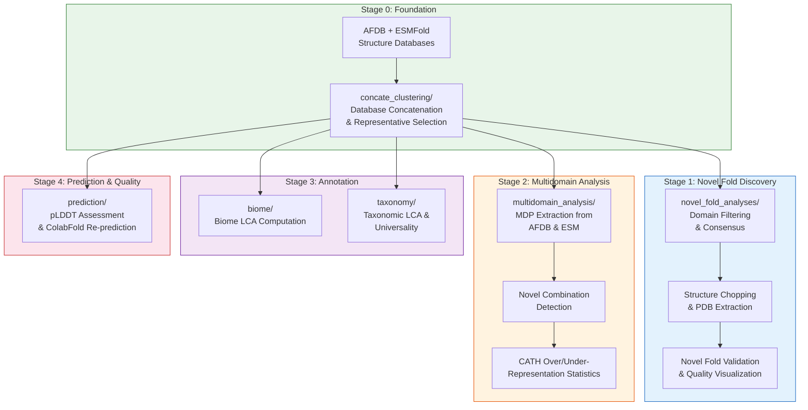
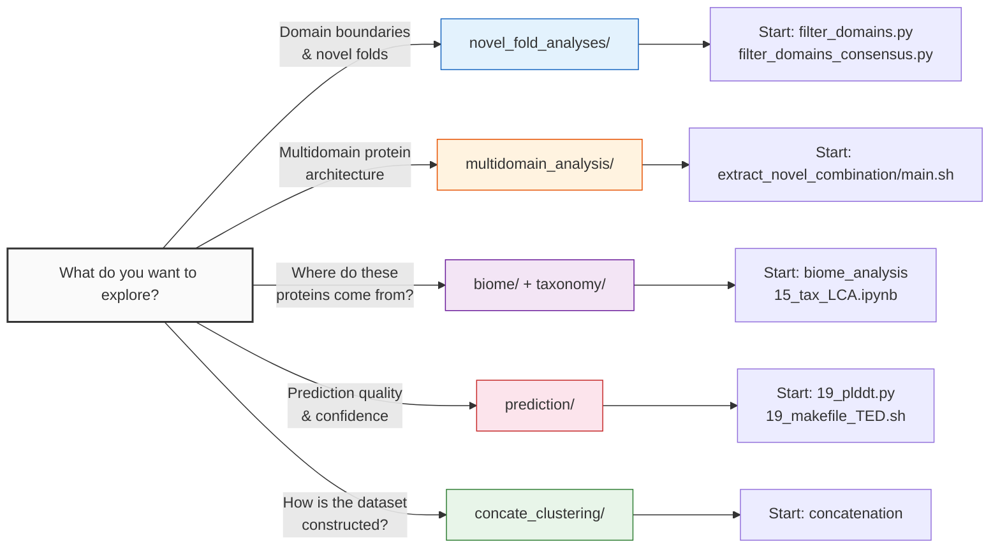

This page provides a fast onboarding path into the **afesm-analysis** repository — a computational analysis suite for discovering novel protein folds and domain combinations by combining AlphaFold DB (AFDB) structures with ESMFold metagenomic predictions. If you have just cloned this repository, read on to orient yourself, understand the directory layout, and identify which analysis module to explore first.

## Repository Purpose and Scope

The afesm-analysis repository implements the full computational pipeline behind a large-scale structural bioinformatics study. It operates on a merged database of approximately 186 million protein structures from two complementary sources: experimentally-validated AlphaFold DB predictions and ESMFold predictions from metagenomic sequences. The pipeline clusters these structures, identifies novel protein folds, discovers previously-unseen multi-domain protein architectures, annotates taxonomic and biome provenance, and produces publication-ready statistical analyses and visualizations.

The workhorse tools driving this analysis are **Foldseek** (for structural search and clustering), **MMseqs2** (for sequence clustering), and custom Python/C++/R/bash scripts that orchestrate domain boundary detection, novel fold validation, and statistical testing. The typical data flow begins with raw structure databases, passes through concatenated sequence and structure clustering at 30% sequence identity, and then branches into parallel analysis tracks for novel folds, multidomain proteins, biome annotation, and quality assessment.

Sources: [concatenation](concate_clustering/concatenation#L1-L126), [10k_subset_sampling.sh](analysis_10k_subset_sampling/10k_subset_sampling.sh#L1-L38)

## Architecture Overview

The repository is organized around five major analytical stages, each corresponding to a top-level directory. The following diagram illustrates the high-level data flow between these stages.

Sources: [concatenation](concate_clustering/concatenation#L1-L126), [main.sh](multidomain_analysis/extract_novel_combination/main.sh#L1-L200)

## Directory Map and Technology Stack

Each top-level directory encapsulates a self-contained analytical module with its own toolchain. The table below summarizes every directory alongside its primary languages, key entry points, and the analytical question it addresses.

| Directory | Languages | Key Entry Point | Analytical Focus |
|---|---|---|---|
| `concate_clustering/` | Bash, MMseqs2, Foldseek | [`concatenation`](concate_clustering/concatenation#L1-L126) | Merge AFDB+ESM databases; sequence clustering at 30% ID; structure clustering; representative selection by pLDDT |
| `novel_fold_analyses/` | Python (NumPy, Matplotlib, Click) | [`filter_domains.py`](novel_fold_analyses/filter_domains.py#L1-L71) | Domain boundary detection, multi-method consensus, novel fold alignment filtering, structural quality visualization |
| `multidomain_analysis/` | Bash, Python, R | [`main.sh`](multidomain_analysis/extract_novel_combination/main.sh#L1-L200) | Extract multidomain proteins from AFDB/ESM; detect novel domain topology combinations; CATH over/under-representation |
| `biome/` | C++, Bash, Perl | [`new_LCA_ignoreMixed.cpp`](biome/new_LCA_ignoreMixed.cpp#L1-L60) | Compute biome Lowest Common Ancestor; Kraken-format report generation; superkingdom summary |
| `taxonomy/` | Jupyter Notebooks (Python) | [`15_tax_LCA.ipynb`](taxonomy/15_tax_LCA.ipynb#L1-L60) | Taxonomic LCA at multiple ranks; clade/family/genus/phylum/superkingdom mapping; universality scoring |
| `prediction/` | Python, Bash, Foldseek | [`19_makefile_TED.sh`](prediction/TED_novel_domains/19_makefile_TED.sh#L1-L176) | Cut TED domains from AFDB; Foldseek structural search against CATH; pLDDT quality scoring; ColabFold re-prediction |
| `analysis_10k_subset_sampling/` | Bash | [`10k_subset_sampling.sh`](analysis_10k_subset_sampling/10k_subset_sampling.sh#L1-L38) | Random 10K subset sampling for exploratory novel domain identification |

Sources: [filter_domains.py](novel_fold_analyses/filter_domains.py#L1-L71), [concatenation](concate_clustering/concatenation#L1-L126), [main.sh](multidomain_analysis/extract_novel_combination/main.sh#L1-L200), [new_LCA_ignoreMixed.cpp](biome/new_LCA_ignoreMixed.cpp#L1-L60), [19_makefile_TED.sh](prediction/TED_novel_domains/19_makefile_TED.sh#L1-L176)

## Core Data Flow: From Raw Structures to Biological Insights

The foundational step — database concatenation and clustering — lives in [`concate_clustering/concatenation`](concate_clustering/concatenation#L1-L126). This script defines four critical functions that establish the dataset used by all downstream modules. First, `concate_afdb_esm_with_fragments` merges the AFDB and ESMFold Foldseek databases (sequence, header, 3Di, and C-alpha components) into a unified `afesm` database. Second, `seq_cluster_afesm` runs MMseqs2 clustering at 30% minimum sequence identity with 0.9 coverage, producing 186.5 million clusters. Third, `alignment_afesm_seq_cluster` generates alignment files with query/target coverage and length ratios. Finally, representative selection picks the highest-pLDDT protein per cluster, filtering for `tlen/qlen ≥ 0.7`, resulting in only ~3.8% of representatives being altered from the default MMseqs2 choice. The resulting representative database `afesm30_repseq` feeds into both structure clustering (via Foldseek at 0.9 coverage, 0.01 E-value) and all subsequent analysis tracks.

Sources: [concatenation](concate_clustering/concatenation#L1-L126)

## Getting Oriented: Where to Start

Depending on your analytical interest, different directories serve as natural entry points into the codebase. The diagram below maps specific developer goals to the most relevant starting modules.

### Novel Fold Discovery Track

Start with [`novel_fold_analyses/filter_domains.py`](novel_fold_analyses/filter_domains.py#L1-L71) to understand how domain boundaries are extracted and filtered. This script enforces two key thresholds: `MIN_DOM_SIZE = 25` residues per domain and `MIN_FRAGMENT_SIZE = 5` residues per continuous segment within a domain. The more advanced [`filter_domains_consensus.py`](novel_fold_analyses/filter_domains_consensus.py#L1-L130) extends this concept to multi-method consensus (e.g., Merizo, Chainsaw, UniDoc), accepting separate chopping assignments for high/medium/low confidence levels. Domain boundaries are expressed in a standard **chopping format** — comma-separated domains, underscore-separated fragments, dash-delimited residue ranges (e.g., `1-100_150-250,300-450`). Novel fold validation then uses [`parse_newfolds.py`](novel_fold_analyses/parse_newfolds.py#L1-L77), which filters structural alignments by TM-score (`> 0.56`) and bidirectional coverage (`> 0.6`), and [`parse_final_search.py`](novel_fold_analyses/parse_final_search.py#L1-L76), which applies a relaxed structural match criterion (max TM-score `> 0.5` OR RMSD `< 3.0 Å`) combined with coverage filtering.

> [!TIP]
> The chopping format `1-100_150-250,300-450` means two domains: the first spanning residues 1–100 and 150–250, the second spanning 300–450. Underscores separate fragments within a single domain; commas separate domains. This convention is used consistently across all novel fold and domain analysis scripts.

Sources: [filter_domains.py](novel_fold_analyses/filter_domains.py#L1-L71), [filter_domains_consensus.py](novel_fold_analyses/filter_domains_consensus.py#L1-L130), [parse_newfolds.py](novel_fold_analyses/parse_newfolds.py#L1-L77), [parse_final_search.py](novel_fold_analyses/parse_final_search.py#L1-L76)

### Multidomain Protein Analysis Track

Begin with [`multidomain_analysis/extract_novel_combination/main.sh`](multidomain_analysis/extract_novel_combination/main.sh#L1-L200). This master orchestrator processes three data sources — AFDB-TED annotated domains, AFDB-TED with Foldseek-rescued N-terminal domains, and ESM-only predictions — through an identical pipeline: extract CATH topology annotations, concatenate per-protein domain combinations, deduplicate and sort within combinations, and filter for proteins containing multiple distinct topologies (indicated by `;` separators). The novel combination detection phase in scripts [`4_gen_copairs.sh`](multidomain_analysis/extract_novel_combination/4_gen_copairs.sh) through [`5_compare_copairs_set.sh`](multidomain_analysis/extract_novel_combination/5_compare_copairs_set.sh) then compares ESM-only co-occurring topology pairs against the AFDB reference set. Statistical significance is computed in [`chi-fisher_test.R`](multidomain_analysis/novel_combination_CATH_over_underrepresentation/chi-fisher_test.R#L1-L60), which applies chi-squared or Fisher's exact tests (depending on expected counts) with Benjamini-Hochberg correction across all CATH superfamilies.

Sources: [main.sh](multidomain_analysis/extract_novel_combination/main.sh#L1-L200), [chi-fisher_test.R](multidomain_analysis/novel_combination_CATH_over_underrepresentation/chi-fisher_test.R#L1-L60)

### Biome and Taxonomy Annotation Track

The [`biome/biome_analysis`](biome/biome_analysis#L1-L30) script and [`biome/new_LCA_ignoreMixed.cpp`](biome/new_LCA_ignoreMixed.cpp#L1-L60) C++ engine compute the biome Lowest Common Ancestor for each protein cluster. The LCA algorithm traverses colon-delimited taxonomy paths (e.g., `root:Environmental:Aquatic:Marine`), finding the deepest common node while explicitly skipping ambiguous paths containing `Mixed` or `Null` labels. On the taxonomy side, the Jupyter notebooks in [`taxonomy/`](taxonomy/) map cluster members through NCBI taxnodes at ranks from superkingdom down to genus, producing bar charts and universality metrics. The [`automated_krakenReportGen.sh`](biome/automated_krakenReportGen.sh#L1-L53) script converts these annotations into standard Kraken-format taxonomy reports for ecosystem-level profiling.

Sources: [biome_analysis](biome/biome_analysis#L1-L30), [new_LCA_ignoreMixed.cpp](biome/new_LCA_ignoreMixed.cpp#L1-L60), [automated_krakenReportGen.sh](biome/automated_krakenReportGen.sh#L1-L53)

### Structure Prediction and Quality Track

The [`prediction/TED_novel_domains/`](prediction/TED_novel_domains/) directory handles domain-level structure extraction and quality scoring. [`19_makefile_TED.sh`](prediction/TED_novel_domains/19_makefile_TED.sh#L1-L176) orchestrates Foldseek database operations to cut individual domains from full-length AFDB structures based on TED boundary annotations, then runs structural search against the CATH s95 database. Quality is assessed via [`19_plddt.py`](prediction/TED_novel_domains/19_plddt.py#L1-L48), which computes mean pLDDT from the B-factor column (columns 61–66) of PDB ATOM records. For a more robust metric, [`calculate_top80_mean_plddt.py`](novel_fold_analyses/calculate_top80_mean_plddt.py#L1-L51) computes both the overall mean and the **top-80% mean pLDDT** (excluding the lowest 20% of residue scores), which is more resistant to localized prediction errors in large proteins.

> [!TIP]
> The pLDDT80 metric (top 80% mean pLDDT) is the preferred confidence score for domain-level structures because it discards the lowest-confidence tail of residues — often disordered or poorly-predicted termini — and thus better reflects the structural reliability of the folded core.

Sources: [19_makefile_TED.sh](prediction/TED_novel_domains/19_makefile_TED.sh#L1-L176), [19_plddt.py](prediction/TED_novel_domains/19_plddt.py#L1-L48), [calculate_top80_mean_plddt.py](novel_fold_analyses/calculate_top80_mean_plddt.py#L1-L51)

## Key File Formats You Will Encounter

Before diving into any module, familiarize yourself with the two most common data formats used throughout the repository.

### Chopping TSV Format

Used by all domain boundary scripts, this tab-separated format has six columns:

| Column | Name | Description | Example |
|---|---|---|---|
| 1 | `target` | Protein identifier | `MGYP001234` |
| 2 | `md5` | Structure hash | `a1b2c3d4` |
| 3 | `nres` | Total residue count | `450` |
| 4 | `ndom` | Number of domains | `2` |
| 5 | `chopping` | Domain boundaries | `1-100_150-250,300-450` |
| 6 | `score` | Confidence score | `0.950` |

The consensus variant (from [`filter_domains_consensus.py`](novel_fold_analyses/filter_domains_consensus.py#L1-L130)) expands this to nine columns, adding separate domain counts and choppings for high, medium, and low consensus levels.

### Foldseek Alignment Format (m8)

Used by all novel fold validation scripts, this whitespace-separated format carries structural alignment results with fields including query ID, target ID, query/target lengths, TM-scores, and a CIGAR string encoding the residue-level alignment operations. The [`parse_newfolds.py`](novel_fold_analyses/parse_newfolds.py#L1-L77) and [`parse_final_search.py`](novel_fold_analyses/parse_final_search.py#L1-L76) scripts parse CIGAR strings to compute query and target coverage, which are critical for distinguishing true structural homologs from spurious partial matches.

Sources: [filter_domains.py](novel_fold_analyses/filter_domains.py#L1-L71), [filter_domains_consensus.py](novel_fold_analyses/filter_domains_consensus.py#L1-L130), [parse_newfolds.py](novel_fold_analyses/parse_newfolds.py#L1-L77)

## Suggested Reading Progression

If you are new to this codebase, the following sequence provides a structured path from foundational understanding to specialized analysis:

1. **[Overview](1-overview)** — Read the high-level description of the scientific goals and dataset composition.
2. **[Quick Start](2-quick-start)** *(you are here)* — Understand the repository layout and where each module fits.
3. **[Dataset and Output Formats](3-dataset-and-output-formats)** — Learn the exact file formats, column schemas, and naming conventions.
4. **[Pipeline Architecture](4-pipeline-architecture)** — See how all modules connect end-to-end with dependency ordering.
5. **Choose your deep-dive track** based on your analytical interest:
   - Novel folds → [Domain Filtering and Consensus](5-domain-filtering-and-consensus) → [Structure Chopping and PDB Extraction](6-structure-chopping-and-pdb-extraction) → [Novel Fold Validation via Alignment Filtering](7-novel-fold-validation-via-alignment-filtering)
   - Multidomain proteins → [MDP Extraction from AFDB and ESM](9-mdp-extraction-from-afdb-and-esm) → [Novel Domain Combination Detection](10-novel-domain-combination-detection) → [CATH Over- and Under-Representation Statistics](11-cath-over-and-under-representation-statistics)
   - Biological context → [Biome LCA Computation Engine](12-biome-lca-computation-engine) → [Taxonomic LCA and Universality Analysis](13-taxonomic-lca-and-universality-analysis)
   - Structure quality → [pLDDT Quality Assessment Pipeline](14-plddt-quality-assessment-pipeline) → [Foldcomp-Based Domain Scoring](16-foldcomp-based-domain-scoring)

Each deep-dive page provides implementation details, parameter explanations, and cross-references back to the source code examined here.