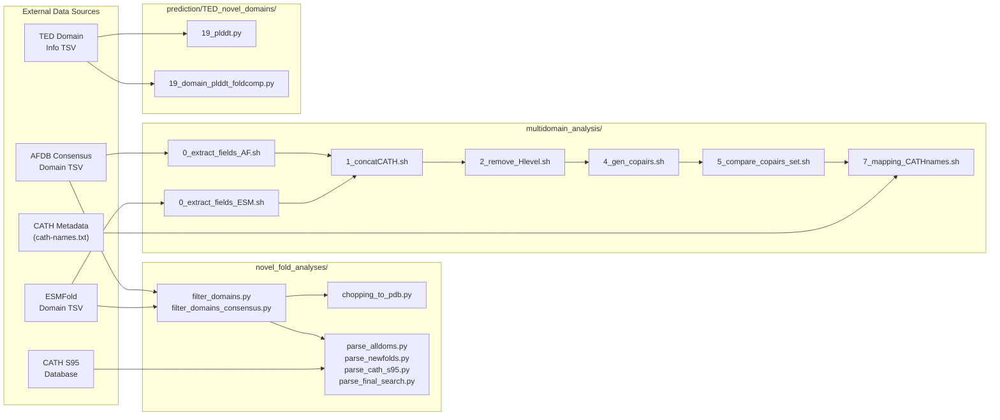

This page catalogs every data format consumed and produced by the afesm-analysis pipeline. Understanding these formats is the single most important prerequisite before diving into any individual analysis module. Whether you are filtering domains, comparing co-occurring pairs, or computing structural quality scores, the same core tabular conventions recur throughout the codebase. This reference organizes those conventions by their functional role — from raw domain annotations through alignment results and final summary tables — so you can quickly identify what each column means and how formats transform as data flows downstream.

## Repository Layout and Data Flow

The repository is organized into seven top-level modules, each operating on a shared set of core data formats. The diagram below shows how the primary data types propagate across these modules.



Each module reads one or more of the formats described below, processes them, and writes outputs in either the same or a derived format. The sections that follow define each format precisely, with field-by-field breakdowns extracted directly from the source code.

Sources: [parse_alldoms.py](novel_fold_analyses/parse_alldoms.py#L1-L77), [filter_domains.py](novel_fold_analyses/filter_domains.py#L1-L71), [0_extract_fields_AF.sh](multidomain_analysis/extract_novel_combination/0_extract_fields_AF.sh#L1-L25)

## Domain Annotation Format (Core Chopping TSV)

This is the **most fundamental format** in the entire repository. Nearly every pipeline stage either consumes or produces a tab-separated file with domain chopping information. There are two major variants: the **single-confidence format** (6 fields) used by individual domain callers, and the **multi-confidence format** (9 fields) used by consensus domain definitions.

### Single-Confidence Chopping (6-Field TSV)

Produced by tools like `filter_domains.py` and consumed by `chopping_to_pdb.py`, this format stores one set of domain boundaries per entry.

| Field | Index | Type | Description |
|-------|-------|------|-------------|
| `target` | 1 | string | Protein entry identifier (e.g., `AF-A0A1Q6QXA8-F1-model_v4`) |
| `md5` | 2 | string | MD5 checksum of the protein sequence |
| `nres` | 3 | int | Total number of residues in the full chain |
| `ndom` | 4 | int | Number of domains identified |
| `chopping` | 5 | string | Domain boundary definitions (see chopping syntax below) |
| `score` | 6 | float | Domain confidence score (e.g., `1.000`) |

The **chopping syntax** encodes domain boundaries as comma-separated domains, where each domain contains dash-separated residue ranges joined by underscores for discontinuous (multi-segment) domains:

```
# Single-domain, single-segment:
5-149

# Multi-domain, each single-segment:
5-149,200-380

# Single-domain with two segments (discontinuous):
3-27_100-141

# Complex multi-domain with discontinuous segments:
47-101,123-206,220-259
```

Special sentinel values include `NULL` (no domains detected) and `NO_SS` (no secondary structure available). When `filter_domains.py` processes these, it applies minimum size filters: fragments smaller than `MIN_FRAGMENT_SIZE` (default 5 residues) are removed, and entire domains smaller than `MIN_DOM_SIZE` (default 25 residues) are discarded. The output file is named by appending `_filtered.tsv` to the input basename.

Sources: [filter_domains.py](novel_fold_analyses/filter_domains.py#L1-L30), [chopping_to_pdb.py](novel_fold_analyses/chopping_to_pdb.py#L58-L62)

### Multi-Confidence Consensus Chopping (9-Field TSV)

The `filter_domains_consensus.py` script operates on an extended format that stores domain definitions at three confidence levels simultaneously — high, medium, and low. This is the format used when integrating predictions from multiple domain boundary callers.

| Field | Index | Type | Description |
|-------|-------|------|-------------|
| `target` | 1 | string | Protein entry identifier |
| `md5` | 2 | string | MD5 checksum of the protein sequence |
| `nres` | 3 | int | Total number of residues |
| `nhigh` | 4 | int | Number of high-confidence domains |
| `nmed` | 5 | int | Number of medium-confidence domains |
| `nlow` | 6 | int | Number of low-confidence domains |
| `chophigh` | 7 | string | Chopping string for high-confidence domains |
| `chopmed` | 8 | string | Chopping string for medium-confidence domains |
| `choplow` | 9 | string | Chopping string for low-confidence domains |

Each confidence level uses the same chopping syntax described above, with `na` as the sentinel value for "not available." The filtering logic applies independently to each level using `--min_dom_size` (default 25) and `--min_fragment_size` (default 5). An optional `--offset_resi` parameter shifts all residue numbers by a fixed value (used for compatibility with the Chainsaw tool). The script also generates a companion `.changed.txt` file listing every entry whose domain assignments were modified.

Sources: [filter_domains_consensus.py](novel_fold_analyses/filter_domains_consensus.py#L53-L130)

## TED Domain Information Format

The TED (Transposable Element Domain) data provides pre-computed domain annotations for novel-domain-containing proteins. These are stored in two complementary TSV files within `prediction/TED_novel_domains/`.

### TED Domain Info (`TED_domain_info.tsv`)

This file maps each protein entry to its TED domain boundaries. With 7,416 entries, it is one of the largest datasets in the repository.

| Field | Index | Type | Description |
|-------|-------|------|-------------|
| `entry` | 1 | string | AFDB entry identifier (e.g., `AF-A0A1Q6QXA8-F1-model_v4`) |
| `start` | 2 | int | Domain start residue position |
| `end` | 3 | int | Domain end residue position |
| `domain_id` | 4 | string | TED domain label (e.g., `AF-A0A1Q6QXA8-F1-model_v4_TED01`) |

Multiple domains per entry appear as groups of consecutive triplets on the same line (start, end, domain_id, start, end, domain_id, ...). This differs from the chopping TSV — TED uses positional triplets rather than the dash-underscore chopping syntax. The domain numbering suffix (TED01, TED02, etc.) indicates the domain index within the protein.

Sources: [TED_domain_info.tsv](prediction/TED_novel_domains/TED_domain_info.tsv#L1-L5)

### TED Novel-Containing Entries (`TED_novel_containing-entryId_length.tsv`)

A simplified lookup table with 7,428 entries mapping each novel-domain-containing protein to its total sequence length.

| Field | Index | Type | Description |
|-------|-------|------|-------------|
| `entry` | 1 | string | AFDB entry identifier |
| `length` | 2 | int | Total protein length in residues |

Sequence lengths range from 77 residues (e.g., `AF-A0A154LM58-F1-model_v4`) to over 1,200 residues (e.g., `AF-A0A5M6BQX2-F1-model_v4` at 1,277). This file serves as a quick reference for filtering proteins by size threshold.

Sources: [TED_novel_containing-entryId_length.tsv](prediction/TED_novel_domains/TED_novel_containing-entryId_length.tsv#L1-L10)

> [!TIP]
> The TED domain files use a **triplet-per-domain** layout (start, end, label) rather than the chopping syntax. When converting between formats, note that a single TED line can encode multiple domains — the number of domains equals the number of triplets divided by 3.

## Alignment Result Format (m8 TSV)

Foldseek structural alignments are stored in a tab-delimited format referred to throughout the codebase as "m8 format" (after the BLAST tabular output format). Three distinct column schemas appear depending on the alignment type, each parsed by a dedicated Python script.

### Standard Structural Alignment (6-Field m8)

Used by `parse_alldoms.py`, `parse_newfolds.py`, and `parse_cath_s95.py` for comparing predicted structures against domain databases.

| Field | Index | Type | Description |
|-------|-------|------|-------------|
| `query` | 1 | string | Query entry identifier |
| `target` | 2 | string | Target database entry identifier |
| `qlen` | 3 | int | Query sequence length |
| `tlen` | 4 | int | Target sequence length |
| `qtmscore` | 5 | float | Query-to-target TM-score |
| `cigar` | 6 | string | CIGAR string encoding the alignment (e.g., `120M2I45M`) |

All three parsers share identical filtering logic: alignments pass if `qtmscore > 0.56`, `qcov > 0.6`, and `tcov > 0.6`. Coverage is computed from the CIGAR string by summing match/alignment operations (M, =, X) and, for target coverage, also counting deletions (D). Pass lines are written to `*_match.m8` and fail lines to `*_nomatch.m8`.

Sources: [parse_alldoms.py](novel_fold_analyses/parse_alldoms.py#L29-L77), [parse_newfolds.py](novel_fold_analyses/parse_newfolds.py#L29-L77), [parse_cath_s95.py](novel_fold_analyses/parse_cath_s95.py#L29-L77)

### Extended Structural Alignment (8-Field m8)

Used by `parse_final_search.py` for the final novelty validation search, which includes additional score columns.

| Field | Index | Type | Description |
|-------|-------|------|-------------|
| `query` | 1 | string | Query entry identifier |
| `target` | 2 | string | Target entry identifier |
| `qlen` | 3 | int | Query sequence length |
| `tlen` | 4 | int | Target sequence length |
| `qtmscore` | 5 | float | Query-to-target TM-score |
| `ttmscore` | 6 | float | Target-to-query TM-score |
| `rmsd` | 7 | float | Root-mean-square deviation of the alignment |
| `cigar` | 8 | string | CIGAR string encoding the alignment |

The filtering criterion is more nuanced here: an alignment passes if `(max(qtmscore, ttmscore) > 0.5 OR rmsd < 3.0)` **and** `qcov > 0.6`. This dual-threshold approach uses both TM-score and RMSD to avoid missing weak-but-close structural matches.

Sources: [parse_final_search.py](novel_fold_analyses/parse_final_search.py#L44-L76)

## Multidomain Protein (MDP) Intermediate Formats

The `multidomain_analysis/extract_novel_combination/` pipeline applies a sequence of transformations to domain annotation data, producing intermediate files at each step. These formats are specific to the MDP analysis workflow.

### Extracted Fields Format (AF variant)

Produced by `0_extract_fields_AF.sh`, this format extracts four key fields from the AFDB consensus domain annotations. The script first checks whether the 8th field contains `"foldseek,foldclass"` to determine the column layout, then normalizes the TED domain labels by replacing `_TED` with a tab character.

| Field | Index | Type | Description |
|-------|-------|------|-------------|
| `entry` | 1 | string | Protein entry identifier |
| `plddt` | 2 | float | Per-chain predicted confidence score |
| `cath_code` | 3 | string | CATH classification code |
| `cath_level` | 4 | string | CATH annotation level: `T` (topology), `H` (homologous superfamily), `N` (near-order superfamily), or `-` (unassigned) |

Sources: [0_extract_fields_AF.sh](multidomain_analysis/extract_novel_combination/0_extract_fields_AF.sh#L10-L25)

### Extracted Fields Format (ESM variant)

Produced by `0_extract_fields_ESM.sh` for ESMFold-predicted structures. The processing is simpler: it extracts columns 1, 4, 6, and 7 from the input, then splits underscore-delimited fields into tab-separated values.

| Field | Index | Type | Description |
|-------|-------|------|-------------|
| `entry` | 1 | string | ESMFold entry identifier |
| `plddt` | 2 | float | Per-chain predicted confidence score |
| `cath_code` | 3 | string | CATH classification code |
| `cath_level` | 4 | string | CATH annotation level |

Sources: [0_extract_fields_ESM.sh](multidomain_analysis/extract_novel_combination/0_extract_fields_ESM.sh#L8-L19)

### Concatenated CATH List Format

Produced by `1_concatCATH.sh`, this format collapses multiple domain rows per protein into a single row with semicolon-separated CATH codes.

| Field | Index | Type | Description |
|-------|-------|------|-------------|
| `entry` | 1 | string | Protein entry identifier |
| `cath_list` | 2 | string | Semicolon-separated CATH codes for all domains (e.g., `1.10.8.10;3.40.50.300`) |

Only unique entries are retained (via `uniq`), and the semicolons accumulate in order of first appearance.

Sources: [1_concatCATH.sh](multidomain_analysis/extract_novel_combination/1_concatCATH.sh#L16-L41)

### Fold-Superfamily List (H-Level Removed)

Produced by `2_remove_Hlevel.sh`, this format strips the H-level (4th number) from CATH codes, retaining only the Class.Architecture.Topology levels.

| Field | Index | Type | Description |
|-------|-------|------|-------------|
| `entry` | 1 | string | Protein entry identifier |
| `cath_list` | 2 | string | Semicolon-separated 3-level CATH codes (e.g., `1.10.8;3.40.50`) |

The transformation first replaces commas with dots for normalization, then truncates each CATH code to three levels.

Sources: [2_remove_Hlevel.sh](multidomain_analysis/extract_novel_combination/2_remove_Hlevel.sh#L12-L28)

### Sorted Deduplicated Pair List

Produced by `3_remove_redundancy_and_sort.sh`, this format takes the concatenated CATH list and sorts domain codes alphabetically within each entry.

| Field | Index | Type | Description |
|-------|-------|------|-------------|
| `entry` | 1 | string | Protein entry identifier |
| `sorted_cath_list` | 2 | string | Semicolon-separated, alphabetically sorted, deduplicated CATH codes |

The alphabetical sorting ensures that domain combinations like `A;B` and `B;A` are normalized to the same representation, which is critical for the downstream pair comparison step.

Sources: [3_remove_redundancy_and_sort.sh](multidomain_analysis/extract_novel_combination/3_remove_redundancy_and_sort.sh#L10-L34)

### Co-occurring Pairs Format

Produced by `4_gen_copairs.sh`, this format expands the domain list into all possible ordered pairs of co-occurring CATH superfamily domains.

| Field | Index | Type | Description |
|-------|-------|------|-------------|
| `entry` | 1 | string | Protein entry identifier |
| `full_cath_list` | 2 | string | Original semicolon-separated CATH list |
| `pair` | 3 | string | A co-occurring domain pair (e.g., `1.10.8;3.40.50`) |

A protein with *n* domains generates *n × (n-1) / 2* pair rows. Pairs are always ordered alphabetically due to the prior sorting step.

Sources: [4_gen_copairs.sh](multidomain_analysis/extract_novel_combination/4_gen_copairs.sh#L12-L28)

### Novel Pair List

Produced by `5_compare_copairs_set.sh`, this format contains only those domain pairs that appear in the query set but **not** in the reference set (set difference).

| Field | Index | Type | Description |
|-------|-------|------|-------------|
| `entry` | 1 | string | Protein entry identifier |
| `full_cath_list` | 2 | string | Original CATH list |
| `novel_pair` | 3 | string | A novel (previously unseen) co-occurring pair |

The set-difference operation uses an associative array in AWK, keyed on the third column (the pair field), loading the reference set first and then filtering the query set against it.

Sources: [5_compare_copairs_set.sh](multidomain_analysis/extract_novel_combination/5_compare_copairs_set.sh#L10-L24)

### Mapped CATH Names Format

Produced by `7_mapping_CATHnames.sh`, this format joins the novel pair list with human-readable CATH superfamily names from the `cath-names.txt` metadata file.

| Field | Index | Type | Description |
|-------|-------|------|-------------|
| `entry` | 1 | string | Protein entry identifier |
| `pair_cath_codes` | 2 | string | Semicolon-separated CATH codes in the pair |
| `pair_cath_names` | 3 | string | Ampersand-separated CATH names (e.g., `Immunoglobulin-like & Rossmann-like`) |

The CATH names metadata file (`cath-names.txt`) is preprocessed to replace spaces with underscores and convert double-underscores to tab delimiters. Entries without names receive a `no_name` placeholder.

Sources: [7_mapping_CATHnames.sh](multidomain_analysis/extract_novel_combination/7_mapping_CATHnames.sh#L27-L42)

## pLDDT Quality Score Format

Two scripts compute per-protein or per-domain confidence scores, each producing a simple two-column output.

### Whole-Protein pLDDT (`19_plddt.py`)

Reads PDB files from a directory, extracts pLDDT values from the B-factor column (columns 60–66 of ATOM records), and computes the mean across all residues.

| Field | Index | Type | Description |
|-------|-------|------|-------------|
| `filename` | 1 | string | PDB filename |
| `avg_plddt` | 2 | float | Mean pLDDT across all residues (2 decimal places) |

Output is sorted by file iteration order, not by pLDDT value.

Sources: [19_plddt.py](prediction/TED_novel_domains/19_plddt.py#L7-L48)

### Per-Domain pLDDT from Foldcomp (`19_domain_plddt_foldcomp.py`)

Computes residue-range-weighted average pLDDT for each TED domain by iterating through a Foldcomp database. The domain regions are read from the domain table, and per-region B-factors are weighted by region length to produce a single average.

| Field | Index | Type | Description |
|-------|-------|------|-------------|
| `entry` | 1 | string | Protein entry identifier |
| `domain_plddt` | 2 | float | Length-weighted average pLDDT for the domain (2 decimal places) |

> [!TIP]
> The domain pLDDT is **not** a simple average over all domain residues — it is weighted by the number of residues in each continuous segment of the domain. This ensures that larger segments contribute proportionally more to the final score.

Sources: [19_domain_plddt_foldcomp.py](prediction/TED_novel_domains/19_domain_plddt_foldcomp.py#L22-L77)

## Format Summary Matrix

The table below provides a consolidated reference of all formats, their file locations, and the scripts that read and write them.

| Format Name | Fields | Produced By | Consumed By |
|-------------|--------|-------------|-------------|
| 6-Field Chopping TSV | 6 | `filter_domains.py` | `chopping_to_pdb.py` |
| 9-Field Consensus Chopping TSV | 9 | `filter_domains_consensus.py` | Downstream consensus analyses |
| TED Domain Info | 3+ (variable) | External (TED) | `19_domain_plddt_foldcomp.py` |
| TED Entry-Length Lookup | 2 | External (TED) | Size-based filtering |
| 6-Field m8 Alignment | 6 | Foldseek search | `parse_alldoms.py`, `parse_newfolds.py`, `parse_cath_s95.py` |
| 8-Field m8 Alignment | 8 | Foldseek search | `parse_final_search.py` |
| Extracted Fields (AF/ESM) | 4 | `0_extract_fields_AF.sh`, `0_extract_fields_ESM.sh` | `1_concatCATH.sh` |
| Concatenated CATH List | 2 | `1_concatCATH.sh` | `2_remove_Hlevel.sh` |
| Fold-Superfamily List | 2 | `2_remove_Hlevel.sh` | `3_remove_redundancy_and_sort.sh` |
| Sorted Deduplicated List | 2 | `3_remove_redundancy_and_sort.sh` | `4_gen_copairs.sh` |
| Co-occurring Pairs | 3 | `4_gen_copairs.sh` | `5_compare_copairs_set.sh` |
| Novel Pair List | 3 | `5_compare_copairs_set.sh` | `7_mapping_CATHnames.sh` |
| Mapped CATH Names | 3 | `7_mapping_CATHnames.sh` | Visualization notebooks |
| Whole-Protein pLDDT | 2 | `19_plddt.py` | Quality assessment |
| Per-Domain pLDDT | 2 | `19_domain_plddt_foldcomp.py` | Quality assessment |

Sources: [filter_domains.py](novel_fold_analyses/filter_domains.py#L1-L71), [filter_domains_consensus.py](novel_fold_analyses/filter_domains_consensus.py#L1-L130), [parse_final_search.py](novel_fold_analyses/parse_final_search.py#L1-L76), [19_domain_plddt_foldcomp.py](prediction/TED_novel_domains/19_domain_plddt_foldcomp.py#L1-L77), [5_compare_copairs_set.sh](multidomain_analysis/extract_novel_combination/5_compare_copairs_set.sh#L1-L26)

## Suggested Reading Path

Now that you understand the data formats powering every module, the most logical next step is to see how these formats flow through the complete analysis pipeline. The following pages build directly on the format definitions above:

- **[Pipeline Architecture](4-pipeline-architecture)** — see how all formats connect end-to-end in the full workflow
- **[Domain Filtering and Consensus](5-domain-filtering-and-consensus)** — deep dive into the 6-field and 9-field chopping formats with filtering logic
- **[MDP Extraction from AFDB and ESM](9-mdp-extraction-from-afdb-and-esm)** — follow the MDP intermediate format chain from extraction through pair generation
- **[pLDDT Quality Assessment Pipeline](14-plddt-quality-assessment-pipeline)** — learn how the pLDDT formats feed into quality evaluation