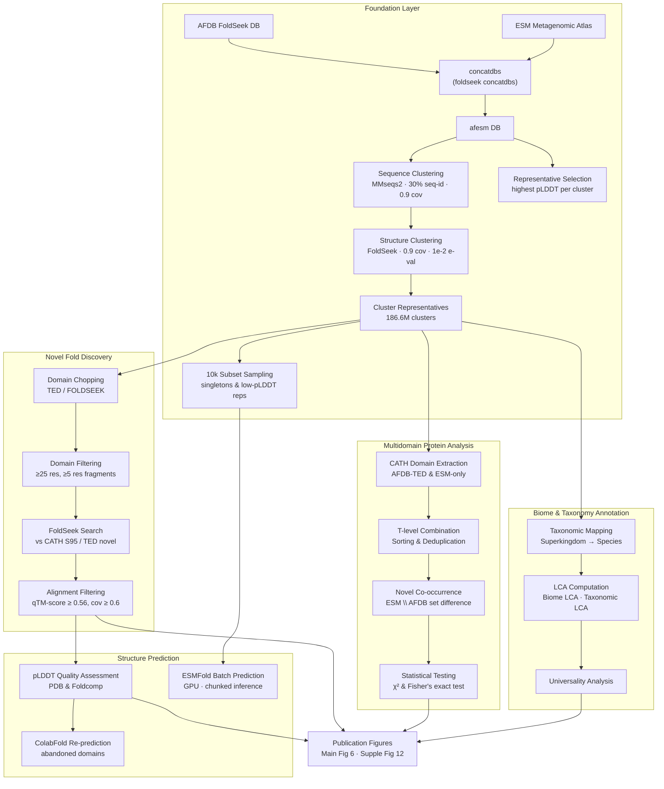

This page describes the end-to-end architecture of the AFESM analysis pipeline — a multi-stage computational workflow that identifies novel protein folds, discovers novel multidomain combinations, and annotates their ecological and taxonomic context across the AlphaFold DB (AFDB) and ESMFold Metagenomic Atlas (ESM). The pipeline is organized as a directed acyclic graph of modular stages, each encapsulated in its own subdirectory, with data flowing from raw database concatenation through clustering, domain analysis, novelty detection, and finally publication-grade visualization. Understanding this architecture is essential before diving into any individual stage.

## High-Level Pipeline Flow

The entire analysis rests on a foundational data preparation layer, which is then consumed by four parallel analytical tracks. These tracks converge at the visualization and reporting layer. The following diagram illustrates the primary data dependencies between stages.

Sources: [concatenation](concate_clustering/concatenation), [10k_subset_sampling.sh](analysis_10k_subset_sampling/10k_subset_sampling.sh)

## Foundation: Database Concatenation and Clustering

The pipeline begins by merging two complementary structure databases into a unified search space. The `concate_clustering/concatenation` script orchestrates three critical operations using FoldSeek and MMseqs2 tooling. First, the AFDB and ESM Atlas FoldSeek databases are concatenated via `foldseek concatdbs`, joining the primary index files and their associated `_h` (header), `_ss` (secondary structure), and `_ca` (Cα coordinates) side-files. This produces the `afesm` database. Second, MMseqs2 performs sequence-level clustering at 30% minimum sequence identity with coverage mode 1 and 0.9 coverage threshold, producing `afesm30` clusters. Third, representative sequences are selected by joining alignment output with per-entry pLDDT scores and picking the highest-confidence structure per cluster. The selection applies two strategies — one prioritizing query coverage > 0.9, another additionally requiring target/query length ratio ≥ 0.7 — and records the alteration rate (3.83% of clusters had their representative swapped when using the stricter length criterion). A final structure-level clustering step with FoldSeek (0.9 coverage, 1e-2 e-value) groups representatives into fold families.

| Parameter | Value | Purpose |
|-----------|-------|---------|
| Sequence identity threshold | 0.3 | MMseqs2 clustering sensitivity |
| Coverage mode | 1 | Bidirectional coverage requirement |
| Coverage threshold | 0.9 | Minimum alignment coverage |
| Structure coverage | 0.9 | FoldSeek structural clustering |
| Structure e-value | 0.01 | FoldSeek significance cutoff |
| Representative selection criterion | Highest pLDDT | Confidence-based delegation |

Sources: [concatenation](concate_clustering/concatenation#L1-L126)

## Parallel Analytical Tracks

After the foundation layer produces cluster representatives, the pipeline fans out into four largely independent analytical tracks that can be executed in parallel. This decoupled architecture is a deliberate design choice — each track operates on a different aspect of the data (fold novelty, domain co-occurrence, ecology, structure quality) and writes to isolated output directories under `data/`.

### Novel Fold Discovery Track

The novel fold analysis pipeline (`novel_fold_analyses/`) takes representative structures through a sequence of filtering, chopping, and validation steps. It begins with parsing FoldSeek domain assignment output files and applies progressively stringent criteria: domain size filtering rejects domains shorter than 25 residues and fragments shorter than 5 residues; CIGAR-based alignment parsers compute query/target coverage from FoldSeek `m8` output; and a consensus filter resolves disagreements between multiple domain callers. The alignment filtering stage, shared across three parser scripts (`parse_alldoms.py`, `parse_newfolds.py`, `parse_cath_s95.py`), enforces a consistent threshold of qTM-score ≥ 0.56, query coverage ≥ 0.6, and target coverage ≥ 0.6. The chopping-to-PDB extraction step and the visual comparison tool (`compare_choppings.py`) support downstream validation. For procedural details, see [Domain Filtering and Consensus](5-domain-filtering-and-consensus) and subsequent pages in that section.

Sources: [filter_domains.py](novel_fold_analyses/filter_domains.py#L1-L71), [parse_alldoms.py](novel_fold_analyses/parse_alldoms.py#L37-L77), [parse_newfolds.py](novel_fold_analyses/parse_newfolds.py#L37-L77)

### Multidomain Protein (MDP) Analysis Track

The MDP pipeline (`multidomain_analysis/`) is the most structurally complex track, implemented as a numbered 0-through-7 shell script pipeline orchestrated by `main.sh`. It processes two independent data sources — AFDB-TED domain assignments and ESM-only annotated tables — through identical transformation stages: field extraction, CATH code concatenation, H-level removal (reducing 4-level CATH codes like `1.10.10.10` to 3-level topology codes like `1.10.10`), redundancy removal, and MDP identification (proteins containing `;`-separated multi-domain signatures). A critical sub-pipeline rescues ~625K unannotated N-terminal domains from AFDB via FoldSeek search against CATH, merging them back into the AFDB dataset and recovering 252,516 new multi-topology proteins. Novel co-occurrence detection generates T-level co-occurring pair sets for both AFDB and ESM, then computes their set difference to identify 4,951 novel domain combinations unique to ESM-only proteins (representing 5,203 distinct proteins). A compilation table aggregates all metadata — MDP flags, novelty flags, domain counts, raw/sorted CATH combinations, and cluster membership statistics — into a single 15-column TSV for downstream visualization.

Sources: [main.sh](multidomain_analysis/extract_novel_combination/main.sh#L1-L200), [main.sh](multidomain_analysis/extract_novel_combination/main.sh#L200-L438)

### Biome and Taxonomy Annotation Track

The annotation track operates across two subdirectories. The `biome/` module provides LCA computation via a C++ engine (`new_LCA_ignoreMixed.cpp`) and automated Kraken-style report generation from NCBI taxonomic lineage data. The `automated_krakenReportGen.sh` script maps lineage paths to taxonomic codes and formats output into a standard Kraken report structure with rank labels (superkingdom through species). The `taxonomy/` module implements a family of Jupyter notebooks, each performing the same mapping pattern at a different taxonomic rank — species, genus, family, phylum, superkingdom, clade, and descendant levels — producing per-rank annotation tables that feed into the universality analysis. For deeper exploration, see [Biome LCA Computation Engine](12-biome-lca-computation-engine) and [Taxonomic LCA and Universality Analysis](13-taxonomic-lca-and-universality-analysis).

Sources: [automated_krakenReportGen.sh](biome/automated_krakenReportGen.sh#L1-L53)

### Structure Prediction and Quality Track

The prediction track (`prediction/`) addresses two needs: quality assessment of existing structures and re-prediction of abandoned domains. Quality assessment operates through three complementary Python scripts that extract per-domain pLDDT scores from either PDB files or Foldcomp-compressed databases. The `esmfold_bulk_argv_size_constraint.py` script implements GPU-accelerated batch ESMFold inference with configurable sequence length filters, chunk sizes for memory-constrained GPUs, and batch processing parameters. The abandoned domains subdirectory contains separate MSA generation, prediction, and analysis workflows for structures that failed initial quality thresholds. For implementation specifics, see [pLDDT Quality Assessment Pipeline](14-plddt-quality-assessment-pipeline) and [ColabFold Re-prediction Workflow](15-colabfold-re-prediction-workflow).

Sources: [19_plddt.py](prediction/TED_novel_domains/19_plddt.py#L1-L48), [19_domain_plddt_foldcomp.py](prediction/TED_novel_domains/19_domain_plddt_foldcomp.py#L1-L77), [esmfold_bulk_argv_size_constraint.py](prediction/TED_novel_domains/esmfold_bulk_argv_size_constraint.py#L2-L84)

## Technology Stack and Conventions

The pipeline employs a deliberately heterogeneous toolchain selected for each stage's computational requirements. Shell scripting (Bash) with heavy `awk` usage handles high-throughput tabular data transformations, particularly in the MDP pipeline where hundreds of millions of rows are processed. Python serves as the language for structured parsing (Click CLI, pandas, foldcomp API), alignment filtering (CIGAR parsing), and GPU-accelerated inference (PyTorch, ESMFold). R provides statistical testing for the over/under-representation analysis. C++ handles the compute-intensive LCA algorithm. Visualization is exclusively notebook-based (Jupyter), separating exploratory analysis from pipeline execution.

> [!TIP]
> The MDP pipeline scripts are numbered (`0_extract_fields` through `7_mapping_CATHnames`) and designed to be invoked sequentially by `main.sh`, but each step writes to an independent intermediate file under `tmp/`. This means individual steps can be re-run from their last checkpoint by pointing the next script at the correct intermediate output — a useful pattern when debugging upstream data issues on datasets exceeding 50 million rows.

| Stage | Primary Language | Core Libraries / Tools | Typical Input Scale |
|-------|-----------------|----------------------|---------------------|
| DB concatenation | Bash | foldseek, mmseqs2 | ~230M structures |
| Domain filtering | Python | sys, os (no deps) | Chopping TSV files |
| Alignment filtering | Python | Click, regex (CIGAR) | FoldSeek m8 format |
| MDP extraction | Bash + awk | Native Unix tools | 50M+ proteins |
| Statistical testing | R | chi-squared, fisher.test | Contingency tables |
| LCA computation | C++ | Custom taxonomy tree | Kraken report files |
| Batch prediction | Python | PyTorch, ESMFold, foldcomp | Configurable batch size |
| Visualization | Python (Jupyter) | matplotlib, seaborn | Aggregated summary tables |

Sources: [concatenation](concate_clustering/concatenation#L1-L10), [filter_domains.py](novel_fold_analyses/filter_domains.py#L1-L15), [esmfold_bulk_argv_size_constraint.py](prediction/TED_novel_domains/esmfold_bulk_argv_size_constraint.py#L36-L50)

## Data Flow Conventions

All inter-stage data exchange follows a consistent set of conventions throughout the pipeline. Intermediate files use TSV format with descriptive filenames encoded as `step_description-inputContext-outputDetail.tsv`. Directory structure mirrors processing stages: `data/` holds all inputs and intermediate outputs, organized by data source (AFDB-TED, ESM-only); `results/` holds final aggregated outputs; and inline scripts operate on sibling `tmp/` directories for ephemeral data. The 10k subset sampling step (`analysis_10k_subset_sampling/10k_subset_sampling.sh`) demonstrates a downstream consumer pattern — it reads pre-computed representative IDs and random-samples 10,000 metagenomic entries (filtered by `MGYP` prefix) for focused novel domain identification.

Sources: [10k_subset_sampling.sh](analysis_10k_subset_sampling/10k_subset_sampling.sh#L1-L38), [main.sh](multidomain_analysis/extract_novel_combination/main.sh#L1-L20)

## Recommended Reading Path

Now that you understand the overall architecture, the most productive next step depends on your specific interest. For understanding how domain boundaries are established before any fold novelty can be assessed, proceed to [Domain Filtering and Consensus](5-domain-filtering-and-consensus). If you are primarily interested in how novel domain combinations are discovered, jump to [MDP Extraction from AFDB and ESM](9-mdp-extraction-from-afdb-and-esm). For the statistical methodology behind the ecological and taxonomic annotations, see [Biome LCA Computation Engine](12-biome-lca-computation-engine). If you need to understand structure quality thresholds before trusting downstream conclusions, read [pLDDT Quality Assessment Pipeline](14-plddt-quality-assessment-pipeline) first.