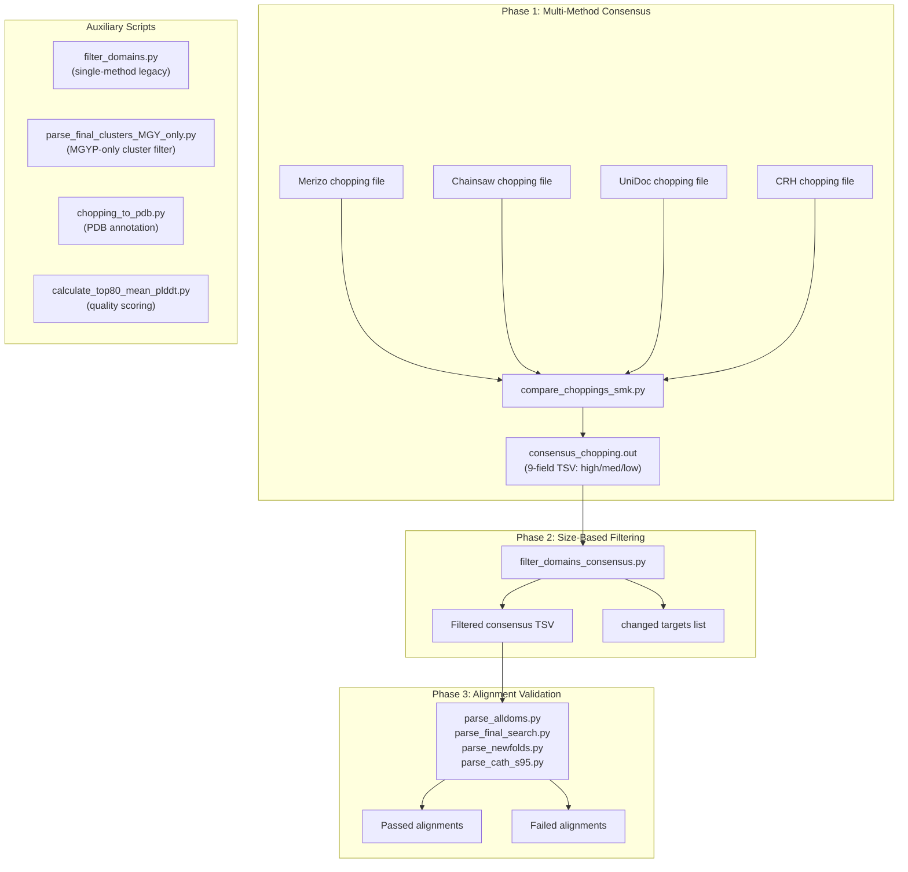

This page documents the domain filtering and consensus computation subsystem that transforms raw multi-tool domain predictions into curated, confidence-stratified domain assignments. It is the gatekeeping layer of the novel fold discovery pipeline: every candidate novel domain must survive this filtering before advancing to structural validation. The subsystem addresses two fundamental challenges of multi-method domain prediction—reconciling disagreeing boundary assignments and eliminating spuriously small domain fragments that inflate domain counts without representing real structural units.

## Architectural Overview

The domain filtering and consensus subsystem operates in three sequential phases: **multi-method consensus computation**, **size-based domain filtering**, and **alignment-based validation filtering**. Each phase progressively narrows the candidate set, and the outputs of each phase feed into downstream stages documented on adjacent pages.

## Phase 1: Multi-Method Consensus Computation

The consensus computation aggregates domain boundary predictions from four independent structure-based domain parsers—Merizo, Chainsaw, UniDoc, and CRH. Each tool outputs a 6-field TSV with columns: `target`, `md5`, `nres`, `ndom`, `chopping`, `score`. The **chopping string** encodes domain architecture using a compound delimiter convention: commas separate domains, underscores separate non-contiguous fragments within a domain, and dashes delimit residue ranges. For example, `1-120_140-250,300-450` represents a two-domain protein where the first domain has a 19-residue insertion gap.

The core computation is delegated to `calculate_domain_consensus` from the `utils.domain_consensus` module (imported in both [compare_choppings.py](novel_fold_analyses/compare_choppings.py#L13-L13) and [compare_choppings_smk.py](novel_fold_analyses/compare_choppings_smk.py#L13-L13)). The function accepts a list of chopping strings (one per method) and the total residue count, then computes consensus at three agreement levels via the `consensus_levels=[3,2,1]` parameter. A residue region is assigned **high** consensus if at least 3 of 4 methods agree on its domain identity, **medium** if at least 2 agree, and **low** if at least 1 method proposes it. The function returns three parallel structures: `consensus` (list of range tuples per level), `consensus_domstr` (formatted chopping strings per level), and `consensus_counts` (integer domain counts per level) [compare_choppings_smk.py](novel_fold_analyses/compare_choppings_smk.py#L104-L107).

Two implementations exist for this phase. [compare_choppings.py](novel_fold_analyses/compare_choppings.py) is the original version that also generates matplotlib sequence-overlap visualizations per target, producing PNG images with per-method domain bars and consensus tracks. [compare_choppings_smk.py](novel_fold_analyses/compare_choppings_smk.py) is the Snakemake-oriented variant that strips all visualization code (noted in the author comment at [line 18](novel_fold_analyses/compare_choppings_smk.py#L18-L18): "S Kandathil - 2024-07-02 NO PLOTS") and outputs only the TSV consensus file. The Smk variant uses `continue` at [line 114](novel_fold_analyses/compare_choppings_smk.py#L114-L114) to skip the entire plotting block after writing the consensus line.

The output `consensus_chopping.out` is a 9-field TSV with columns: `target`, `md5`, `nres`, `nhigh`, `nmed`, `nlow`, `chophigh`, `chopmed`, `choplow` [compare_choppings_smk.py](novel_fold_analyses/compare_choppings_smk.py#L109-L112).

> [!TIP]
> The `utils/domain_consensus.py` and `utils/score_utils.py` modules are imported but not present in the repository's `novel_fold_analyses/` directory. These are external utility dependencies—likely from the chainsaw or merizo ecosystem—that must be installed separately for the consensus scripts to function. The `domstr_to_ranges()` function from `score_utils` converts chopping strings into `[(domain_index, start, end), ...]` tuples used for both visualization and consensus computation.

## Phase 2: Size-Based Domain Filtering

Two filtering scripts address the problem of spurious small domain assignments. Both enforce minimum thresholds on fragment size and total domain residue count, but they differ in scope and input format.

### Single-Method Filtering: `filter_domains.py`

The legacy [filter_domains.py](novel_fold_analyses/filter_domains.py) operates on a single 6-field chopping TSV. It applies two hardcoded constants: `MIN_FRAGMENT_SIZE = 25` and `MIN_DOM_SIZE = 5` (note the unusual naming—`MIN_DOM_SIZE` with value 25 is the domain threshold, `MIN_FRAGMENT_SIZE` with value 5 is the fragment threshold) [filter_domains.py](novel_fold_analyses/filter_domains.py#L4-L5). For each protein, it iterates over comma-separated domains, then over underscore-separated fragments within each domain. Fragments shorter than `MIN_FRAGMENT_SIZE` (5 residues) are dropped from the fragment list. If the sum of surviving fragment lengths falls below `MIN_DOM_SIZE` (25 residues), the entire domain is removed. Proteins with `NULL` or `NO_SS` chopping values pass through unmodified [filter_domains.py](novel_fold_analyses/filter_domains.py#L25-L57). The script outputs a `_filtered.tsv` suffixed file preserving the original 6-field format.

### Consensus Filtering: `filter_domains_consensus.py`

The production-grade [filter_domains_consensus.py](novel_fold_analyses/filter_domains_consensus.py) processes the 9-field consensus output from Phase 1. It applies the same two-level filtering logic via the `filter_domains()` function, but with configurable thresholds (defaults: `--min_dom_size 25`, `--min_fragment_size 5`) and several important enhancements [filter_domains_consensus.py](novel_fold_analyses/filter_domains_consensus.py#L45-L47).

The function applies filtering independently to each of the three consensus levels (high, medium, low) for every target [filter_domains_consensus.py](novel_fold_analyses/filter_domains_consensus.py#L65-L90). After processing, it writes two outputs: the filtered consensus TSV and a `.changed.txt` file listing all targets whose chopping was modified by the filter—enabling downstream audit of how many and which predictions were affected [filter_domains_consensus.py](novel_fold_analyses/filter_domains_consensus.py#L124-L126). A notable feature is the `--offset_resi` parameter (default 0), which adds a fixed integer to all residue indices in the chopping string—designed to accommodate Chainsaw's residue indexing offset relative to the full-length sequence [filter_domains_consensus.py](novel_fold_analyses/filter_domains_consensus.py#L19-L22).

Domains that survive fragment filtering but produce an empty chopping string are represented as `'na'` rather than `'NULL'` [filter_domains_consensus.py](novel_fold_analyses/filter_domains_consensus.py#L35-L36), which is the convention used by the consensus computation layer.

| Parameter | Script | Default | Purpose |
|-----------|--------|---------|---------|
| `--min_dom_size` | `filter_domains_consensus.py` | 25 | Minimum total residues for a domain to be retained |
| `--min_fragment_size` | `filter_domains_consensus.py` | 5 | Minimum residues for a contiguous fragment |
| `--offset_resi` | `filter_domains_consensus.py` | 0 | Residue index offset (for Chainsaw compatibility) |
| `MIN_DOM_SIZE` | `filter_domains.py` | 25 | Hardcoded equivalent (note: named "dom" but is the domain threshold) |
| `MIN_FRAGMENT_SIZE` | `filter_domains.py` | 5 | Hardcoded equivalent |

> [!TIP]
> In `filter_domains.py`, the variable names are semantically inverted compared to `filter_domains_consensus.py`: `MIN_DOM_SIZE = 25` acts as the domain-level threshold while `MIN_FRAGMENT_SIZE = 5` acts as the fragment-level threshold. This naming inconsistency between the two scripts is a legacy artifact—always verify which threshold you are configuring by checking the actual comparison logic, not the variable name alone.

## Phase 3: Alignment-Based Validation Filtering

Four structurally similar alignment parsers filter structural comparison results (in m8 format) against different reference databases. They share a common architecture: parse CIGAR strings to compute sequence coverage, then apply TM-score and coverage thresholds to separate passing from failing alignments.

### CIGAR Parsing and Coverage Computation

All four parsers use an identical `parse_cigar()` function that extracts `(operation, length)` tuples via regex `r'(\d+)([MIDNSHP=X])'` [parse_alldoms.py](novel_fold_analyses/parse_alldoms.py#L4-L16). Coverage computation, however, diverges into two variants. The **bidirectional coverage** variant (used by `parse_alldoms.py`, `parse_newfolds.py`, and `parse_cath_s95.py`) computes both query coverage (`qcov`) and target coverage (`tcov`), where aligned query bases use operations `M`, `=`, `X` and aligned target bases additionally include `D` (deletions) [parse_alldoms.py](novel_fold_analyses/parse_alldoms.py#L18-L35). The **query-only coverage** variant (used by `parse_final_search.py`) computes only `qcov` [parse_final_search.py](novel_fold_analyses/parse_final_search.py#L18-L31).

### Filter Thresholds by Script

Each script targets a different structural comparison stage and applies distinct filtering criteria:

**[parse_alldoms.py](novel_fold_analyses/parse_alldoms.py)** filters all-domain TM-align results (`alldoms_results.m8`). It applies a two-stage filter: first, `qtmscore > 0.56`; then, if the score passes, both `qcov > 0.6` and `tcov > 0.6` must hold [parse_alldoms.py](novel_fold_analyses/parse_alldoms.py#L65-L72). This is the broadest structural comparison, scanning against all known domains.

**[parse_final_search.py](novel_fold_analyses/parse_final_search.py)** filters final-stage search results with a more nuanced score criterion. It passes alignments where `max(qtmscore, ttmscore) > 0.5 OR rmsd < 3.0`, then requires `qcov > 0.6` [parse_final_search.py](novel_fold_analyses/parse_final_search.py#L62-L71). The disjunction of TM-score and RMSD allows capture of geometrically close matches even when TM-scores are modest.

**[parse_newfolds.py](novel_fold_analyses/parse_newfolds.py)** applies the same three-threshold filter as `parse_alldoms.py` (qtmscore > 0.56, qcov > 0.6, tcov > 0.6) but targets the final novel fold set versus TED domains (`final_set_vs_TED_novel`) [parse_newfolds.py](novel_fold_analyses/parse_newfolds.py#L38-L44).

**[parse_cath_s95.py](novel_fold_analyses/parse_cath_s95.py)** uses identical thresholds to `parse_alldoms.py` but operates on CATH S95 representative hits (`n_hits_good_models_vs_CATH_s95.m8`) [parse_cath_s95.py](novel_fold_analyses/parse_cath_s95.py#L38-L44).

| Script | Input File | Score Filter | Coverage Filter | Coverage Type |
|--------|-----------|--------------|-----------------|---------------|
| `parse_alldoms.py` | `alldoms_results.m8` | `qtmscore > 0.56` | `qcov > 0.6 AND tcov > 0.6` | Bidirectional |
| `parse_final_search.py` | `final_search.m8` | `max(qtmscore,ttmscore) > 0.5 OR rmsd < 3.0` | `qcov > 0.6` | Query-only |
| `parse_newfolds.py` | `final_set_vs_TED_novel` | `qtmscore > 0.56` | `qcov > 0.6 AND tcov > 0.6` | Bidirectional |
| `parse_cath_s95.py` | `n_hits_good_models_vs_CATH_s95.m8` | `qtmscore > 0.56` | `qcov > 0.6 AND tcov > 0.6` | Bidirectional |

All four scripts produce a `*_match.m8` file for passing alignments and a `*_nomatch.m8` file for failing ones, enabling downstream re-analysis of rejected hits if thresholds are adjusted [parse_alldoms.py](novel_fold_analyses/parse_alldoms.py#L39-L40).

## Auxiliary Scripts

### Metagenomic Cluster Filtering

[parse_final_clusters_MGY_only.py](novel_fold_analyses/parse_final_clusters_MGY_only.py) post-processes clustering results to retain only clusters where **all** members have the `MGYP` prefix (metagenome-assembled protein identifiers). It reads a two-column TSV (`cluster_rep`, `cluster_member`), builds a dictionary keyed by representative, then filters using `all(member.startswith("MGYP") for member in members)` [parse_final_clusters_MGY_only.py](novel_fold_analyses/parse_final_clusters_MGY_only.py#L22-L30). This isolates the purely metagenomic novel fold candidates from clusters that include reference (UniProt/AFDB) entries.

### PDB Annotation: `chopping_to_pdb.py`

[chopping_to_pdb.py](novel_fold_analyses/chopping_to_pdb.py) converts domain chopping assignments into physically annotated PDB structures. It writes domain identifiers into the PDB **occupancy column** (rather than B-factor, to preserve AlphaFold2 pLDDT confidence scores) [chopping_to_pdb.py](novel_fold_analyses/chopping_to_pdb.py#L23-L26). The tool uses `domstr_to_assignment_by_resi()` from utils to map the chopping string onto the actual residue numbers found in the PDB's CA atoms, accommodating potential indexing discrepancies [chopping_to_pdb.py](novel_fold_analyses/chopping_to_pdb.py#L72-L73). With the `--save_domains` flag, it also splits multi-domain PDBs into individual domain PDB files and writes a `.domains` TSV with per-domain statistics including mean B-factor [chopping_to_pdb.py](novel_fold_analyses/chopping_to_pdb.py#L105-L126).

### Quality Scoring: `calculate_top80_mean_plddt.py`

[calculate_top80_mean_plddt.py](novel_fold_analyses/calculate_top80_mean_plddt.py) computes two per-domain confidence metrics from PDB B-factor columns (where AlphaFold stores pLDDT): the **mean pLDDT** across all CA atoms, and the **mean top-80% pLDDT**—the mean of the highest 80% of pLDDT values after sorting [calculate_top80_mean_plddt.py](novel_fold_analyses/calculate_top80_mean_plddt.py#L15-L20). The top-80% metric is more robust to localized low-confidence regions (e.g., flexible linkers between domains) that would depress the overall mean. The script accepts an optional `--plddt_threshold` (default 0.9) that can be used to flag high-confidence domains, though the filtering action is currently commented out [calculate_top80_mean_plddt.py](novel_fold_analyses/calculate_top80_mean_plddt.py#L29-L29).

## Data Flow and File Conventions

The chopping string convention is the central data contract across all scripts. Understanding its grammar is essential for working with any component of this subsystem:

- **Domain separator**: `,` (comma) — divides distinct domains within a protein
- **Fragment separator**: `_` (underscore) — divides non-contiguous segments within a single domain
- **Range delimiter**: `-` (dash) — defines start and end residue positions (inclusive, 1-based)
- **Special values**: `NULL` (no domain prediction), `NO_SS` (no secondary structure available), `na` (filtered to empty in consensus), `0` (equivalent to no assignment)

The three output file formats encountered across the pipeline are distinguished by column count: **6-field** (`target md5 nres ndom chopping score`) for single-method predictions, **9-field** (`target md5 nres nhigh nmed nlow chophigh chopmed choplow`) for consensus output, and **8-field** (`query target qlen tlen qtmscore ttmscore rmsd cigar`) for alignment m8 files processed by `parse_final_search.py`.

## Next Steps

With filtered, consensus-stratified domain assignments in hand, the pipeline proceeds to extract these domains as physical structures and validate their novelty:

- **[Structure Chopping and PDB Extraction](6-structure-chopping-and-pdb-extraction)** — how `chopping_to_pdb.py` and related tools convert domain boundaries into separate PDB files
- **[Novel Fold Validation via Alignment Filtering](7-novel-fold-validation-via-alignment-filtering)** — how the alignment parsers classify domains as known or novel against CATH and TED references
- **[Structural Quality Visualization](8-structural-quality-visualization)** — how pLDDT metrics feed into quality assessment and filtering decisions