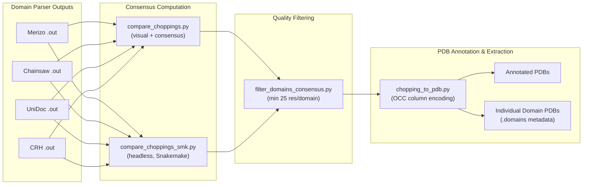

This stage of the novel fold pipeline transforms domain boundary predictions from multiple parsers into consensus-driven residue assignments, applies quality-based filtering, and ultimately writes domain-annotated PDB files with per-domain extraction. The design preserves AlphaFold2 pLDDT scores by encoding domain identities into the occupancy column rather than the b-factor column, ensuring that downstream quality assessments remain intact.

## Chopping String and File Format Primer

Every script in this module operates on a consistent data representation. A **chopping string** encodes domain boundaries using three nested delimiters: commas separate domains, underscores separate contiguous segments within a domain, and dashes separate residue range endpoints. For example, the string `1-120_250-350,121-249` describes a two-domain protein where domain 1 spans residues 1–120 and 250–350 (with a linker), and domain 2 spans residues 121–249.

The **standard chopping file** is a tab-separated file with six columns in the order: `target`, `md5`, `nres`, `ndom`, `chopping`, `score`. The `md5` field provides integrity verification between the chopping assignment and the source structure, while `nres` records the total residue count. Both `compare_choppings.py` and `chopping_to_pdb.py` validate this six-field contract at parse time [compare_choppings.py](novel_fold_analyses/compare_choppings.py#L50-L51).

The **consensus chopping file** produced by the comparison step extends this to nine columns: `target`, `md5`, `nres`, `nhigh`, `nmed`, `nlow`, `chophigh`, `chopmed`, `choplow`. Here `nhigh`/`nmed`/`nlow` report the domain counts at three consensus stringency levels, and the corresponding `chop*` fields hold the actual boundary strings (or `na` if no consensus exists at that level) [compare_choppings_smk.py](novel_fold_analyses/compare_choppings_smk.py#L109-L112).



## Multi-Method Consensus Computation

The pipeline accepts chopping results from multiple domain boundary prediction tools — the code explicitly references Merizo, Chainsaw, UniDoc, and CRH as the canonical set. The consensus step reads all provided chopping files, collects the union of all target identifiers, and for each target gathers the boundary predictions from every method [compare_choppings.py](novel_fold_analyses/compare_choppings.py#L72-L81).

Each method's chopping string is converted into a list of `(domain_index, start, end)` tuples via `domstr_to_ranges` from the external `utils.score_utils` module. Methods that fail to produce a valid prediction (yielding sentinel values `0`, `NULL`, or `NO_SS`) are treated as single-domain assignments spanning the entire protein [compare_choppings.py](novel_fold_analyses/compare_choppings.py#L97-L102).

The `calculate_domain_consensus` function from `utils.domain_consensus` then operates on the collection of chopping strings for a given target. It accepts a `consensus_levels` parameter set to `[3, 2, 1]`, defining three stringency tiers:

| Consensus Level | Agreement Threshold | Description |
|---|---|---|
| **High** | All methods agree on a boundary | Maximum confidence; used as the primary assignment |
| **Medium** | At least 2 of 3 methods agree | Fallback when full agreement is absent |
| **Low** | At least 1 method assigns a boundary | Most permissive; captures single-method predictions |

The function returns three consensus domain strings and their corresponding domain counts, which are written to the `consensus_chopping.out` file alongside the target metadata [compare_choppings_smk.py](novel_fold_analyses/compare_choppings_smk.py#L105-L112).

Two implementations serve different workflow contexts. `compare_choppings.py` generates matplotlib sequence-overlap visualizations as PNG files — horizontal colored bars representing each method's domain assignments stacked by residue position — alongside the consensus TSV output [compare_choppings.py](novel_fold_analyses/compare_choppings.py#L133-L183). `compare_choppings_smk.py` is a headless variant refactored for Snakemake integration; it retains only the consensus computation loop, skips all matplotlib/imageio code, and writes exclusively to the TSV file [compare_choppings_smk.py](novel_fold_analyses/compare_choppings_smk.py#L114). Both share an identical `read_chopping` helper that parses the six-field TSV format, validates the field count, and skips lines beginning with `Done.` [compare_choppings.py](novel_fold_analyses/compare_choppings.py#L42-L55).

> [!TIP]
> The `continue` statement at line 114 of `compare_choppings_smk.py` causes the function to skip all post-consensus visualization code, making it a true headless consensus engine. When choosing between the two scripts, use the `_smk` variant for automated pipelines and the standard version when visual inspection of domain overlaps is needed.

## Post-Consensus Domain Filtering

After consensus boundaries are established, `filter_domains_consensus.py` applies size-based quality constraints. The script reads the nine-column consensus file and evaluates each consensus level independently [filter_domains_consensus.py](novel_fold_analyses/filter_domains_consensus.py#L57-L63).

The filtering logic operates on two configurable thresholds:

| Parameter | Default | CLI Flag | Purpose |
|---|---|---|---|
| `min_dom_size` | 25 residues | `--min_dom_size` | Minimum total residue count for a domain to be retained |
| `min_fragment_size` | 5 residues | `--min_fragment_size` | Minimum length for individual segments within a domain |

For each domain in a chopping string, the script iterates through all underscore-separated segments. Segments shorter than `min_fragment_size` are silently dropped, and if the remaining segment count for a domain falls below `min_dom_size`, the entire domain is removed [filter_domains_consensus.py](novel_fold_analyses/filter_domains_consensus.py#L26-L28). Additionally, an `offset_resi` parameter supports residue index correction — primarily needed for Chainsaw outputs that use a different numbering scheme [filter_domains_consensus.py](novel_fold_analyses/filter_domains_consensus.py#L20-L22).

The script tracks which targets had their choppings modified and writes a separate `.changed.txt` file listing those identifiers, enabling downstream auditing of filtering effects [filter_domains_consensus.py](novel_fold_analyses/filter_domains_consensus.py#L92-L93).

A simpler predecessor, `filter_domains.py`, applies the same filtering logic (with hardcoded 25/5 thresholds) to standard six-column chopping files rather than consensus output. It produces two outputs: a filtered full-chain file and a domain-level summary (the latter currently commented out) [filter_domains.py](novel_fold_analyses/filter_domains.py#L4-L14).

> [!TIP]
> The `filter_domains_consensus.py` script uses `natsorted` for segment ordering rather than standard lexicographic sorting. This ensures that residue ranges like `9-10` sort correctly before `10-20` in multi-segment domains, preventing boundary corruption in edge cases.

## PDB Annotation and Domain Extraction

`chopping_to_pdb.py` bridges the boundary between abstract domain strings and concrete structural files. It reads a chopping file and a directory of source PDB models, then produces annotated PDBs where each atom's occupancy value encodes its domain membership [chopping_to_pdb.py](novel_fold_analyses/chopping_to_pdb.py#L23-L25).

The conversion process follows a precise sequence. First, the chopping string is converted into a per-residue assignment array via `domstr_to_assignment_by_resi`, which maps the chopping notation against the actual residue numbering extracted from the PDB's CA atoms — this residue-aware mapping is critical because PDB files may have non-sequential or gapped residue numbering [chopping_to_pdb.py](novel_fold_analyses/chopping_to_pdb.py#L69-L73). The resulting assignment array is a numpy array where each position holds an integer domain ID (0 for non-domain regions). This array is then transferred onto the PDB structure through `add_domains_to_pdb`, which writes the domain IDs into the occupancy column [chopping_to_pdb.py](novel_fold_analyses/chopping_to_pdb.py#L88).

The script operates in two mutually exclusive modes controlled by the `--save_domains` flag:

| Mode | Flag | Output | Description |
|---|---|---|---|
| **Full-chain annotation** | (default) | Single annotated PDB per target | Writes the complete structure with OCC-encoded domain IDs |
| **Domain extraction** | `--save_domains` | Individual PDB per domain + `.domains` metadata file | Splits the structure into separate domain PDBs with quality metadata |

In domain extraction mode, the script iterates over each unique non-zero occupancy value, filters the PDB DataFrame to that domain's atoms, computes the mean b-factor (pLDDT) from CA atoms, generates a domain-specific chopping string, and writes both the domain PDB and a tabular metadata line to the `.domains` companion file [chopping_to_pdb.py](novel_fold_analyses/chopping_to_pdb.py#L106-L126). The metadata format is: `domain_name, md5, domain_nres, confidence, mean_bfactor, dom_str`, where `confidence` is set to a dummy value of 1.000 [chopping_to_pdb.py](novel_fold_analyses/chopping_to_pdb.py#L118-L124).

An `--inherit_from` option exists for masking non-domain regions (NDRs) using a secondary chopping file (e.g., from Merizo), but this code path is currently commented out while retaining the MD5 verification infrastructure [chopping_to_pdb.py](novel_fold_analyses/chopping_to_pdb.py#L49-L100).

## CLI Reference

### `chopping_to_pdb.py`

```
python chopping_to_pdb.py \
  -i <chopping.txt> \
  -d </path/to/models/> \
  -o </path/to/output/> \
  [-il <input_suffix>] [-ol <output_suffix>] \
  [-m <inherit_chopping.txt>] \
  [--save_domains] \
  [--skip_header]
```

| Argument | Required | Default | Description |
|---|---|---|---|
| `-i, --input` | Yes | — | Path to chopping file (6-column TSV) |
| `-d, --model_dir` | Yes | — | Directory containing source PDB files |
| `-o, --output_dir` | Yes | — | Output directory for annotated PDBs |
| `-il, --input_model_label` | No | `.pdb` | File suffix for input PDBs |
| `-ol, --output_model_label` | No | `.pdb` | File suffix for output PDBs |
| `-m, --inherit_from` | No | `None` | Secondary chopping for NDR inheritance (commented out) |
| `--save_domains` | No | `False` | Enable per-domain PDB extraction |
| `--skip_header` | No | `False` | Skip header line in input chopping file |

Sources: [chopping_to_pdb.py](novel_fold_analyses/chopping_to_pdb.py#L31-L40)

### `compare_choppings.py` / `compare_choppings_smk.py`

```
python compare_choppings.py \
  -c <chopping1.out> <chopping2.out> ... \
  -o </path/to/output/> \
  [-s <size_cm>] [-lw <linewidth>]
```

| Argument | Required | Default | Description |
|---|---|---|---|
| `-c, --choppings` | Yes | — | Space-separated list of chopping files |
| `-o, --output_dir` | Yes | — | Output directory for PNG images and consensus TSV |
| `-s, --size` | No | `5` | Image size in cm (visualization mode only) |
| `-lw, --linewidth` | No | `10` | Line width for domain bars (visualization mode only) |

The `_smk` variant accepts the same `-c` and `-o` flags but ignores size/linewidth parameters.

Sources: [compare_choppings.py](novel_fold_analyses/compare_choppings.py#L59-L66), [compare_choppings_smk.py](novel_fold_analyses/compare_choppings_smk.py#L60-L67)

### `filter_domains_consensus.py`

```
python filter_domains_consensus.py <consensus_chopping.out> \
  [-o <output.tsv>] \
  [--changed_file <changed.txt>] \
  [--min_dom_size 25] \
  [--min_fragment_size 5] \
  [--offset_resi 0]
```

| Argument | Required | Default | Description |
|---|---|---|---|
| `input_file` (positional) | Yes | — | Path to consensus chopping file (9-column TSV) |
| `-o, --output_file` | No | Auto-derived | Filtered output file path |
| `--changed_file` | No | Auto-derived | File listing modified targets |
| `--min_dom_size` | No | `25` | Minimum residues per domain |
| `--min_fragment_size` | No | `5` | Minimum residues per segment |
| `--offset_resi` | No | `0` | Residue index offset correction |

Sources: [filter_domains_consensus.py](novel_fold_analyses/filter_domains_consensus.py#L40-L48)

## External Dependencies

Both the consensus computation and PDB annotation steps rely on an external `utils` package that is not bundled within this repository. The required modules and their imported functions are:

| Module | Functions Used | Called By |
|---|---|---|
| `utils.score_utils` | `domstr_to_assignment_by_resi`, `assignment_to_domstr`, `read_chopping`, `domstr_to_ranges` | `chopping_to_pdb.py`, `compare_choppings.py` |
| `utils.pdb_utils` | `open_pdb`, `write_pdb`, `add_domains_to_pdb`, `select_from_mol` | `chopping_to_pdb.py` |
| `utils.domain_consensus` | `calculate_domain_consensus` | `compare_choppings.py`, `compare_choppings_smk.py` |

Sources: [chopping_to_pdb.py](novel_fold_analyses/chopping_to_pdb.py#L6-L17), [compare_choppings.py](novel_fold_analyses/compare_choppings.py#L12-L13)

---

**Next steps**: Once domain PDBs are extracted, the pipeline proceeds to structural validation. See [Novel Fold Validation via Alignment Filtering](7-novel-fold-validation-via-alignment-filtering) for the TM-score and coverage-based filtering that determines true novelty, or [Structural Quality Visualization](8-structural-quality-visualization) for how pLDDT distributions across extracted domains are analyzed.