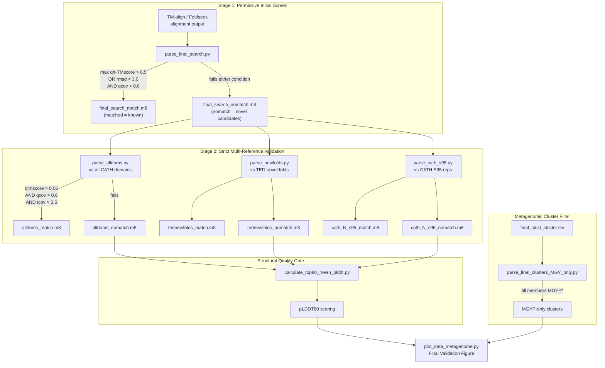
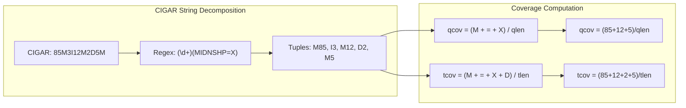

This page documents the multi-stage alignment filtering pipeline that separates genuinely novel protein folds from those already known in structural databases. The system applies a **cascading validation strategy**: an initial permissive screen eliminates obviously non-novel candidates, while a stricter subsequent gate cross-references remaining domains against CATH, TED, and metagenomic-only cluster membership to produce the final validated novel fold set.

## Pipeline Architecture: Two-Stage Cascading Filter

The validation pipeline operates on TM-align/Foldseek output in a custom tab-delimited format (`.m8`-style). Rather than applying a single monolithic filter, the system decomposes the problem into two sequential stages with deliberately different stringency levels. This design reflects a fundamental trade-off in structural alignment: early-stage screening must avoid discarding true negatives (genuinely novel folds) through overly aggressive criteria, while later validation must avoid false positives (known folds misclassified as novel).

Each alignment record passes through a CIGAR string–based coverage computation engine shared across all filtering scripts, ensuring consistent geometric interpretation of alignment boundaries.

Sources: [parse_final_search.py](novel_fold_analyses/parse_final_search.py#L33-L76), [parse_alldoms.py](novel_fold_analyses/parse_alldoms.py#L37-L77), [parse_newfolds.py](novel_fold_analyses/parse_newfolds.py#L37-L77), [parse_cath_s95.py](novel_fold_analyses/parse_cath_s95.py#L37-L77)

## Stage 1: Permissive Alignment Screen

The initial filter in `parse_final_search.py` uses an **OR-combined structural similarity gate** paired with a query coverage floor. This combination is deliberately loose: a domain is considered "matched to known structure" if *either* its TM-score is sufficiently high *or* its RMSD is sufficiently low, and the alignment covers a minimum fraction of the query sequence. The OR logic on structural similarity ensures that high-quality local alignments (high TM-score, possibly high RMSD) and globally close fits (low RMSD, possibly moderate TM-score) are both captured, reducing false novel-fold assignments.

The gate evaluates two conditions in sequence. First, `max(qtmscore, ttmscore) > 0.5 or rmsd < 3.0` serves as the structural similarity screen [parse_final_search.py](novel_fold_analyses/parse_final_search.py#L62). Only if this passes does the pipeline incur the cost of CIGAR parsing to compute query coverage against a threshold of 0.6 (60%) [parse_final_search.py](novel_fold_analyses/parse_final_search.py#L68). This lazy-evaluation pattern avoids unnecessary regex operations on lines that fail the cheaper numerical comparison.

> [!TIP]
> The stage 1 filter deliberately omits target coverage (`tcov`). Since this screen processes *any* structural database hit, requiring target coverage would penalize alignments against significantly longer reference structures where only a sub-region matches—a common scenario when novel domains align to portions of known multi-domain proteins.

| Parameter | Threshold | Rationale |
|---|---|---|
| `max(qtmscore, ttmscore)` | > 0.5 | Captures biologically significant structural similarity; TM-score > 0.5 generally indicates same fold topology |
| `rmsd` | < 3.0 Å | Complementary to TM-score; catches globally close fits even when TM-score is borderline |
| `qcov` | > 0.6 | Ensures the alignment spans a majority of the query domain, not just a local sub-motif |
| `tcov` | *not applied* | Intentionally omitted to avoid penalizing alignments against longer reference structures |

The 8-field tabular input format is: `query`, `target`, `qlen`, `tlen`, `qtmscore`, `ttmscore`, `rmsd`, `cigar` [parse_final_search.py](novel_fold_analyses/parse_final_search.py#L56-L59). Records with fewer than 8 fields are silently routed to the fail output [parse_final_search.py](novel_fold_analyses/parse_final_search.py#L52-L54).

Sources: [parse_final_search.py](novel_fold_analyses/parse_final_search.py#L33-L76)

## Stage 2: Strict Multi-Reference Validation

Domains surviving the permissive screen are candidates for novelty. Three independent validation scripts then test these candidates against progressively more specific reference datasets. Unlike stage 1, these scripts apply a **strictly conjunctive (AND) triple-criterion filter**: query TM-score, query coverage, *and* target coverage must all exceed their respective thresholds simultaneously.

### Shared CIGAR-Based Coverage Engine

All three stage-2 scripts share an identical two-function coverage computation pattern. The `parse_cigar` function uses a regex to decompose CIGAR strings into `(operation, length)` tuples [parse_alldoms.py](novel_fold_analyses/parse_alldoms.py#L14-L16). The `compute_coverage` function then derives two metrics from these tuples:

- **Query coverage (`qcov`)**: Counts `M`, `=`, and `X` operations (match/mismatch residues) divided by total query length [parse_alldoms.py](novel_fold_analyses/parse_alldoms.py#L30).
- **Target coverage (`tcov`)**: Counts `M`, `=`, `X`, *and* `D` operations (match/mismatch plus deletions) divided by total target length [parse_alldoms.py](novel_fold_analyses/parse_alldoms.py#L31).

The inclusion of `D` (deletion from target perspective / gap in query) in target coverage is architecturally significant: when the query aligns with gaps against the target, those gapped target positions still represent covered structural elements in the reference, so they contribute to target coverage.

Sources: [parse_alldoms.py](novel_fold_analyses/parse_alldoms.py#L4-L35), [parse_newfolds.py](novel_fold_analyses/parse_newfolds.py#L4-L35), [parse_cath_s95.py](novel_fold_analyses/parse_cath_s95.py#L4-L35)

### The Three Reference Filters

Each script applies the identical triple-criterion gate but targets a different reference database, serving a distinct validation purpose:

| Script | Reference Database | Default Input | Default Pass Output | Default Fail Output | Purpose |
|---|---|---|---|---|---|
| `parse_alldoms.py` | All CATH domains | `alldoms_results.m8` | `alldoms_match.m8` | `alldoms_nomatch.m8` | Broadest known-structure screen |
| `parse_newfolds.py` | TED novel folds | `final_set_vs_TED_novel` | `tednewfolds_match.m8` | `tednewfolds_nomatch.m8` | Eliminate redundancy with previously discovered novel folds |
| `parse_cath_s95.py` | CATH S95 representatives | `n_hits_good_models_vs_CATH_s95.m8` | `cath_N_s95_match.m8` | `cath_N_s95_nomatch.m8` | High-identity representative validation |

The stage-2 input format differs from stage 1: it uses a 6-field format (`query`, `target`, `qlen`, `tlen`, `qtmscore`, `cigar`), dropping `ttmscore` and `rmsd` in favor of a streamlined single-score approach [parse_alldoms.py](novel_fold_analyses/parse_alldoms.py#L63). The gate is `qtmscore > 0.56 AND qcov > 0.6 AND tcov > 0.6` [parse_alldoms.py](novel_fold_analyses/parse_alldoms.py#L65-L69).

The `parse_newfolds.py` script deserves particular attention: it validates candidate novel folds against the **TED (True Estimated Domains) novel fold database**. Domains that pass this filter (written to `tednewfolds_match.m8`) are actually matches to *previously identified* novel folds, meaning they should be excluded from the truly novel set. Only domains that land in `tednewfolds_nomatch.m8` represent genuinely new fold discoveries not found in any existing novel fold catalog [parse_newfolds.py](novel_fold_analyses/parse_newfolds.py#L38-L40).

> [!TIP]
> The qtmscore threshold increases from 0.5 (stage 1) to 0.56 (stage 2). This 12% tightening reflects the shift from a broad elimination screen to a precision-focused validation gate where false negatives (misclassifying a known fold as novel) are more costly than false positives (requiring additional manual inspection).

Sources: [parse_alldoms.py](novel_fold_analyses/parse_alldoms.py#L37-L77), [parse_newfolds.py](novel_fold_analyses/parse_newfolds.py#L37-L77), [parse_cath_s95.py](novel_fold_analyses/parse_cath_s95.py#L37-L77)

## Metagenomic-Only Cluster Isolation

Beyond alignment-based validation, the pipeline includes a cluster-level filter that isolates domains originating exclusively from metagenomic sources. `parse_final_clusters_MGY_only.py` reads a TSV cluster file (`final_clust_cluster.tsv`) with two columns: cluster representative and cluster member [parse_final_clusters_MGY_only.py](novel_fold_analyses/parse_final_clusters_MGY_only.py#L9-L11).

The filter retains only clusters where **every single member** has an identifier starting with `MGYP`—the UniProt metagenome protein prefix [parse_final_clusters_MGY_only.py](novel_fold_analyses/parse_final_clusters_MGY_only.py#L27). This is a critical novelty constraint: clusters containing even one member from a cultured/isolate source (e.g., a UniProtKB/Swiss-Prot entry) likely represent domains already sampled by traditional structural biology and thus fail the "metagenomic novelty" criterion.

The `all()` builtin enforces strict unanimity: a cluster of 100 MGYP entries with 1 non-MGYP member is rejected entirely, not partially [parse_final_clusters_MGY_only.py](novel_fold_analyses/parse_final_clusters_MGY_only.py#L27). Output is written to stdout as a two-column TSV of `representative\tmember` pairs [parse_final_clusters_MGY_only.py](novel_fold_analyses/parse_final_clusters_MGY_only.py#L43-L44).

Sources: [parse_final_clusters_MGY_only.py](novel_fold_analyses/parse_final_clusters_MGY_only.py#L3-L47)

## Structural Quality Gate: Top-80% pLDDT Scoring

Alignment filtering alone cannot distinguish genuinely novel folds from poorly predicted structures that merely fail to align to anything. The `calculate_top80_mean_plddt.py` script provides a structural confidence metric that acts as an orthogonal quality gate.

The script scans PDB files in a directory and extracts per-residue pLDDT scores from the B-factor column (positions 61–66) of `ATOM` records restricted to `CA` atoms [calculate_top80_mean_plddt.py](novel_fold_analyses/calculate_top80_mean_plddt.py#L12-L13). It computes two statistics:

- **Mean pLDDT**: The arithmetic mean across all CA atoms.
- **Mean pLDDT80**: After sorting pLDDT values ascending, the bottom 20% are discarded, and the mean is computed over the remaining top 80% [calculate_top80_mean_plddt.py](novel_fold_analyses/calculate_top80_mean_plddt.py#L16-L18).

The pLDDT80 metric is the key innovation: by trimming the lowest-confidence residues, it provides a robust estimate of the prediction quality for the *well-predicted core* of the domain. A domain with low overall pLDDT but high pLDDT80 likely has flexible termini or disordered regions but a well-folded core—precisely the profile expected for many real metagenomic proteins. The default threshold of 0.9 (90%) for pLDDT80 filtering is defined but commented out in the current implementation, indicating it was used during development but the script now outputs scores for downstream filtering decisions [calculate_top80_mean_plddt.py](novel_fold_analyses/calculate_top80_mean_plddt.py#L29).

Output is a three-column TSV: `filename`, `mean_plddt`, `mean_plddt80` [calculate_top80_mean_plddt.py](novel_fold_analyses/calculate_top80_mean_plddt.py#L44).

Sources: [calculate_top80_mean_plddt.py](novel_fold_analyses/calculate_top80_mean_plddt.py#L8-L50)

## Domain Boundary Consensus via Multi-Method Chopping Comparison

The `compare_choppings_smk.py` script (the Snakemake-oriented variant, stripped of visualization code) computes domain boundary consensus across multiple domain parsing methods (e.g., Merizo, Chainsaw, UniDoc, CRH). This is relevant to novel fold validation because a domain with unstable boundary assignments across methods likely has ambiguous fold topology, undermining confidence in its classification as a novel fold.

The script reads multiple `.out` chopping files, each in a 6-field TSV format: `target`, `md5`, `nres`, `ndom`, `chopping`, `score` [compare_choppings_smk.py](novel_fold_analyses/compare_choppings_smk.py#L51). For each target present across all methods, it collects the domain boundary assignments and computes a three-level consensus (high, medium, low agreement) via `calculate_domain_consensus` from the project's utility library [compare_choppings_smk.py](novel_fold_analyses/compare_choppings_smk.py#L105). Results are appended to `consensus_chopping.out` with columns: `target`, `md5`, `nres`, `nhigh`, `nmed`, `nlow`, `high_chopping`, `medium_chopping`, `low_chopping` [compare_choppings_smk.py](novel_fold_analyses/compare_choppings_smk.py#L109-L112).

Domains where no method agrees on boundary placement (high consensus = 0) represent cases where the "novel fold" designation may reflect boundary artifacts rather than genuine structural novelty. The `_smk` variant intentionally skips all plotting logic with a `continue` statement after writing the consensus line [compare_choppings_smk.py](novel_fold_analyses/compare_choppings_smk.py#L114), making it suitable for batch pipeline execution.

Sources: [compare_choppings_smk.py](novel_fold_analyses/compare_choppings_smk.py#L43-L114), [compare_choppings.py](novel_fold_analyses/compare_choppings.py#L42-L111)

## Validation Outcome Visualization

The `plot_data_metagenome.py` script consumes the final aggregated table (`final_table_metagenome.tsv`) and produces a 3×3 diagnostic figure that characterizes the validated novel fold set across multiple structural and classification dimensions.

The script groups classifications into two bins: `CATH_MATCH` (known structure) and `NO_CATH_MATCH` (validated novel fold candidate) [plot_data_metagenome.py](novel_fold_analyses/plot_data_metagenome.py#L7-L9). The nine panels provide complementary validation angles:

| Position | Panel Type | Variable | Validation Insight |
|---|---|---|---|
| (0,0) | Pie chart | pLDDT (< 70 vs ≥ 70) | Fraction of domains with acceptable prediction confidence |
| (0,1) | Pie chart | Secondary structure elements (< 6 vs ≥ 6) | Structural complexity distribution |
| (0,2) | Pie chart | Globularity (G vs NG) | Compactness of validated novel folds |
| (1,0) | Histogram (KDE) | pLDDT by classification | Confidence gap between known and novel |
| (1,1) | Histogram (KDE) | pLDDT80 by classification | Core-quality gap between known and novel |
| (1,2) | Bar chart (log) | Classification categories | Distribution across all classification bins |
| (2,0) | Hexbin | pLDDT vs domain length | Length-dependent prediction quality |
| (2,1) | Box plot | pLDDT by consensus level | Relationship between boundary agreement and prediction quality |
| (2,2) | Scatter | Packing density vs normed radius of gyration | Structural compactness with reference thresholds (NRG = 0.356, PD = 10.333) |

The scatter plot at (2,2) is particularly informative: reference lines at `nrg = 0.356` and `packing_density = 10.333` delineate the expected structural parameter space for well-folded globular domains [plot_data_metagenome.py](novel_fold_analyses/plot_data_metagenome.py#L108-L109). Novel fold candidates falling within these bounds exhibit physical plausibility, while outliers may represent modeling artifacts.

Sources: [plot_data_metagenome.py](novel_fold_analyses/plot_data_metagenome.py#L1-L125)

## Threshold Parameter Summary

The following table consolidates all configurable thresholds across the validation pipeline for quick reference and parameter tuning:

| Script | Parameter | Default | Field Format | Gate Logic |
|---|---|---|---|---|
| `parse_final_search.py` | `qcov_threshold` | 0.6 | 8-field | `max(qtms,ttms) > 0.5 ∨ rmsd < 3.0` ∧ `qcov > θ` |
| `parse_alldoms.py` | `qtmscore_threshold` | 0.56 | 6-field | `qtms > 0.56` ∧ `qcov > 0.6` ∧ `tcov > 0.6` |
| `parse_alldoms.py` | `qcov_threshold` | 0.6 | 6-field | (see above) |
| `parse_alldoms.py` | `tcov_threshold` | 0.6 | 6-field | (see above) |
| `parse_newfolds.py` | `qtmscore_threshold` | 0.56 | 6-field | `qtms > 0.56` ∧ `qcov > 0.6` ∧ `tcov > 0.6` |
| `parse_cath_s95.py` | `qtmscore_threshold` | 0.56 | 6-field | `qtms > 0.56` ∧ `qcov > 0.6` ∧ `tcov > 0.6` |
| `calculate_top80_mean_plddt.py` | `plddt_threshold` | 0.9 | PDB files | `pLDDT80 > 0.9` (currently inactive) |

All threshold parameters are exposed as CLI options via `click` (stages 1–2) or `argparse` (pLDDT), enabling systematic sensitivity analysis without code modification.

## Next Steps

Having understood how alignment filtering produces the validated novel fold candidate set, you can proceed to:

- **[Structural Quality Visualization](8-structural-quality-visualization)** — Deep-dive into the diagnostic plots and interpret the physical plausibility metrics (packing density, radius of gyration, globularity) for the final novel fold set.
- **[Domain Filtering and Consensus](5-domain-filtering-and-consensus)** — Examine the upstream domain-level filtering (`filter_domains.py`, `filter_domains_consensus.py`) that precedes alignment validation, including minimum domain size constraints.
- **[Structure Chopping and PDB Extraction](6-structure-chopping-and-pdb-extraction)** — Understand how domain boundaries are extracted from predicted structures before they enter the alignment validation pipeline.
- **[pLDDT Quality Assessment Pipeline](14-plddt-quality-assessment-pipeline)** — Explore the broader pLDDT scoring infrastructure beyond the top-80% metric computed here.