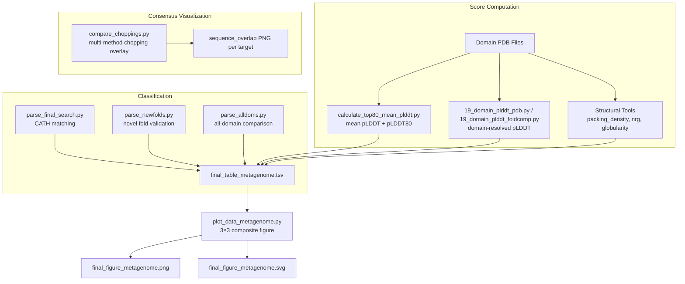

This page documents the visualization layer that turns raw structural quality metrics into publication-ready figures for the AFDB–ESM metagenome novel fold analysis. The pipeline operates in two stages: first, per-domain quality metrics are computed from PDB structures (pLDDT, pLDDT80, packing density, globularity); then, a composite 3×3 figure panel summarizes the entire dataset's structural integrity. An auxiliary chopping-comparison tool provides visual domain boundary consensus across multiple prediction methods.

## Data Flow Architecture

The visualization system draws from two upstream data streams — computed quality scores from domain PDBs, and classification results from alignment filtering — which converge into a single summary TSV consumed by the plotting script.



## pLDDT Score Computation

Three scripts extract per-residue confidence (pLDDT) from PDB files, each operating at a different granularity and source format.

### Whole-structure and top-80% pLDDT

`calculate_top80_mean_plddt.py` iterates over all `.pdb` files in a directory, reads the B-factor column (PDB columns 61–66) from every `CA` atom line, and produces two aggregate scores per domain. The **mean pLDDT** is a simple arithmetic average across all CA atoms. The **mean pLDDT80** discards the lowest 20% of per-residue scores (after sorting) and averages the remaining 80%, providing a more robust measure that down-weights poorly predicted terminal or loop regions. The sort-and-trim logic at [lines 16–18](novel_fold_analyses/calculate_top80_mean_plddt.py#L16-L18) implements this as `idx20 = len(plddts) // 5` followed by `sum(plddts[idx20:]) / (len(plddts) - idx20)`.

Sources: [calculate_top80_mean_plddt.py](novel_fold_analyses/calculate_top80_mean_plddt.py#L8-L21)

### Domain-resolved pLDDT from PDB files

`19_domain_plddt_pdb.py` takes a domain boundary table (TSV with `entry` and `domain` columns where domain boundaries are comma-delimited triplets of `start,end,...`), applies the external `calculate_avg_bfactor` function to each residue range within the PDB file, and outputs a per-entry domain pLDDT. The domain string is parsed in segments of three at [lines 22–24](prediction/TED_novel_domains/19_domain_plddt_pdb.py#L22-L24), accumulating a length-weighted pLDDT sum across all segments of a multi-segment domain.

Sources: [19_domain_plddt_pdb.py](prediction/TED_novel_domains/19_domain_plddt_pdb.py#L17-L30)

### Domain-resolved pLDDT from Foldcomp databases

`19_domain_plddt_foldcomp.py` performs the same domain-resolved pLDDT calculation but reads structures directly from a Foldcomp compressed database rather than individual PDB files. It traverses the Foldcomp database via `foldcomp.open()`, parses each entry with BioPython's `PDBParser`, and delegates the B-factor extraction to `calculate_avg_bfactor_from_parser` at [line 39](prediction/TED_novel_domains/19_domain_plddt_foldcomp.py#L39). This is the production-scale variant used when operating against the AFDB or ESMFold databases without decompressing them to disk.

Sources: [19_domain_plddt_foldcomp.py](prediction/TED_novel_domains/19_domain_plddt_foldcomp.py#L25-L43)

### Average whole-structure pLDDT

`19_plddt.py` provides the simplest variant: it reads all `ATOM` records (not just `CA`) from each PDB file in a directory, extracts pLDDT from columns 60–66, and writes a tab-separated file of `<filename>\t<avg_plddt>`. This differs from `calculate_top80_mean_plddt.py` in two ways — it includes all atom types and does not compute the trimmed top-80% metric.

Sources: [19_plddt.py](prediction/TED_novel_domains/19_plddt.py#L4-L17)

## The Composite Figure Panel: `plot_data_metagenome.py`

The central visualization artifact is a single 3×3 figure (18×18 inches at 300 DPI) generated by `plot_data_metagenome.py`. It reads `final_table_metagenome.tsv`, a pre-assembled table that joins structural quality scores with classification outcomes. The script uses a consistent two-color palette (`#348ABD` blue and `#A60628` red) across pie charts, and Seaborn's `"tab10"` palette for classification-hued plots.

### Row 1 — Binary quality distributions (pie charts)

The top row provides at-a-glance proportions for three quality gates:

| Panel | Metric | Threshold | Meaning |
|-------|--------|-----------|---------|
| (0,0) | pLDDT | 70 | Standard AF2 confidence cutoff; entries below 70 are considered low-confidence |
| (0,1) | Secondary Structure Elements | 6 | `num_helix_strand` < 6 suggests the domain lacks a stable secondary structure scaffold |
| (0,2) | Globularity | G / NG | Classifies domains as Globular (G) vs Non-Globular (NG) |

Each pie chart applies a lambda to bin entries above/below the threshold, then counts with `value_counts()` — see [lines 19–36](novel_fold_analyses/plot_data_metagenome.py#L19-L36).

### Row 2 — Score distributions by classification

The middle row drills into score distributions, stratified by classification outcome:

- **(1,0) pLDDT histogram**: Kernel density estimate (KDE) overlay showing how pLDDT distributes separately for `CATH_MATCH` and `NO_CATH_MATCH` entries, using 30 bins at [line 39](novel_fold_analyses/plot_data_metagenome.py#L39).
- **(1,1) pLDDT80 histogram**: Same structure but for the trimmed top-80% metric, which should show a right-shifted distribution relative to full pLDDT.
- **(1,2) Classification bar chart**: Log-scaled bar plot of raw classification categories (not just the binary grouping), with 45° rotated labels at [lines 55–70](novel_fold_analyses/plot_data_metagenome.py#L55-L70). This reveals the relative abundance of each classification tier in the dataset.

The classification grouping applied for histograms collapses all categories into a binary `CATH_MATCH` vs `NO_CATH_MATCH` at [lines 7–9](novel_fold_analyses/plot_data_metagenome.py#L7-L9), while the bar chart preserves the original multi-class labels.

### Row 3 — Structural geometry and consensus quality

The bottom row correlates quality metrics against domain properties:

- **(2,0) pLDDT vs domain length (hexbin)**: A density hexbin plot with `gridsize=50` and viridis colormap at [lines 73–79](novel_fold_analyses/plot_data_metagenome.py#L73-L79), revealing whether shorter or longer domains tend to have higher confidence. The color bar encodes data density.
- **(2,1) pLDDT by consensus (box plot)**: A Seaborn box plot at [line 89](novel_fold_analyses/plot_data_metagenome.py#L89) showing how well different consensus levels (from multi-method domain boundary agreement) correlate with prediction confidence.
- **(2,2) Packing density vs normed radius of gyration**: A scatter plot at [lines 95–105](novel_fold_analyses/plot_data_metagenome.py#L95-L105) with two reference lines — a vertical dashed blue line at NRG = 0.356 and a horizontal dashed red line at PD = 10.333 — that demarcate expected ranges for well-folded globular domains. Each classification category is colored separately with `palette="tab10"` and small dot size (`s=5`) to handle overlapping points.

Sources: [plot_data_metagenome.py](novel_fold_analyses/plot_data_metagenome.py#L1-L125)

> [!TIP]
> The reference lines in the packing density scatter (NRG = 0.356, PD = 10.333) at [lines 108–109](novel_fold_analyses/plot_data_metagenome.py#L108-L109) serve as empirically derived thresholds for globularity. Domains falling to the upper-left of both lines are likely compact globular folds, while those in the lower-right may represent non-globular or disordered predictions. When interpreting this panel, focus on the quadrant classification relative to these two lines rather than individual point positions.

### Output format

The figure is exported in both raster and vector formats at [lines 124–125](novel_fold_analyses/plot_data_metagenome.py#L124-L125): `final_figure_metagenome.png` (300 DPI, for presentations and quick review) and `final_figure_metagenome.svg` (vector, for publication submission and post-editing).

## Domain Boundary Consensus Visualization

`compare_choppings.py` provides an orthogonal visualization focused on **how well multiple domain prediction methods agree on boundary positions**, rather than on structural quality scores. This is a critical input to the consensus filtering described in [Domain Filtering and Consensus](5-domain-filtering-and-consensus).

### How it works

The script accepts an arbitrary number of chopping files (from tools like Merizo, Chainsaw, UniDoc, and CRH), each in a 6-field TSV format (`target, md5, nres, ndom, chopping, score`). For each target protein found across all files, it:

1. Parses each method's domain string into `(index, start, end)` ranges via `domstr_to_ranges` at [line 98](novel_fold_analyses/compare_choppings.py#L98).
2. Computes a three-level consensus (high, medium, low agreement) using `calculate_domain_consensus` at [line 104](novel_fold_analyses/compare_choppings.py#L104).
3. Renders a sequence-overlap visualization where each method occupies one horizontal lane, with domain segments colored by domain index from a 16-color palette defined at [lines 31–36](novel_fold_analyses/compare_choppings.py#L31-L36).

### Visual encoding

Each lane in the output PNG consists of a gray backbone line spanning residues 1 to N, overlaid with colored segments for predicted domains. The color palette assigns consistent colors by domain index modulo 16, enabling visual tracking of which domains are shared across methods. The consensus levels are stored in `consensus_chopping.out` at [lines 108–111](novel_fold_analyses/compare_choppings.py#L108-L111) for downstream filtering but are currently commented out from the visual rendering (lines 152–177).

Sources: [compare_choppings.py](novel_fold_analyses/compare_choppings.py#L42-L183)

> [!TIP]
> The commented-out consensus visualization blocks (lines 152–177 in `compare_choppings.py`) would add three additional lanes below the method lanes showing high (green), medium (orange), and low (red) consensus boundaries. Uncommenting these lines and restoring the `ax4` subplot would enable direct visual comparison of method-level disagreement against the computed consensus — useful during iterative parameter tuning of consensus thresholds.

## Input Data Schema

The `final_table_metagenome.tsv` file consumed by the plotting script is expected to contain at minimum the following columns:

| Column | Type | Description |
|--------|------|-------------|
| `pLDDT` | float | Whole-domain mean pLDDT from `calculate_top80_mean_plddt.py` |
| `pLDDT80` | float | Trimmed top-80% mean pLDDT |
| `length` | int | Domain residue count |
| `num_helix_strand` | int | Count of helix and strand secondary structure elements |
| `globularity` | str | `G` (globular) or `NG` (non-globular) |
| `classification` | str | Classification category (e.g., `CATH_MATCH`, `NO_CATH_MATCH`, or finer-grained labels) |
| `consensus` | str | Domain boundary consensus level |
| `nrg` | float | Normalized radius of gyration |
| `packing_density` | float | Packing density metric |

This table is assembled from the outputs of the filtering scripts (`parse_final_search.py`, `parse_newfolds.py`, `parse_alldoms.py`) merged with structural metrics computed during the chopping and prediction stages.

## Running the Visualization

The plotting script has no command-line arguments and operates on a fixed input filename. To generate the composite figure:

```bash
cd novel_fold_analyses/
python plot_data_metagenome.py
# Produces: final_figure_metagenome.png, final_figure_metagenome.svg
```

For the chopping consensus visualization, the invocation requires at least two chopping files and an output directory:

```bash
python compare_choppings.py \
  -c merizo.out chainsaw.out unidoc.out crh.fix.out \
  -o comparison_output/ \
  -s 5 \
  -lw 10
```

| Parameter | Flag | Default | Description |
|-----------|------|---------|-------------|
| Chopping files | `-c` | (required) | Space-separated list of chopping TSV files |
| Output directory | `-o` | (required) | Directory for per-target PNGs and consensus output |
| Image size | `-s` | 5 | Figure size in centimeters per dimension |
| Line width | `-lw` | 10 | Pixel width of domain boundary lines |

Sources: [compare_choppings.py](novel_fold_analyses/compare_choppings.py#L57-L66), [plot_data_metagenome.py](novel_fold_analyses/plot_data_metagenome.py#L1-L125)

## Relationship to Upstream and Downstream Pages

The quality metrics visualized here originate from two upstream stages: the domain extraction and chopping process documented in [Structure Chopping and PDB Extraction](6-structure-chopping-and-pdb-extraction) produces the PDB files from which pLDDT scores are computed, while the classification filtering described in [Novel Fold Validation via Alignment Filtering](7-novel-fold-validation-via-alignment-filtering) provides the `classification` column. The consensus-level analysis in `compare_choppings.py` feeds directly into the consensus filtering logic in [Domain Filtering and Consensus](5-domain-filtering-and-consensus). For the broader reproducible visualization framework including multidomain and taxonomy figures, see [Reproducible Visualization Notebooks](18-reproducible-visualization-notebooks).