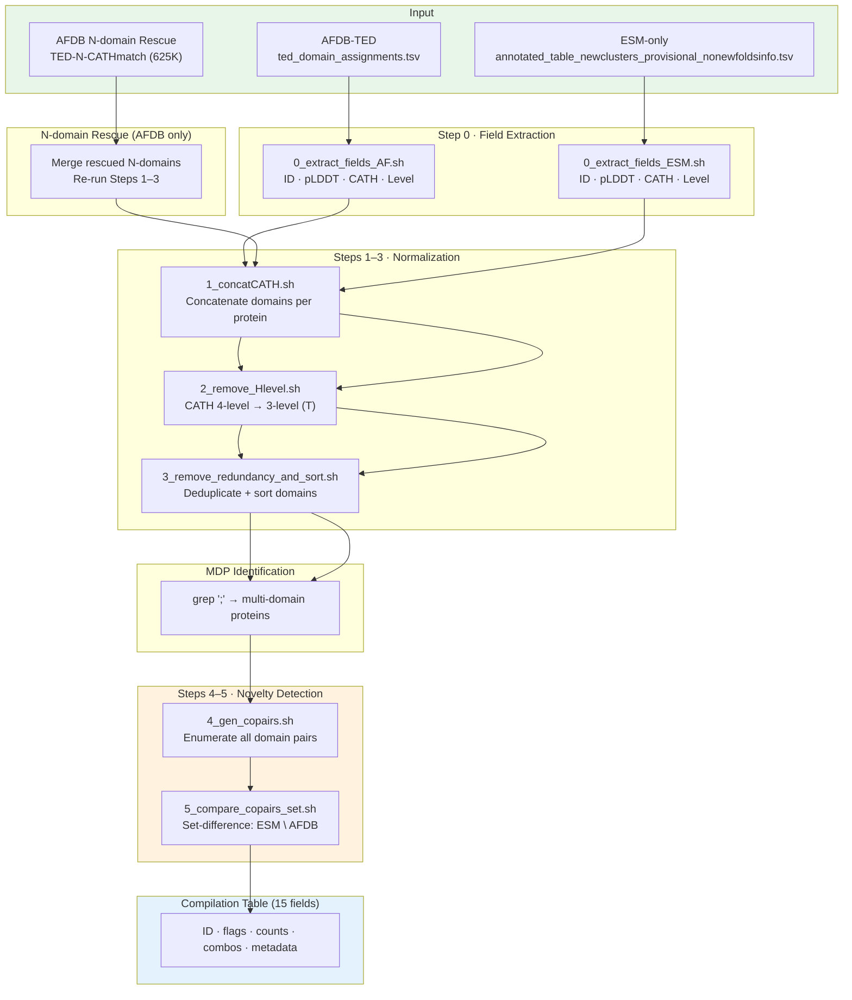

Multidomain proteins (MDPs) are proteins harboring two or more structurally distinct domains within a single polypeptide chain. This pipeline extracts MDPs from two complementary structure prediction databases — **AlphaFold DB (AFDB)** via the TED domain annotation, and **ESM Metagenomic Atlas (ESM)** via Foldseek-based CATH assignments — then identifies *novel* domain combinations present exclusively in the metagenomic (ESM) set. The final output is a 15-field compilation table for every ESM-only representative sequence, enriched with novelty flags, domain counts, and cluster membership metadata. The entire workflow is orchestrated from a single entry point: [main.sh](multidomain_analysis/extract_novel_combination/main.sh#L1-L438).

Sources: [main.sh](multidomain_analysis/extract_novel_combination/main.sh#L1-L14)

## Pipeline Architecture Overview

The pipeline follows a symmetric fork-join architecture: AFDB and ESM data are processed through nearly identical field-extraction → concatenation → topology-level normalization → redundancy removal steps, then intersected via a co-pair set-difference operation. An optional N-domain rescue stage supplements AFDB with Foldseek-search-recovered domains before the comparison.



## Input Data Sources

The pipeline consumes two distinct data formats, each representing domain-level structural annotations at the protein level.

| Source | Input File | Format | Domains (raw) |
|--------|-----------|--------|--------------|
| **AFDB-TED** | `ted_domain_assignments.tsv` | TED domain parser output with foldclass field | ~215M domain assignments |
| **AFDB N-domain Rescue** | `TED-N-CATHmatch-id_num_CATuniq-concat-sorted.tsv` | Foldseek search results for 625K unannotated domains | 625K rescued entries |
| **ESM-only** | `annotated_table_newclusters_provisional_nonewfoldsinfo.tsv` | Foldseek CATH assignments with globularity flag | ~5.1M domain assignments |

Sources: [main.sh](multidomain_analysis/extract_novel_combination/main.sh#L7-L14), [main.sh](multidomain_analysis/extract_novel_combination/main.sh#L50-L53), [main.sh](multidomain_analysis/extract_novel_combination/main.sh#L119-L126)

## Step 0 — Field Extraction

Each database requires a dedicated field-extraction script because the input formats differ fundamentally. Both scripts produce a common 4-column tab-separated output: **protein ID**, **domain number**, **CATH code**, and **CATH assignment level** (`T`, `H`, `N`, or `-`).

### AFDB-TED Extraction ([0_extract_fields_AF.sh](multidomain_analysis/extract_novel_combination/0_extract_fields_AF.sh#L1-L25))

The AFDB source uses a special format where the TED domain identifier is embedded within the protein ID (e.g., `MGYP00123_TED4_v1`). The script handles two cases depending on whether the foldclass field contains a comma-separated pair (`foldseek,foldclass`) or a simple value. The domain identifier is split from the protein ID by replacing `_TED` with a tab delimiter, yielding separate protein ID and domain-number columns.

```bash
# Simplified logic: extract 4 fields, then split _TED from the ID
awk -F'\t' -v OFS='\t' '{
    if ($8 == "foldseek,foldclass") {
        split($6, b, ","); print $1, $4, b[2], $7
    } else { print $1, $4, $6, $7 }
}' "$input1" | awk '{ gsub(/_TED/, "\t"); print }'
```

Sources: [0_extract_fields_AF.sh](multidomain_analysis/extract_novel_combination/0_extract_fields_AF.sh#L10-L22)

### ESM-only Extraction ([0_extract_fields_ESM.sh](multidomain_analysis/extract_novel_combination/0_extract_fields_ESM.sh#L1-L19))

The ESM source embeds the domain number as an underscore-delimited suffix in the protein ID (e.g., `MGYP00123_4`). A simple `gsub(/_/, "\t")` splits this into ID and domain-number fields. Columns `$1`, `$4`, `$6`, `$7` map directly to ID, pLDDT, CATH code, and CATH level respectively.

```bash
awk -F'\t' -v OFS='\t' '{print $1, $4, $6, $7}' "$input1" | awk '{
    gsub(/_/, "\t"); print
}'
```

Sources: [0_extract_fields_ESM.sh](multidomain_analysis/extract_novel_combination/0_extract_fields_ESM.sh#L11-L18)

## Step 1 — CATH Domain Concatenation ([1_concatCATH.sh](multidomain_analysis/extract_novel_combination/1_concatCATH.sh#L1-L53))

Multiple domain rows for the same protein must be collapsed into a single row with semicolon-separated CATH codes. This script groups all domain assignments by protein ID (first field), concatenating the CATH codes (fourth field) with `;` delimiters while preserving insertion order.

The resulting two-column format (`ID\tCATH1;CATH2;...;CATHn`) is the canonical "combination" representation used throughout all downstream stages. For example, a protein with three CATH hits `3.40.50.300`, `1.10.10.10`, and `3.40.50.300` (duplicate) would produce:

```
MGYP00123  3.40.50.300;1.10.10.10;3.40.50.300
```

> [!TIP]
> The concatenation step preserves **order of appearance** and does **not** deduplicate. Deduplication is deferred to Step 3 (`3_remove_redundancy_and_sort.sh`), where sorting also produces a canonical form for set-comparison operations.

Sources: [1_concatCATH.sh](multidomain_analysis/extract_novel_combination/1_concatCATH.sh#L19-L41)

## Step 2 — CATH Level Truncation ([2_remove_Hlevel.sh](multidomain_analysis/extract_novel_combination/2_remove_Hlevel.sh#L1-L29))

For the novelty comparison, the pipeline operates at the **Topology (T)** level of the CATH hierarchy (3 levels: C.A.T) rather than the full Homologous Superfamily level (4 levels: C.A.T.H). This script truncates each 4-level CATH code to its first three components by splitting on `.` and rejoining.

For instance, `1.10.10.10;3.40.50.300` becomes `1.10.10;3.40.50`. The choice of T-level balances specificity (distinguishing structurally distinct topologies) with sensitivity (collapsing superfamilies within the same topology, avoiding false novel calls from sub-family resolution differences between databases).

Sources: [2_remove_Hlevel.sh](multidomain_analysis/extract_novel_combination/2_remove_Hlevel.sh#L13-L28)

## Step 3 — Redundancy Removal and Canonical Sorting ([3_remove_redundancy_and_sort.sh](multidomain_analysis/extract_novel_combination/3_remove_redundancy_and_sort.sh#L1-L37))

After concatenation and level truncation, a protein's domain list may contain duplicate topology codes (e.g., from repeated domain insertions). This script produces a **canonical representation** by: (1) removing duplicate CATH codes within each protein using an associative array, and (2) sorting the remaining codes alphabetically via GNU awk's `PROCINFO["sorted_in"]`.

```
# Before:  MGYP00123  3.40.50;1.10.10;3.40.50
# After:   MGYP00123  1.10.10;3.40.50
```

The alphabetical sort is critical — it ensures that the same set of domains always produces the same string representation regardless of input order, which is a prerequisite for reliable co-pair generation and set-difference operations in Steps 4–5.

Sources: [3_remove_redundancy_and_sort.sh](multidomain_analysis/extract_novel_combination/3_remove_redundancy_and_sort.sh#L6-L35)

## MDP Identification

A protein is classified as an MDP when its canonical domain combination string contains at least one semicolon, indicating two or more distinct topology-level domains. This is achieved with a simple `grep ";"` filter applied to the sorted, non-redundant combination file.

| Dataset | Total Proteins | MDPs (multi-domain) |
|---------|---------------|---------------------|
| AFDB-TED (original) | 143,511,353 | 51,431,676 |
| AFDB-TED (with N-domain rescue) | — | 51,431,676 + 252,516 rescued |
| ESM-only | 1,998,888 | 393,793 |

Sources: [main.sh](multidomain_analysis/extract_novel_combination/main.sh#L34-L38), [main.sh](multidomain_analysis/extract_novel_combination/main.sh#L89-L93), [main.sh](multidomain_analysis/extract_novel_combination/main.sh#L144-L148)

## N-domain Rescue (AFDB-Specific)

A significant number of AFDB domains receive only an `N`-level (Novel fold) or no CATH assignment from the TED annotation. The pipeline optionally rescues ~625K of these "good quality N domains" via a supplementary Foldseek search against the CATH database ([main.sh](multidomain_analysis/extract_novel_combination/main.sh#L40-L93)). The rescued entries are reformatted to match the standard 4-field schema (with `H` level assignment) and **appended** to the original AFDB domain file before re-running the concatenation → filtering → normalization pipeline.

A sanity-check step at [main.sh](multidomain_analysis/extract_novel_combination/main.sh#L100-L111) quantifies the rescue impact: 252,516 previously single-domain proteins became MDPs after rescue, and 77,439 existing MDPs gained additional domain types in their combination strings.

Sources: [main.sh](multidomain_analysis/extract_novel_combination/main.sh#L40-L111)

## Step 4 — Co-pair Generation ([4_gen_copairs.sh](multidomain_analysis/extract_novel_combination/4_gen_copairs.sh#L1-L34))

To compare domain combinations across databases, the pipeline decomposes each MDP's domain set into all possible **co-occurring pairs**. For a protein with domains `{A, B, C}` (already sorted), this generates three pairs: `A;B`, `A;C`, `B;C`. The output is a 3-column file: protein ID, full domain combination, and individual pair.

```
# Input:   MGYP00123  1.10.10;2.20.20;3.30.30
# Output:
#   MGYP00123  1.10.10;2.20.20;3.30.30  1.10.10;2.20.20
#   MGYP00123  1.10.10;2.20.20;3.30.30  1.10.10;3.30.30
#   MGYP00123  1.10.10;2.20.20;3.30.30  2.20.20;3.30.30
```

Because domains are pre-sorted, each pair is also in canonical (alphabetical) order, and the set of all pairs from both databases can be directly compared as string sets.

Sources: [4_gen_copairs.sh](multidomain_analysis/extract_novel_combination/4_gen_copairs.sh#L14-L32)

## Step 5 — Novel Co-pair Detection ([5_compare_copairs_set.sh](multidomain_analysis/extract_novel_combination/5_compare_copairs_set.sh#L1-L26))

This is the **core novelty detection step**. It computes the set difference between ESM co-pairs and AFDB co-pairs: any domain pair present in ESM but absent from AFDB is flagged as *novel*. The implementation loads all AFDB pair strings (column 3) into an associative array, then filters the ESM pairs against this lookup set.

The result identifies 11,941 unique ESM-only proteins containing at least one novel domain pair, which ultimately correspond to 5,203 MDPs with novel combinations (after H-level remapping), comprising 4,951 unique novel combination patterns and 5,134 novel co-occurring topology pairs.

Sources: [5_compare_copairs_set.sh](multidomain_analysis/extract_novel_combination/5_compare_copairs_set.sh#L9-L21), [main.sh](multidomain_analysis/extract_novel_combination/main.sh#L186-L202)

## H-level Remapping of Novel Combinations

Novelty is initially determined at the T-level (topology), but downstream analysis and publication require **H-level** (Homologous Superfamily) annotations with human-readable CATH names. The pipeline performs this remapping in two stages.

First, the ESM-only Globular + H-level dataset is used to generate H-level co-pairs, and T-level pairs are derived from them by truncating the fourth CATH component. These T-level pairs are then intersected with the previously identified novel co-pair set, effectively filtering for novel combinations and elevating them to H-level resolution ([main.sh](multidomain_analysis/extract_novel_combination/main.sh#L206-L267)).

Second, [7_mapping_CATHnames.sh](multidomain_analysis/extract_novel_combination/7_mapping_CATHnames.sh#L1-L45) joins the H-level CATH codes against a preprocessed CATH metadata file (`cath-names_modified.txt`) to produce human-readable descriptions for each novel pair.

Sources: [main.sh](multidomain_analysis/extract_novel_combination/main.sh#L206-L277), [7_mapping_CATHnames.sh](multidomain_analysis/extract_novel_combination/7_mapping_CATHnames.sh#L9-L38)

## Compilation Table Assembly

The pipeline's final output is a comprehensive 15-field table for all 3,213,408 ESM-only representative sequences. This table is assembled through a multi-stage awk pipeline that left-joins raw, T-level, H-level, and novel-pair data onto a unified ID index ([main.sh](multidomain_analysis/extract_novel_combination/main.sh#L281-L398)).

| Column | Field | Description |
|--------|-------|-------------|
| $1 | `ID` | MGYP metagenomic identifier |
| $2 | `isMDP` | 1 if nDomain > 1, else 0 |
| $3 | `hasTpair` | 1 if nTdomain ≥ 2, else 0 |
| $4 | `hasGHpair` | 1 if nGHdomain ≥ 2, else 0 |
| $5 | `isNovel` | 1 if protein has ESM-unique co-pair(s) |
| $6 | `nDomain` | Total domain count (raw, including `-` and duplicates) |
| $7 | `nTdomain` | Distinct topology-level domain count |
| $8 | `nGHdomain` | Distinct H-level Globular domain count |
| $9 | `nNovelGHPair` | Number of novel co-occurring H-level pairs (`&`-delimited) |
| $10 | `rawCombi` | Raw semicolon-delimited CATH combination |
| $11 | `Tcombi` | Sorted non-redundant topology combination |
| $12 | `GHcombi` | Sorted non-redundant H-level combination |
| $13 | `Concat_NovelGHpairs` | Concatenated novel H-level pairs (`&`-delimited) |
| $14 | `nMem` | Number of Foldseek cluster members (representative sequences) |
| $15 | `nAllMem` | Total number of sequences in the cluster (including non-representatives) |

The `nMem` and `nAllMem` fields are derived from external Foldseek clustering files ([main.sh](multidomain_analysis/extract_novel_combination/main.sh#L400-L437)), providing a proxy for the abundance and conservation of each MDP in the metagenomic data.

> [!TIP]
> The `isNovel` flag is set at the **protein level** — a protein is flagged if *any* of its domain co-pairs is novel. The actual number of novel pairs per protein is captured separately in `nNovelGHPair`, allowing downstream analysis to distinguish proteins with a single novel link from those with extensively novel architectures.

Sources: [main.sh](multidomain_analysis/extract_novel_combination/main.sh#L286-L398), [main.sh](multidomain_analysis/extract_novel_combination/main.sh#L400-L437)

## Script Reference Summary

| Script | Purpose | Input | Output |
|--------|---------|-------|--------|
| `0_extract_fields_AF.sh` | Parse TED domain assignments for AFDB | TED TSV | ID, dom#, CATH, level |
| `0_extract_fields_ESM.sh` | Parse CATH annotations for ESM | Annotated table | ID, dom#, CATH, level |
| `1_concatCATH.sh` | Group domains per protein | 4-field records | ID, `CATH1;CATH2;...` |
| `2_remove_Hlevel.sh` | Truncate CATH to T-level | ID, full CATH combo | ID, T-level combo |
| `3_remove_redundancy_and_sort.sh` | Deduplicate + sort domains | ID, unsorted combo | ID, canonical combo |
| `4_gen_copairs.sh` | Enumerate all domain pairs | MDPs with combos | ID, combo, individual pair |
| `5_compare_copairs_set.sh` | Set-difference: ESM − AFDB | AF pairs, ESM pairs | ESM-unique (novel) pairs |
| `6_concatCATHpairs.sh` | Aggregate pairs per protein | Novel pair records | ID, `pair1&pair2&...` |
| `7_mapping_CATHnames.sh` | Annotate with CATH names | Novel pairs + CATH metadata | ID, H-pairs, CATH names |

## Next Steps

- **[Novel Domain Combination Detection](10-novel-domain-combination-detection)** — builds directly on this pipeline's novel co-pair output to perform CATH over- and under-representation statistical testing.
- **[CATH Over- and Under-Representation Statistics](11-cath-over-and-under-representation-statistics)** — applies Fisher's exact and chi-squared tests to quantify the significance of novel domain co-occurrences.
- **[Taxonomic LCA and Universality Analysis](13-taxonomic-lca-and-universality-analysis)** — annotates the novel MDPs with taxonomic provenance to determine whether novel combinations are enriched in specific clades or biomes.
- **[Pipeline Architecture](4-pipeline-architecture)** — for the broader context of how MDP extraction fits within the complete AF-ESM analysis framework.