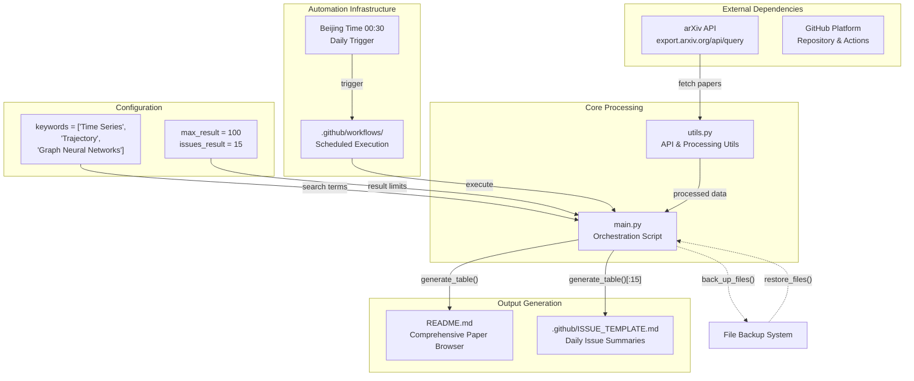
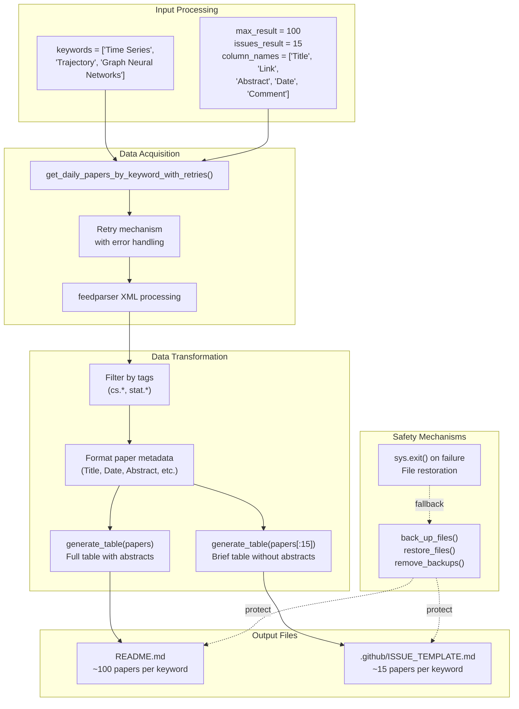
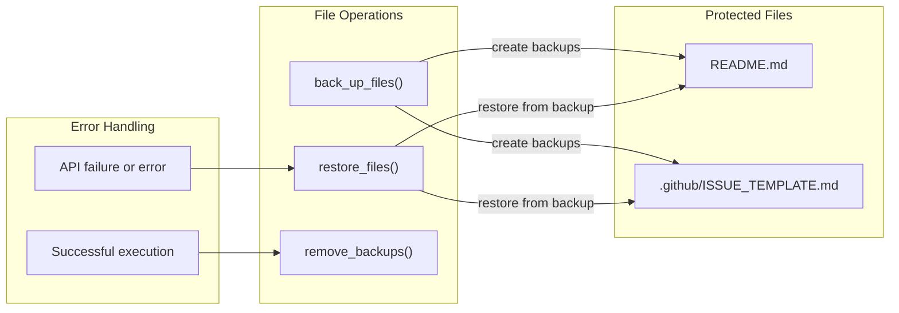

# Overview

<details>
<summary>Relevant source files</summary>

The following files were used as context for generating this wiki page:

- [.github/ISSUE_TEMPLATE.md](.github/ISSUE_TEMPLATE.md)
- [README.md](README.md)
- [main.py](main.py)

</details>


This document provides a high-level introduction to the DailyArXiv system, an automated research paper aggregation tool that fetches and organizes academic papers from arXiv based on predefined keywords. The system automatically generates two primary outputs: a comprehensive paper browser and daily notification summaries, all running on a scheduled automation pipeline.

For detailed information about the system's outputs and user interfaces, see [Output Formats & User Interfaces](#2). For technical implementation details, see [Core Implementation](#4). For automation and infrastructure, see [Automation & Infrastructure](#5).

## System Purpose and Architecture

The DailyArXiv system serves the research community by automatically collecting and organizing papers from three key domains: Time Series, Trajectory analysis, and Graph Neural Networks. The system operates entirely through GitHub's infrastructure, leveraging GitHub Actions for automation and GitHub Issues for notifications.

### High-Level System Architecture



**Sources:** [main.py:1-73](), [README.md:1-11](), [.github/ISSUE_TEMPLATE.md:1-7]()

### Data Processing Pipeline

The system follows a clear data pipeline that transforms arXiv API responses into formatted markdown tables:



**Sources:** [main.py:25-73](), [utils.py]() (referenced in imports)

## Key System Components

### Primary Keywords and Search Strategy

The system focuses on three research domains defined in [main.py:25]():

| Keyword | Search Logic | Purpose |
|---------|-------------|---------|
| `Time Series` | `OR` logic | Multi-word terms use OR between words |
| `Trajectory` | `AND` logic | Single words search title AND abstract |
| `Graph Neural Networks` | `OR` logic | Multi-word terms use OR between words |

The search logic is determined by [main.py:53-54]() where single words use `AND` logic while multi-word phrases use `OR` logic.

### Output Limits and Constraints

The system operates with two distinct output limits configured in [main.py:27-28]():

- **`max_result = 100`**: Maximum papers fetched from arXiv API per keyword for README.md
- **`issues_result = 15`**: Maximum papers included in GitHub issue templates

### File Management and Safety

The system implements a robust backup mechanism through three key functions:



**Sources:** [main.py:35](), [main.py:60](), [main.py:72]()

## Temporal Execution Pattern

The system operates on a strict daily schedule configured in the GitHub Actions workflow:

### Daily Execution Cycle

```mermaid
timeline
    title Daily Paper Aggregation Timeline (Beijing Time)
    
    section Pre-Execution
        00:00-00:29 : Quiet Period
                    : No system activity
    
    section Execution Window
        00:30 : Cron Trigger
              : GitHub Actions activation
              : Environment setup
        
        00:31-00:35 : Paper Collection
                    : get_daily_papers_by_keyword_with_retries()
                    : Process each keyword sequentially
                    : 5-second delays between keywords
        
        00:36-00:40 : Table Generation  
                    : generate_table() for README
                    : generate_table()[:15] for issues
                    : File writing operations
    
    section Post-Processing
        00:41+ : Cleanup & Notification
               : remove_backups()
               : Git commit and push
               : GitHub issue creation
```

The 5-second delay between keyword processing is implemented in [main.py:68]() to avoid being blocked by the arXiv API.

**Sources:** [main.py:68](), [main.py:15]() (Beijing timezone), GitHub Actions workflow (referenced in automation)

## Date Handling and Updates

The system uses Beijing timezone for all date operations and includes update tracking:

- **Current date calculation**: [main.py:15]() using `pytz.timezone('Asia/Shanghai')`
- **Last update tracking**: [main.py:17-21]() reads from existing README.md
- **Date formatting**: [main.py:40]() and [main.py:45]() for output files

The system writes the current date to both output files to track when the data was last refreshed, providing transparency to users about data freshness.

**Sources:** [main.py:10](), [main.py:15](), [main.py:40](), [main.py:45]()

---