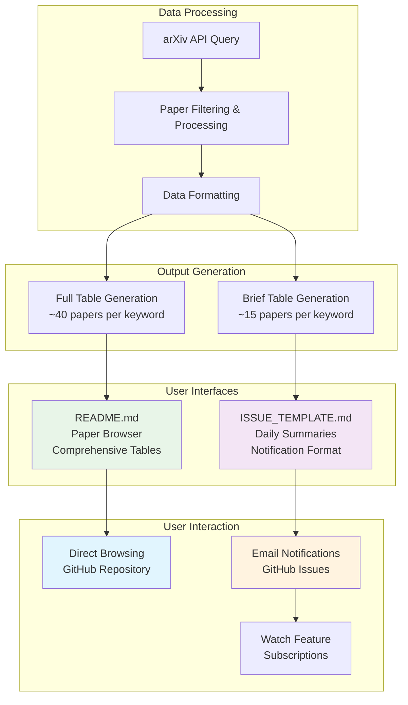
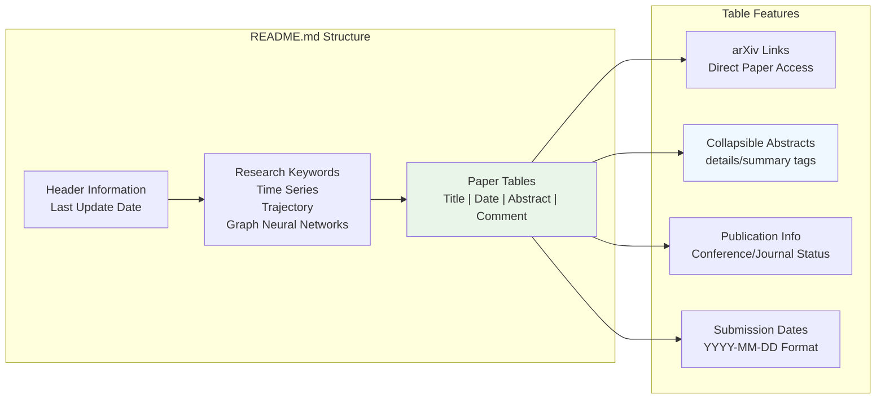
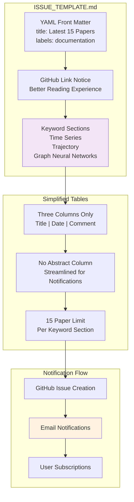
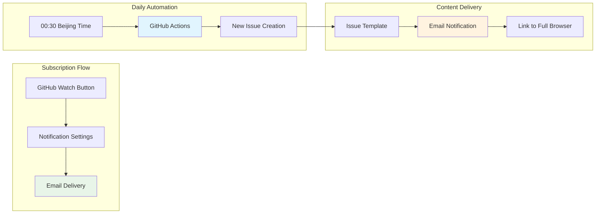

# Output Formats & User Interfaces

<details>
<summary>Relevant source files</summary>

The following files were used as context for generating this wiki page:

- [.github/ISSUE_TEMPLATE.md](.github/ISSUE_TEMPLATE.md)
- [README.md](README.md)

</details>


This page documents the two primary output interfaces of the DailyArXiv system and how users interact with them. The system generates dual formats optimized for different consumption patterns: a comprehensive paper browser for detailed exploration and condensed daily summaries for notifications.

For technical implementation details of the processing pipeline, see [Core Implementation](#4). For automation and infrastructure details, see [Automation & Infrastructure](#5).

## Overview

The DailyArXiv system implements a dual output strategy to serve different user needs with the same underlying data. This approach addresses the fundamental challenge of balancing comprehensive access with digestible notifications.

### Dual Output Architecture



Sources: [README.md:1-79](), [ISSUE_TEMPLATE.md:1-63]()

### Output Characteristics

| Characteristic | README.md Browser | ISSUE_TEMPLATE.md Summaries |
|---|---|---|
| **Paper Limit** | ~40 per keyword | ~15 per keyword |
| **Abstract Display** | Full abstracts in collapsible details | No abstracts |
| **Update Frequency** | Daily at 00:30 Beijing | Daily notifications |
| **Primary Use Case** | Research exploration | Quick updates |
| **User Access** | Direct repository browsing | Email subscriptions |

Sources: [README.md:6](), [ISSUE_TEMPLATE.md:2]()

## Paper Browser Interface (README.md)

The primary user interface is the `README.md` file, which serves as a comprehensive paper browsing experience directly within the GitHub repository.

### Table Structure and Organization

The browser organizes papers into keyword-based sections with consistent table formatting:



Sources: [README.md:10-79](), [README.md:13-14]()

### Interactive Elements

Each paper entry includes several interactive components:

- **Title Links**: Direct links to arXiv papers using format `http://arxiv.org/abs/{paper_id}`
- **Collapsible Abstracts**: HTML `<details>` and `<summary>` tags for space-efficient abstract display
- **Comment Information**: Publication status, page counts, and submission details

Example table entry structure from the live interface:
```markdown
| **[Paper Title](http://arxiv.org/abs/paper_id)** | YYYY-MM-DD | <details><summary>Show</summary><p>Abstract text...</p></details> | <details><summary>Info...</summary><p>Publication details</p></details> |
```

Sources: [README.md:15-25]()

### User Interaction Patterns

The README.md interface supports several user workflows:

1. **Sequential Browsing**: Users scan paper titles within their research areas
2. **Selective Reading**: Click-to-expand abstracts for papers of interest  
3. **Direct Access**: One-click navigation to full papers on arXiv
4. **Research Tracking**: Monitor daily updates through the repository

Sources: [README.md:8-9]()

## Daily Issue Template System

The `ISSUE_TEMPLATE.md` generates condensed summaries optimized for notification delivery through GitHub's issue system.

### Template Format and Structure



Sources: [ISSUE_TEMPLATE.md:1-4](), [ISSUE_TEMPLATE.md:8-9]()

### Notification Integration

The issue template integrates with GitHub's notification system:

- **YAML Front Matter**: Configures issue title with current date and applies `documentation` label
- **Email Integration**: Users can subscribe via GitHub's "Watch" feature for daily email delivery
- **Cross-Reference**: Includes link back to full repository for comprehensive browsing

Sources: [ISSUE_TEMPLATE.md:1-5]()

### Content Optimization

The template optimizes content for quick consumption:

- **Reduced Columns**: Excludes abstract column to minimize email length
- **Paper Limitation**: Shows only 15 most recent papers per keyword instead of 40
- **Streamlined Format**: Focuses on title, date, and publication status only

Example simplified table entry:
```markdown
| **[Paper Title](http://arxiv.org/abs/paper_id)** | YYYY-MM-DD | Publication info |
```

Sources: [ISSUE_TEMPLATE.md:8-43]()

## User Access Patterns

### Direct Repository Access

Users can access the paper browser through several pathways:

1. **GitHub Repository Browsing**: Direct navigation to `README.md` in the repository root
2. **Search Discovery**: GitHub's search functionality indexes paper titles and abstracts
3. **Bookmark Access**: Direct links to specific sections or the full repository

### Subscription-Based Notifications

The notification system enables automated updates:



Sources: [README.md:8](), [ISSUE_TEMPLATE.md:5]()

### Research Domain Focus

The system organizes content around three primary research areas:

- **Time Series**: Forecasting, analysis, and temporal modeling papers
- **Trajectory**: Path prediction, motion analysis, and spatial-temporal research  
- **Graph Neural Networks**: Graph-based learning, network analysis, and structural modeling

This domain-specific organization enables users to focus on their particular research interests while maintaining awareness of adjacent fields.

Sources: [README.md:12](), [ISSUE_TEMPLATE.md:7,26,45]()

---