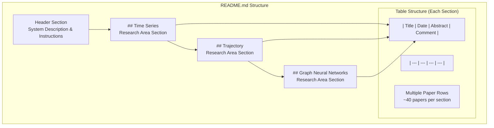
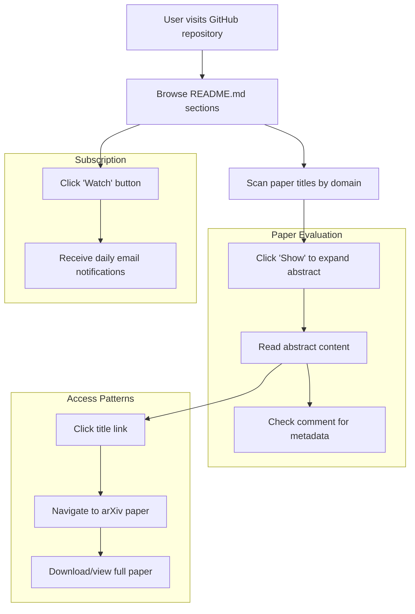
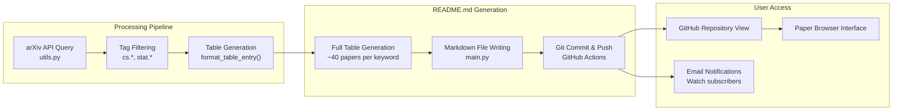

# Paper Browser (README.md)

<details>
<summary>Relevant source files</summary>

The following files were used as context for generating this wiki page:

- [README.md](README.md)

</details>


This document describes the primary user interface for browsing research papers collected by the DailyArXiv system. The README.md file serves as a comprehensive paper browser that displays organized tables of recently published papers from arXiv across multiple research domains.

For information about the condensed daily summaries sent as notifications, see [Daily Issue Templates](#2.2). For details about the underlying data collection and processing pipeline, see [Core Implementation](#4).

## Overview and Purpose

The README.md file functions as a static web interface accessible through the GitHub repository homepage. It provides users with an organized view of recently published research papers, automatically updated daily through the system's processing pipeline. The browser presents papers in a structured table format, enabling efficient discovery and access to relevant research across three primary domains: Time Series, Trajectory analysis, and Graph Neural Networks.

**Sources:** [README.md:1-11]()

## Table Structure and Organization

### Multi-Domain Layout

The paper browser organizes content into distinct sections based on research keywords, with each section containing its own dedicated table:



**Sources:** [README.md:12-150]()

### Table Column Design

Each paper entry contains four standardized columns with specific formatting:

| Column | Content Type | Format | Purpose |
|--------|--------------|--------|---------|
| `Title` | Paper title with arXiv link | `**[Title](arXiv_URL)**` | Primary identification and access |
| `Date` | Publication date | `YYYY-MM-DD` | Temporal organization |
| `Abstract` | Full paper abstract | `<details><summary>Show</summary><p>text</p></details>` | Detailed content preview |
| `Comment` | arXiv metadata | `<details><summary>Truncated</summary><p>text</p></details>` | Additional paper information |

**Sources:** [README.md:13-14](), [README.md:15-25]()

## User Interaction Patterns

### Discovery and Navigation Workflow



**Sources:** [README.md:8](), [README.md:15-25]()

### Content Accessibility Features

The browser implements collapsible content sections to manage information density:

- **Abstract Expansion**: Abstracts are collapsed by default with "Show" summary text, allowing users to selectively expand content of interest
- **Comment Truncation**: Long comments display truncated previews (e.g., "Accep...", "16 pa...") to maintain table readability
- **Direct arXiv Integration**: Title links provide immediate access to full papers on arXiv

**Sources:** [README.md:15-25]()

## Data Presentation Format

### Paper Entry Structure

Each paper entry follows a standardized markdown format generated by the processing pipeline:

```
|| **[Paper Title](http://arxiv.org/abs/paperID)** | YYYY-MM-DD | <details><summary>Show</summary><p>Abstract text</p></details> | <details><summary>Preview</summary><p>Comment text</p></details> |
```

### Content Limits and Filtering

The browser implements several content management strategies:

- **Volume Control**: Maximum of 100 papers retained per keyword section
- **Recency Focus**: Only the most recent articles are displayed
- **Quality Filtering**: Papers filtered by tag categories (cs.*, stat.*) during processing

**Sources:** [README.md:6](), system architecture diagrams

## Integration with Processing Pipeline

### Data Flow from Pipeline to Browser



**Sources:** System architecture diagrams, [main.py](), [utils.py]()

### Update Frequency and Versioning

The README.md file undergoes daily regeneration through the automated pipeline:

- **Schedule**: Updates occur daily at 00:30 Beijing time
- **Version Control**: Each update creates a new Git commit with timestamp
- **Last Update Tracking**: Header displays last update date for user reference

**Sources:** [README.md:10](), GitHub Actions workflow

## Technical Implementation Details

### Markdown Generation Process

The browser content is generated through a structured process within the main processing pipeline:

1. **Data Collection**: Papers fetched via `utils.py` arXiv API functions
2. **Table Assembly**: Full table generation with abstracts and comments included
3. **File Writing**: Complete README.md regeneration with new content
4. **Backup Management**: Safety mechanisms protect against data loss during updates

### Performance Characteristics

The static file approach provides several advantages:

- **Fast Load Times**: No server-side processing required for user access
- **High Availability**: Leverages GitHub's infrastructure reliability  
- **Offline Capability**: Content accessible without active API connections
- **SEO Optimization**: Static content easily indexed by search engines

**Sources:** [main.py](), [utils.py](), system architecture diagrams

---