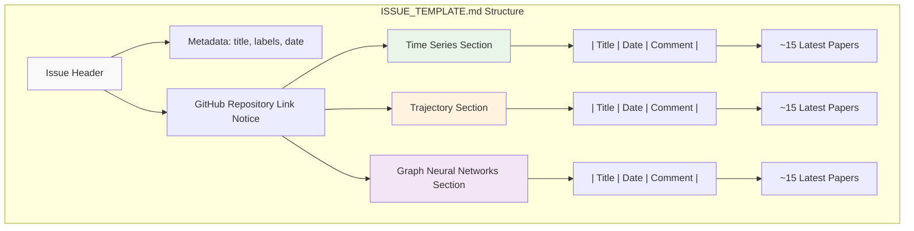
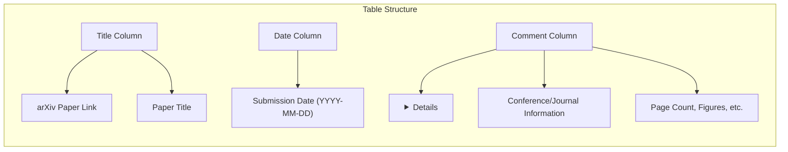
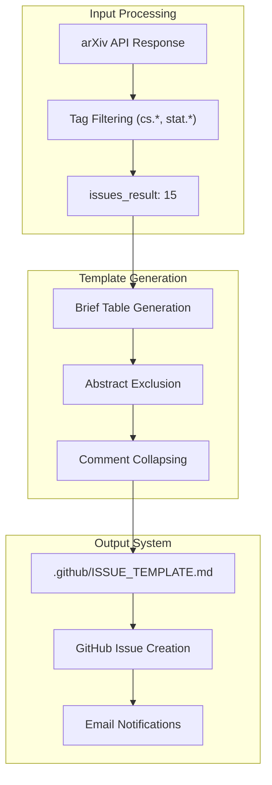
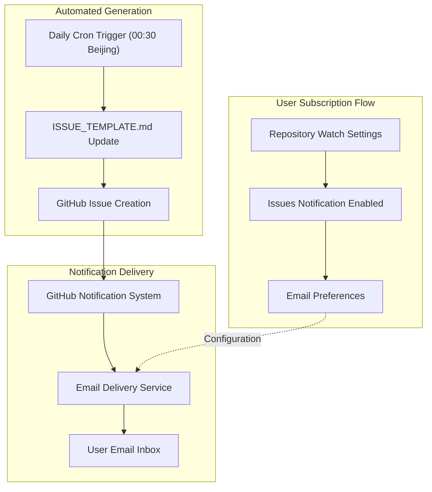

# Daily Issue Templates

<details>
<summary>Relevant source files</summary>

The following files were used as context for generating this wiki page:

- [.github/ISSUE_TEMPLATE.md](.github/ISSUE_TEMPLATE.md)

</details>


This page documents the GitHub issue template system used for daily paper summary notifications in the DailyArXiv system. The issue template provides a condensed view of the latest research papers, optimized for notifications and quick browsing. For comprehensive paper browsing with full abstracts and extended listings, see [Paper Browser (README.md)](#2.1).

## Purpose and Structure

The daily issue template serves as a notification mechanism that automatically creates GitHub issues containing a curated summary of the latest research papers. Unlike the comprehensive README format, the issue template is designed for:

- **Limited paper count**: Approximately 15 papers per research category
- **Notification delivery**: Integration with GitHub's watch/subscription system
- **Quick scanning**: Condensed format without full abstracts
- **Email distribution**: Automatic email notifications to subscribers

## Template Format and Organization

The issue template follows a structured markdown format organized into three primary research categories:



Sources: [.github/ISSUE_TEMPLATE.md:1-64]()

### Header Structure

The template begins with YAML front matter containing metadata:

| Field | Purpose | Example |
|-------|---------|---------|
| `title` | Issue title with date | "Latest 15 Papers - May 30, 2025" |
| `labels` | Issue categorization | "documentation" |

The header also includes a redirect notice pointing users to the main repository for enhanced reading experience and complete paper listings.

Sources: [.github/ISSUE_TEMPLATE.md:1-6]()

### Research Category Tables

Each research category contains a markdown table with three columns:



Sources: [.github/ISSUE_TEMPLATE.md:8-63]()

## Data Processing and Generation Pipeline

The issue template generation follows a streamlined process optimized for brevity and notification delivery:



Sources: [.github/ISSUE_TEMPLATE.md:1-64]()

### Key Differences from README Format

| Aspect | Issue Template | README Browser |
|--------|---------------|----------------|
| Paper Count | ~15 per category | ~40 per category |
| Abstracts | Excluded | Full abstracts included |
| Comments | Collapsible `<details>` tags | Full text display |
| Update Frequency | Daily via GitHub Issues | Daily via file commits |
| Notification Method | Email subscriptions | Repository watching |

## User Interaction and Notification Mechanisms

The issue template system integrates with GitHub's native notification infrastructure:



Sources: [.github/ISSUE_TEMPLATE.md:5-6]()

### Comment Formatting and Collapsible Content

The template uses HTML `<details>` tags to make lengthy comments collapsible, improving readability while preserving information:

```markdown
<details><summary>Accep...</summary><p>Accepted as a full paper at ICLR 2025 (top 5% of scores) in Singapore</p></details>
```

This approach allows users to:
- Quickly scan paper titles and dates
- Expand comments for additional context when needed
- Maintain clean visual formatting in email notifications

Sources: [.github/ISSUE_TEMPLATE.md:10-62]()

## Integration with GitHub Ecosystem

The issue template system leverages several GitHub features for seamless operation:

| GitHub Feature | Purpose | Implementation |
|---------------|---------|----------------|
| Issue Templates | Standardized formatting | `.github/ISSUE_TEMPLATE.md` |
| Issue Creation | Daily notifications | Automated via GitHub Actions |
| Watch System | User subscriptions | Native GitHub functionality |
| Email Integration | Notification delivery | GitHub's email service |
| Labels | Content categorization | `documentation` label |

The system creates a new issue daily, allowing users to receive consistent notifications while maintaining a searchable history of daily paper summaries.

Sources: [.github/ISSUE_TEMPLATE.md:1-4]()

---