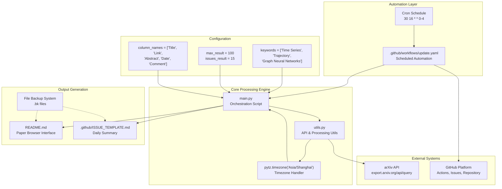
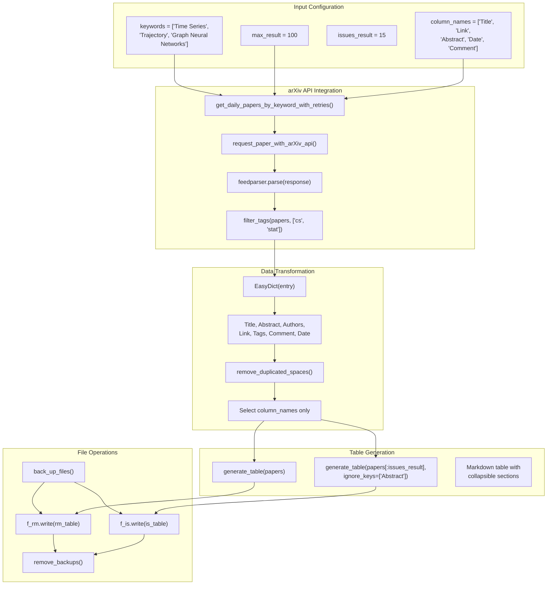
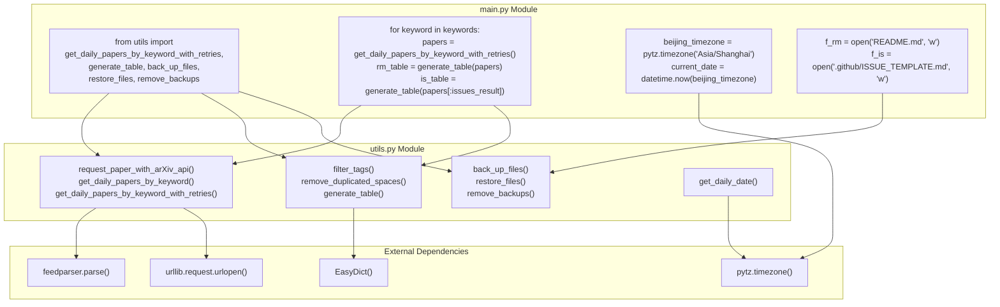
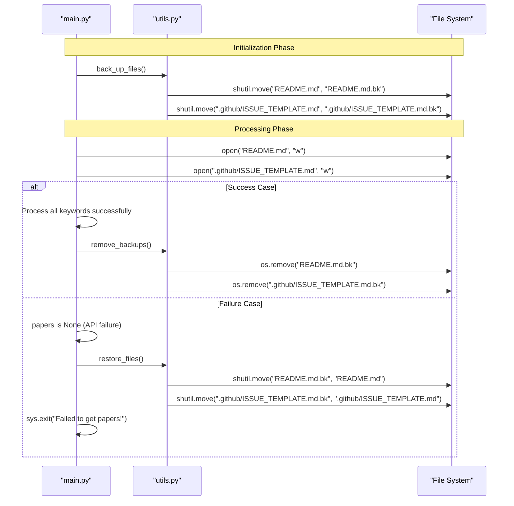

# System Architecture

Relevant source files

The following files were used as context for generating this wiki page:

- [.github/workflows/update.yaml](.github/workflows/update.yaml)
- [main.py](main.py)
- [utils.py](utils.py)

This document explains the technical architecture of the DailyArXiv system, covering how the core components interact, data flows through the processing pipeline, and how the automation infrastructure operates. For details about the specific output formats generated by this system, see [Output Formats & User Interfaces](#2). For implementation details of individual modules, see [Core Implementation](#4).

## Overall System Components

The DailyArXiv system follows a pipeline architecture with four primary layers: automation, processing, external integration, and output generation. The system is designed to run autonomously with minimal manual intervention.

### Core System Architecture

**Sources:** [main.py:1-73](), [utils.py:1-148](), [.github/workflows/update.yaml:1-48]()

## Data Processing Pipeline

The system implements a linear processing pipeline that transforms arXiv API responses into formatted markdown tables through several distinct stages.

### Processing Flow with Code Entities

**Sources:** [main.py:25-72](), [utils.py:16-78](), [utils.py:80-126]()

## Component Integration and Dependencies

The system's modules are tightly integrated through function calls and shared data structures. The `main.py` script orchestrates the entire process while `utils.py` provides specialized functionality.

### Module Interaction Map

**Sources:** [main.py:6-7](), [main.py:50-68](), [utils.py:9-11](), [utils.py:60-78]()

## Error Handling and Resilience Architecture

The system implements multiple layers of error handling to ensure reliable operation despite potential API failures or network issues.

| Component | Error Handling Mechanism | Implementation | Fallback Action |
|-----------|-------------------------|----------------|-----------------|
| **arXiv API Requests** | Retry with exponential backoff | `get_daily_papers_by_keyword_with_retries()` with 6 retries, 30-minute delays | System exit with error message |
| **Empty Response Detection** | Result validation | Check `len(papers) > 0` after each API call | Retry up to 6 times |
| **File Operations** | Backup and restore system | `back_up_files()`, `restore_files()` before critical operations | Restore original files on failure |
| **Rate Limiting** | Deliberate delays | `time.sleep(5)` between keyword queries | Prevent API blocking |
| **GitHub Actions** | Workflow-level error handling | Ubuntu container with Python 3.9 environment | Workflow failure notification |

**Sources:** [utils.py:60-68](), [main.py:56-61](), [main.py:68](), [utils.py:128-141]()

## File Management and Backup System

The system implements a robust file management strategy to prevent data loss during updates and provide recovery mechanisms.

### File Operation Flow

**Sources:** [main.py:35](), [main.py:56-61](), [main.py:72](), [utils.py:128-141]()

## Automation Infrastructure Integration

The system integrates with GitHub's automation infrastructure through GitHub Actions, providing scheduled execution and automated deployment.

### GitHub Actions Integration Points

| Integration Point | Configuration | Purpose |
|------------------|---------------|---------|
| **Scheduling** | `cron: '30 16 * * 0-4'` | Monday-Friday at 00:30 Beijing time |
| **Permissions** | `contents: write`, `issues: write` | Repository modification and issue creation |
| **Environment** | `ubuntu-latest`, `python-version: '3.9'` | Consistent execution environment |
| **Dependencies** | `pip install -r requirements.txt` | Runtime dependency management |
| **Execution** | `python main.py` | Primary script invocation |
| **Deployment** | `github-actions-x/commit@v2.9` | Automated commit and push |
| **Notification** | `JasonEtco/create-an-issue@v2` | User notification system |

The workflow commits changes to both `README.md` and `.github/ISSUE_TEMPLATE.md` files, maintaining the dual-output architecture that serves different user interaction patterns.

**Sources:** [.github/workflows/update.yaml:7-48]()

---