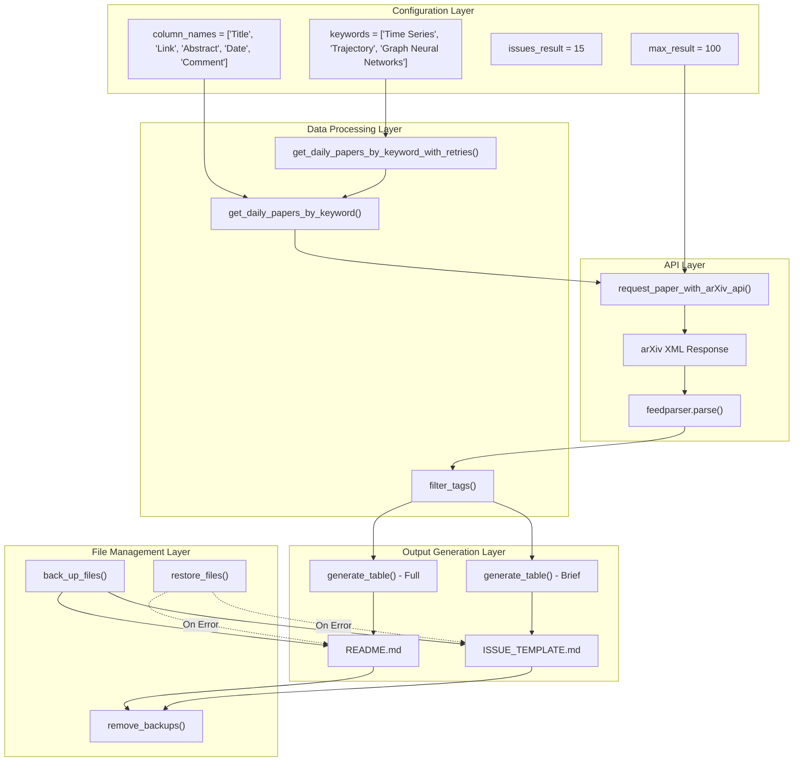
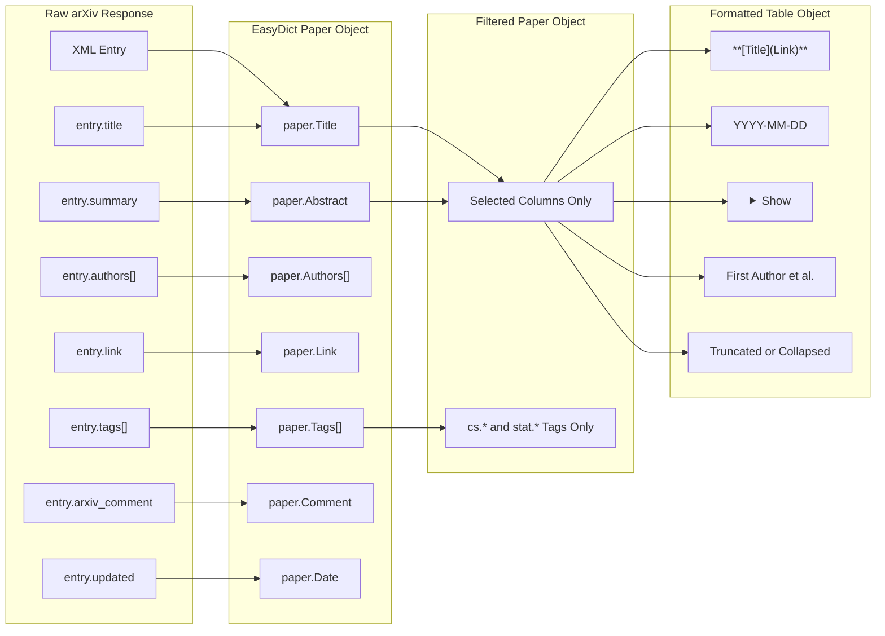
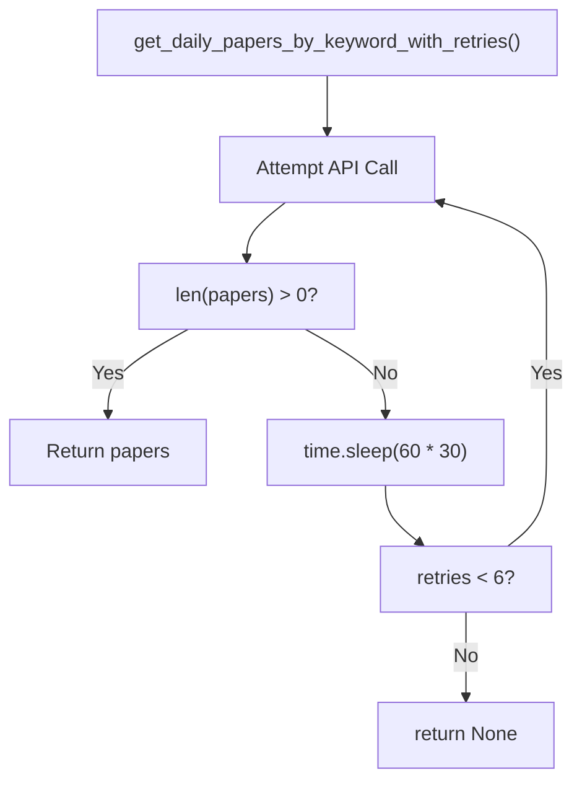
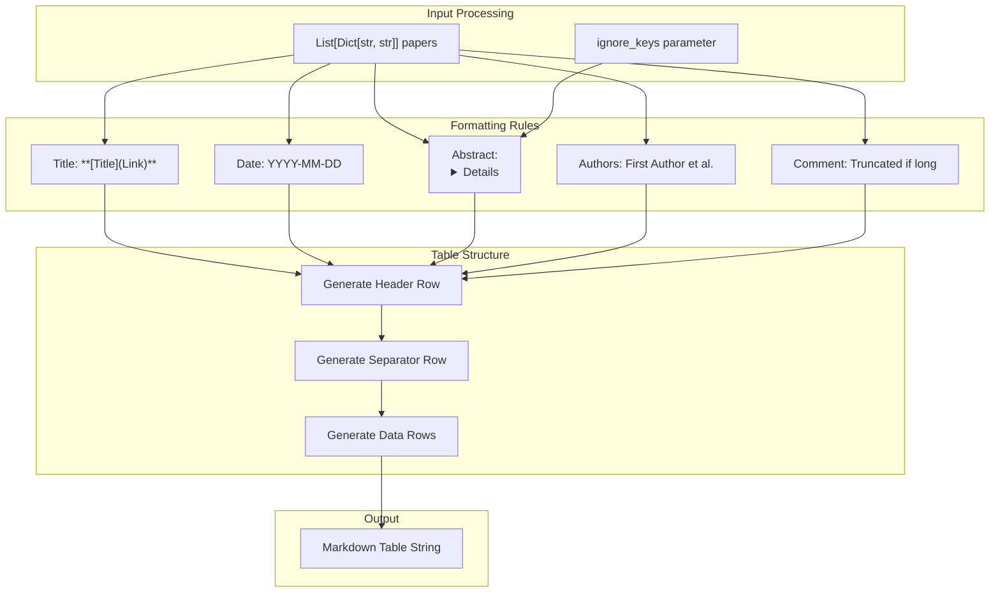

# Core Implementation

<details>
<summary>Relevant source files</summary>

The following files were used as context for generating this wiki page:

- [main.py](main.py)
- [utils.py](utils.py)

</details>


This document provides detailed technical documentation of the processing logic, API interactions, and data transformation pipeline that powers the DailyArXiv system. It covers the core implementation components that fetch, process, and format research papers from arXiv.

For specific details about the main orchestration workflow, see [Main Processing Pipeline](#4.1). For comprehensive coverage of utility functions and API integration patterns, see [Utility Functions & API Integration](#4.2). For higher-level system design, see [System Architecture](#3).

## Processing Architecture

The core implementation consists of two primary modules that work together to transform arXiv API responses into formatted markdown outputs. The system employs a pipeline architecture where data flows through distinct processing stages.

### Core Data Processing Pipeline



**Sources:** [main.py:25-28](), [main.py:33](), [main.py:55](), [main.py:62-63](), [utils.py:16](), [utils.py:49](), [utils.py:60](), [utils.py:70](), [utils.py:80]()

### Paper Data Structure Transformation

The system transforms raw arXiv API responses through multiple data structure conversions to produce the final markdown output.



**Sources:** [utils.py:27-46](), [utils.py:49-58](), [utils.py:77](), [utils.py:80-126]()

## API Integration Layer

### arXiv API Query Construction

The system constructs specialized queries for the arXiv API that search both titles and abstracts for specified keywords. The query logic uses different linking strategies based on keyword complexity.

| Parameter | Value | Purpose |
|-----------|-------|---------|
| `search_query` | `ti:"keyword"+OR/AND+abs:"keyword"` | Searches both title and abstract fields |
| `max_results` | 100 (configurable) | Limits results per query |
| `sortBy` | `lastUpdatedDate` | Ensures recent papers appear first |
| `link` | `OR` (multi-word) / `AND` (single-word) | Controls keyword matching strategy |

The URL construction in `request_paper_with_arXiv_api()` creates properly encoded queries:

**Sources:** [utils.py:16-23](), [main.py:53-54]()

### Response Processing and Error Handling

The system implements a robust retry mechanism to handle arXiv API inconsistencies. The `get_daily_papers_by_keyword_with_retries()` function provides automatic retry logic with exponential backoff.



**Sources:** [utils.py:60-68](), [main.py:56-61]()

## Data Filtering and Processing

### Tag-Based Filtering

The `filter_tags()` function implements subject area filtering to focus on computer science and statistics papers. It examines the tag prefix before the first dot to determine subject classification.

```python
# Filtering logic from utils.py:49-58
target_fields = ["cs", "stat"]  # Computer Science and Statistics
for tag in paper.Tags:
    if tag.split(".")[0] in target_fields:
        # Paper belongs to target subject area
        results.append(paper)
        break
```

**Sources:** [utils.py:49-58]()

### Column Selection and Data Cleaning

The system processes raw paper data through several cleaning operations:

| Function | Operation | Purpose |
|----------|-----------|---------|
| `remove_duplicated_spaces()` | Normalize whitespace | Clean up formatting inconsistencies |
| Column selection | Extract specified fields only | Reduce data to required columns |
| Date formatting | Convert ISO format to YYYY-MM-DD | Standardize date display |

**Sources:** [utils.py:13-14](), [utils.py:77](), [utils.py:89]()

## Output Generation Engine

### Markdown Table Generation

The `generate_table()` function converts processed paper data into markdown tables with specialized formatting for different content types. It handles dual output modes: full tables for README.md and brief tables for issue templates.



**Sources:** [utils.py:80-126](), [main.py:62-63]()

### File Management and Safety Mechanisms

The system implements a comprehensive backup and restore mechanism to ensure data integrity during file operations.

| Function | Purpose | Files Affected |
|----------|---------|----------------|
| `back_up_files()` | Create safety copies | README.md → README.md.bk<br/>ISSUE_TEMPLATE.md → ISSUE_TEMPLATE.md.bk |
| `restore_files()` | Rollback on error | Restore from .bk files |
| `remove_backups()` | Cleanup after success | Delete .bk files |

**Sources:** [utils.py:128-141](), [main.py:35](), [main.py:60](), [main.py:72]()

## Configuration and Parameters

The core implementation uses several key configuration parameters that control system behavior:

| Parameter | Location | Value | Impact |
|-----------|----------|-------|---------|
| `keywords` | [main.py:25]() | `["Time Series", "Trajectory", "Graph Neural Networks"]` | Determines search scope |
| `max_result` | [main.py:27]() | `100` | API query limit per keyword |
| `issues_result` | [main.py:28]() | `15` | Papers included in issue templates |
| `column_names` | [main.py:33]() | `["Title", "Link", "Abstract", "Date", "Comment"]` | Output table structure |
| `beijing_timezone` | [main.py:10]() | `Asia/Shanghai` | Timezone for date operations |

**Sources:** [main.py:25-33](), [main.py:10]()

---