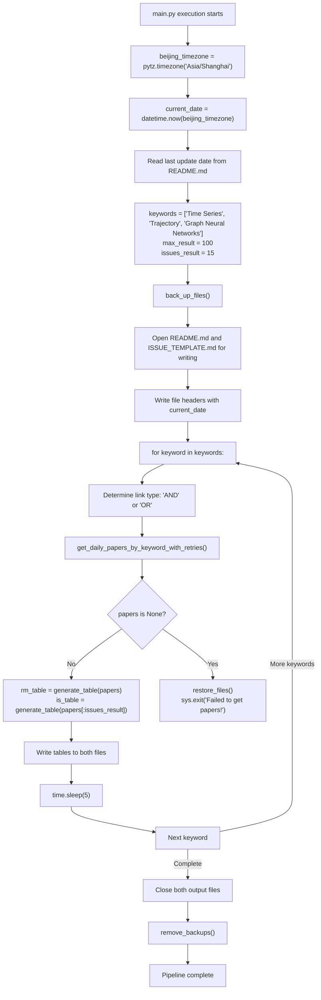
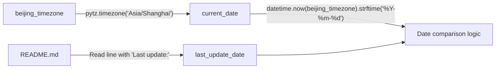
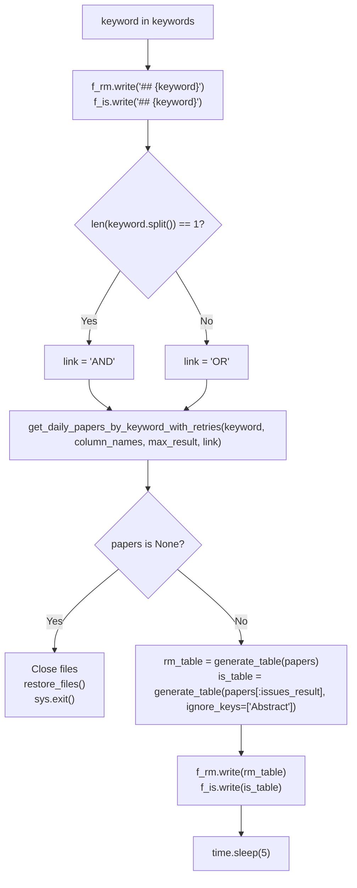
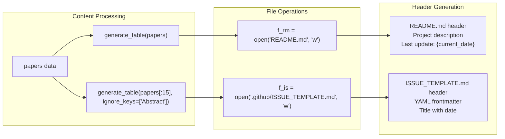
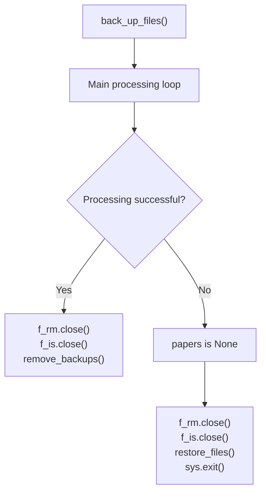

# Main Processing Pipeline

Relevant source files

The following files were used as context for generating this wiki page:

- [main.py](main.py)

## Purpose and Scope

This document covers the main orchestration script that coordinates the daily paper aggregation process. The pipeline is implemented in `main.py` and serves as the central controller that fetches papers, processes them, and generates output files. For detailed information about the utility functions and API integration used by this pipeline, see [Utility Functions & API Integration](#4.2). For information about the output formats produced by this pipeline, see [Output Formats & User Interfaces](#2).

The main processing pipeline handles:
- Daily execution coordination and date validation
- Sequential processing of research keywords
- Dual output generation for different user interfaces
- Error handling and file backup/restore operations
- Rate limiting and API interaction management

## Pipeline Overview

The main processing pipeline follows a sequential workflow that processes each keyword independently and generates two distinct output formats.

**Sources:** [main.py:1-73]()

## Initialization and Configuration

The pipeline begins with timezone configuration and parameter setup. The system operates on Beijing time to ensure consistent daily scheduling.

### Timezone and Date Handling

The date checking mechanism reads the last update date from the existing README.md file to prevent duplicate processing, though the check is currently commented out [main.py:22-23]().

### Keyword and Result Configuration

| Parameter | Value | Purpose |
|-----------|-------|---------|
| `keywords` | `["Time Series", "Trajectory", "Graph Neural Networks"]` | Research domains to search |
| `max_result` | `100` | Maximum papers per keyword for README.md |
| `issues_result` | `15` | Maximum papers per keyword for issue template |
| `column_names` | `["Title", "Link", "Abstract", "Date", "Comment"]` | Output table structure |

**Sources:** [main.py:10-34]()

## Main Processing Loop

The core processing logic iterates through each keyword and generates content for both output files simultaneously.

### Keyword Processing Flow

### Link Type Determination Logic

The system uses different search strategies based on keyword complexity:
- **Single word keywords**: Uses `AND` logic to search for papers containing the keyword in both title and abstract
- **Multi-word keywords**: Uses `OR` logic for broader matching

This logic is implemented in [main.py:53-54]().

**Sources:** [main.py:50-69]()

## Output Generation Strategy

The pipeline employs a dual-output strategy, generating two different views of the same data for different use cases.

### File Writing Process

### Output Differentiation

| Output File | Content Strategy | Paper Limit | Abstract Inclusion |
|-------------|------------------|-------------|-------------------|
| `README.md` | Comprehensive browsing | 100 per keyword | Yes |
| `ISSUE_TEMPLATE.md` | Daily notifications | 15 per keyword | No |

The README.md receives the full table with abstracts for detailed browsing, while the issue template gets a condensed version without abstracts for notification purposes [main.py:62-63]().

**Sources:** [main.py:37-48](), [main.py:62-67]()

## Error Handling and Backup System

The pipeline implements a comprehensive backup and restore mechanism to ensure data integrity during processing.

### Backup and Restore Flow

### Error Detection Points

The pipeline checks for failures at the API level:
- **Null response detection**: If `get_daily_papers_by_keyword_with_retries()` returns `None`, the pipeline immediately triggers error recovery
- **File state preservation**: Original README.md and ISSUE_TEMPLATE.md are restored from backups
- **Clean exit**: The process terminates with an error message to prevent incomplete updates

### Rate Limiting Strategy

To prevent API blocking, the pipeline includes a 5-second delay between keyword processing cycles [main.py:68]().

**Sources:** [main.py:35](), [main.py:56-61](), [main.py:70-72]()

## Function Integration Points

The main pipeline coordinates with utility functions from `utils.py`:

| Function Call | Purpose | Parameters |
|---------------|---------|------------|
| `get_daily_papers_by_keyword_with_retries()` | Fetch papers with retry logic | keyword, column_names, max_result, link |
| `generate_table()` | Convert papers to markdown table | papers, ignore_keys (optional) |
| `back_up_files()` | Create backup copies | None |
| `restore_files()` | Restore from backups on error | None |
| `remove_backups()` | Clean up backup files | None |
| `get_daily_date()` | Format date for issue title | None |

**Sources:** [main.py:6-7](), [main.py:45](), [main.py:55](), [main.py:62-63]()

---