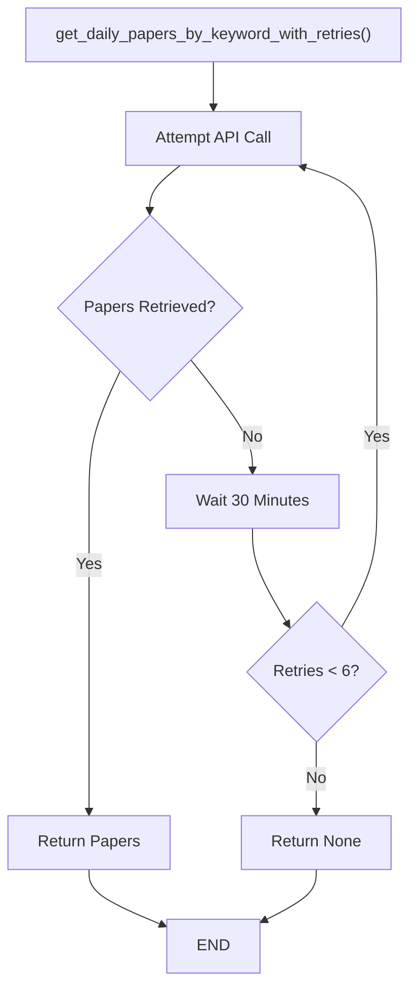
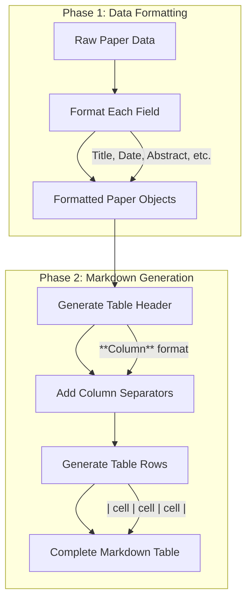
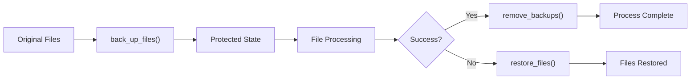

# Utility Functions & API Integration

<details>
<summary>Relevant source files</summary>

The following files were used as context for generating this wiki page:

- [utils.py](utils.py)

</details>


This document covers the `utils.py` module, which provides the core utility functions for arXiv API integration, data processing, table generation, and system operations. This module serves as the foundation layer that the main processing pipeline depends on for all external API interactions and data transformations.

For information about how these utilities are orchestrated together, see [Main Processing Pipeline](#4.1). For details about the automated scheduling that triggers these functions, see [GitHub Actions Workflow](#5.1).

## arXiv API Integration

The system's primary external dependency is the arXiv.org API, which provides access to research paper metadata. The API integration is built around a robust request-retry pattern designed for automated daily operations.

### Core API Functions

The `request_paper_with_arXiv_api()` function [utils.py:16-47]() forms the foundation of all paper retrieval operations. It constructs queries targeting both paper titles and abstracts using the arXiv export API format:

```
http://export.arxiv.org/api/query?search_query=ti:{keyword}+OR+abs:{keyword}&max_results={count}&sortBy=lastUpdatedDate
```

The function handles several critical aspects:
- URL encoding and special character safety [utils.py:21]()
- XML response parsing using `feedparser` [utils.py:23]()
- Data extraction into standardized paper objects [utils.py:25-46]()
- Text normalization via `remove_duplicated_spaces()` [utils.py:13-14]()

### Paper Data Structure

Each paper object contains the following standardized fields:
- **Title**: Cleaned paper title [utils.py:32]()
- **Abstract**: Full paper summary [utils.py:34]()
- **Authors**: List of author names [utils.py:36]()
- **Link**: Direct arXiv paper URL [utils.py:38]()
- **Tags**: arXiv subject classification tags [utils.py:40]()
- **Comment**: Optional metadata (pages, figures, etc.) [utils.py:42]()
- **Date**: Last updated timestamp [utils.py:44]()

### Retry Mechanism

The `get_daily_papers_by_keyword_with_retries()` function [utils.py:60-68]() implements a robust retry strategy to handle API failures:



**Sources:** [utils.py:60-68]()

## Data Processing Pipeline

The data processing layer transforms raw arXiv API responses into filtered, formatted datasets suitable for table generation.

### Tag Filtering System

The `filter_tags()` function [utils.py:49-58]() implements subject area filtering to focus on computer science and statistics papers:

| Filter Criteria | Implementation | Purpose |
|-----------------|----------------|---------|
| Computer Science | `cs.*` tags | Core ML/AI research |
| Statistics | `stat.*` tags | Statistical methods |
| Tag Matching | First part before `.` | Broad category filtering |

The filtering logic examines each paper's tags and includes papers with at least one matching subject area [utils.py:54-57]().

### Column Selection and Data Transformation

The `get_daily_papers_by_keyword()` function [utils.py:70-78]() orchestrates the complete data processing pipeline:


**Sources:** [utils.py:70-78]()

## Table Generation System

The `generate_table()` function [utils.py:80-126]() converts processed paper data into GitHub-flavored markdown tables with specialized formatting for different content types.

### Field-Specific Formatting Rules

| Field | Formatting Strategy | Implementation |
|-------|-------------------|----------------|
| **Title** | Bold markdown link | `**[title](url)**` [utils.py:87]() |
| **Date** | ISO date truncation | `YYYY-MM-DD` format [utils.py:89]() |
| **Abstract** | Collapsible details | `<details><summary>Show</summary>` [utils.py:97]() |
| **Authors** | First author + "et al." | Simplified attribution [utils.py:100]() |
| **Tags** | Truncated or collapsible | Context-sensitive display [utils.py:101-106]() |
| **Comment** | Conditional collapsible | Based on length [utils.py:107-113]() |

### Table Structure Generation

The table generation process follows a two-phase approach:



**Sources:** [utils.py:80-126]()

## File Management Utilities

The system includes robust file management functions to ensure data safety during the automated update process.

### Backup and Restore Operations

Three complementary functions handle file safety:

| Function | Purpose | Files Affected |
|----------|---------|----------------|
| `back_up_files()` | Create `.bk` copies | `README.md`, `ISSUE_TEMPLATE.md` [utils.py:128-131]() |
| `restore_files()` | Revert from backups | Restore original files [utils.py:133-136]() |
| `remove_backups()` | Clean up `.bk` files | Delete backup copies [utils.py:138-141]() |

### File Operation Flow



**Sources:** [utils.py:128-141]()

## Date and Time Utilities

The `get_daily_date()` function [utils.py:143-147]() provides timezone-aware date formatting specifically configured for Beijing time operations.

### Beijing Timezone Configuration

The system uses `pytz.timezone('Asia/Shanghai')` for consistent date formatting across all operations, ensuring that daily updates align with the intended schedule regardless of server location.

Output format: `"March 1, 2021"` - Human-readable date strings for display in generated content.

**Sources:** [utils.py:143-147]()

## External Dependencies and Integration Points

The utilities module integrates several external libraries to provide its functionality:

| Library | Purpose | Key Usage |
|---------|---------|-----------|
| `feedparser` | XML parsing | arXiv API response handling [utils.py:9,23]() |
| `pytz` | Timezone handling | Beijing time calculations [utils.py:3,145]() |
| `easydict` | Object notation | Simplified data access [utils.py:10,28,29]() |
| `urllib` | HTTP requests | arXiv API communication [utils.py:7,20-22]() |
| `shutil` | File operations | Backup/restore functionality [utils.py:4,130,131,135,136]() |

**Sources:** [utils.py:1-11]()

---