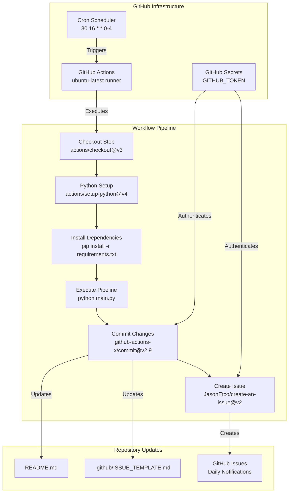
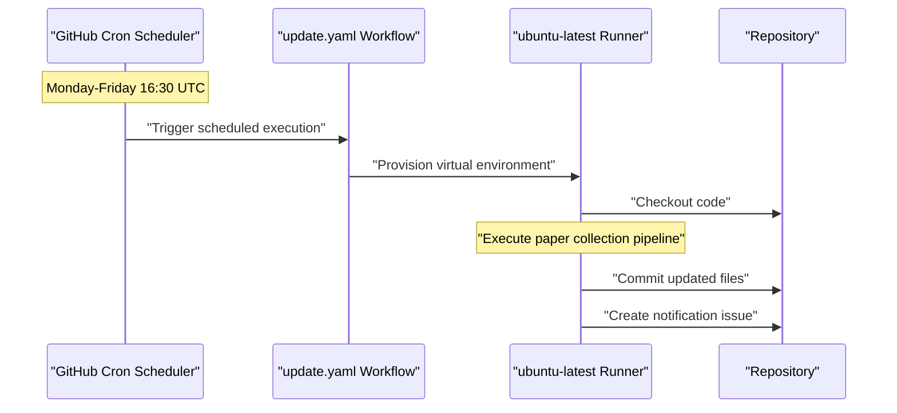
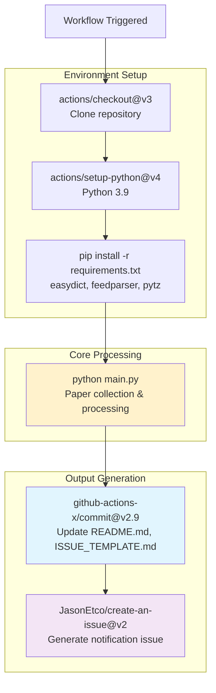
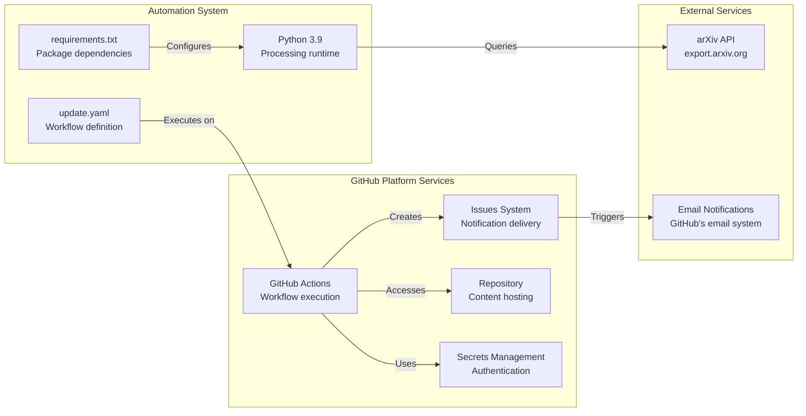

# Automation & Infrastructure

<details>
<summary>Relevant source files</summary>

The following files were used as context for generating this wiki page:

- [.github/workflows/update.yaml](.github/workflows/update.yaml)
- [requirements.txt](requirements.txt)

</details>


This section documents the automated systems that maintain the DailyArXiv paper aggregation service without manual intervention. It covers the GitHub Actions-based automation pipeline, scheduling mechanisms, and infrastructure dependencies that enable continuous operation. For detailed workflow implementation, see [GitHub Actions Workflow](#5.1). For system dependencies and configuration details, see [Dependencies & Configuration](#5.2).

## Automation Overview

The DailyArXiv system operates as a fully automated service using GitHub's native infrastructure. The automation consists of a scheduled workflow that executes the paper collection pipeline, updates repository content, and notifies users through GitHub's issue system.

### Core Automation Components

The automation infrastructure is built around several key components:

| Component | Purpose | Implementation |
|-----------|---------|----------------|
| **GitHub Actions Workflow** | Orchestrates daily execution | [`.github/workflows/update.yaml`]() |
| **Cron Scheduling** | Triggers execution at specific times | Line 8: `'30 16 * * 0-4'` |
| **Automated Commits** | Updates repository content | Uses `github-actions-x/commit@v2.9` |
| **Issue Creation** | Generates user notifications | Uses `JasonEtco/create-an-issue@v2` |
| **Environment Setup** | Configures Python runtime | Uses `actions/setup-python@v4` |

**Automation Architecture**


Sources: [`.github/workflows/update.yaml:1-48`]()

## Scheduling System

The system operates on a weekday schedule aligned with Beijing time zone, executing Monday through Friday at 00:30 Beijing time (16:30 UTC). This timing ensures fresh papers are available for the research community at the start of each workday.

### Schedule Configuration

The cron expression `'30 16 * * 0-4'` in [`.github/workflows/update.yaml:8`]() defines the execution schedule:

- **Minute**: 30
- **Hour**: 16 (UTC, equivalent to 00:30 Beijing time)  
- **Day of Month**: * (every day)
- **Month**: * (every month)
- **Day of Week**: 0-4 (Sunday through Thursday, accounting for timezone offset)

### Trigger Mechanisms

The workflow supports two trigger types defined in [`.github/workflows/update.yaml:3-8`]():

| Trigger Type | Purpose | Configuration |
|--------------|---------|---------------|
| **Schedule** | Production daily execution | `cron: '30 16 * * 0-4'` |
| **Label** | Testing and manual execution | `types: [created]` |

**Scheduling Flow**


Sources: [`.github/workflows/update.yaml:3-8`]()

## Workflow Pipeline

The automation pipeline executes as a sequence of coordinated steps, each with specific responsibilities and dependencies. The workflow runs on GitHub's `ubuntu-latest` runners with necessary permissions for content modification and issue creation.

### Pipeline Steps

**Step Execution Flow**


### Step Implementation Details

Each workflow step is implemented with specific GitHub Actions and configurations:

| Step | Action | Configuration | Purpose |
|------|--------|---------------|---------|
| **Repository Checkout** | `actions/checkout@v3` | Default settings | Clone latest repository state |
| **Python Environment** | `actions/setup-python@v4` | `python-version: '3.9'` | Setup consistent Python runtime |
| **Dependency Installation** | Native `pip` | `requirements.txt` | Install required packages |
| **Core Execution** | Native `python` | `main.py` | Execute paper collection pipeline |
| **Content Commit** | `github-actions-x/commit@v2.9` | Force add, specific files | Update repository content |
| **Issue Creation** | `JasonEtco/create-an-issue@v2` | Template-based | Generate user notifications |

### Authentication and Permissions

The workflow operates with GitHub token authentication defined in [`.github/workflows/update.yaml:10-12`]():

```yaml
permissions:
  contents: write
  issues: write
```

The `GITHUB_TOKEN` secret provides authentication for:
- Committing changes to the repository
- Creating GitHub issues for notifications
- Accessing repository metadata

Sources: [`.github/workflows/update.yaml:14-48`]()

## Infrastructure Dependencies

The system relies on minimal external dependencies to maintain reliability and reduce maintenance overhead. All dependencies are managed through GitHub's infrastructure and standard Python package management.

### Runtime Environment

The automation environment is standardized across executions:

| Component | Version/Specification | Source |
|-----------|----------------------|---------|
| **Operating System** | `ubuntu-latest` | GitHub Actions runner |
| **Python Runtime** | `3.9` | [`.github/workflows/update.yaml:24`]() |
| **Package Manager** | `pip` (default) | Standard Python installation |

### Python Dependencies

The system requires three core Python packages defined in [`requirements.txt:1-3`]():

| Package | Purpose | Usage in System |
|---------|---------|-----------------|
| **easydict** | Configuration management | Settings and parameter handling |
| **feedparser** | XML/RSS parsing | Processing arXiv API responses |
| **pytz** | Timezone handling | Beijing time calculations |

These dependencies are chosen for:
- **Minimal footprint**: Only essential libraries
- **Stability**: Well-established packages with infrequent breaking changes  
- **Functionality**: Core capabilities for API interaction and data processing

### GitHub Infrastructure Integration

The system leverages several GitHub platform features:

**Platform Integration Architecture**


Sources: [`.github/workflows/update.yaml:1-48`](), [`requirements.txt:1-3`]()

## Reliability and Error Handling

The automation infrastructure includes several mechanisms to ensure reliable operation and graceful handling of failures.

### Built-in Reliability Features

| Feature | Implementation | Purpose |
|---------|----------------|---------|
| **Atomic Operations** | GitHub Actions step isolation | Prevent partial updates |
| **Authentication Management** | `GITHUB_TOKEN` secrets | Secure, automatic credential handling |
| **Environment Consistency** | Fixed Python version, Ubuntu runner | Reproducible execution environment |
| **Selective File Updates** | `files: README.md .github/ISSUE_TEMPLATE.md` | Only update necessary content |

### Failure Recovery

The system handles common failure scenarios through GitHub Actions' native capabilities:

- **Network Issues**: GitHub Actions automatically retry failed API calls
- **Permission Errors**: Workflow permissions are explicitly defined and validated
- **Dependency Failures**: Package installation errors halt execution before data processing
- **Execution Failures**: Failed runs are logged and reported through GitHub's interface

### Monitoring and Observability

Execution status and errors are tracked through GitHub's built-in systems:

- **Workflow Run History**: Complete execution logs available in Actions tab
- **Commit History**: Automated commits show successful executions
- **Issue Creation**: Failed issue creation indicates notification problems
- **User Notifications**: Email delivery through GitHub's notification system

The system prioritizes **fail-fast** behavior - if any step fails, subsequent steps are not executed, preventing inconsistent repository states.

Sources: [`.github/workflows/update.yaml:10-48`]()

---