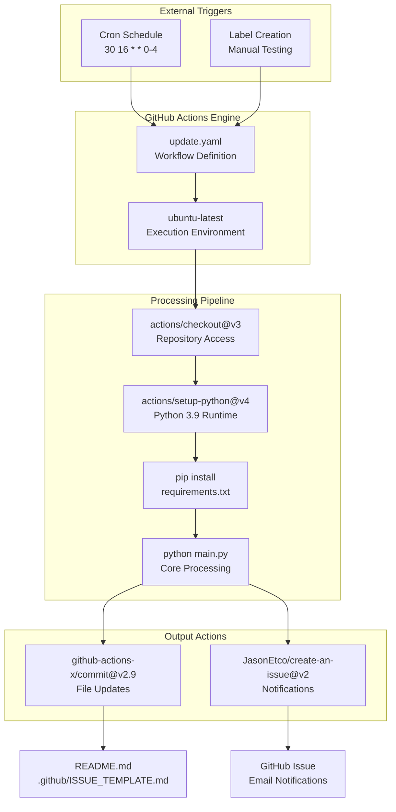
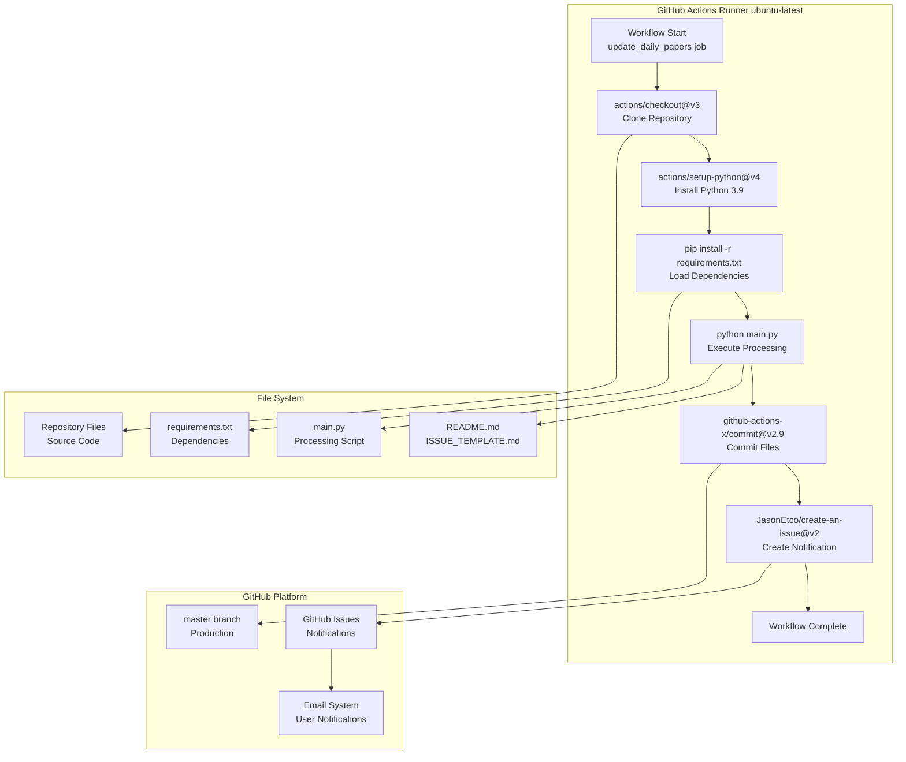
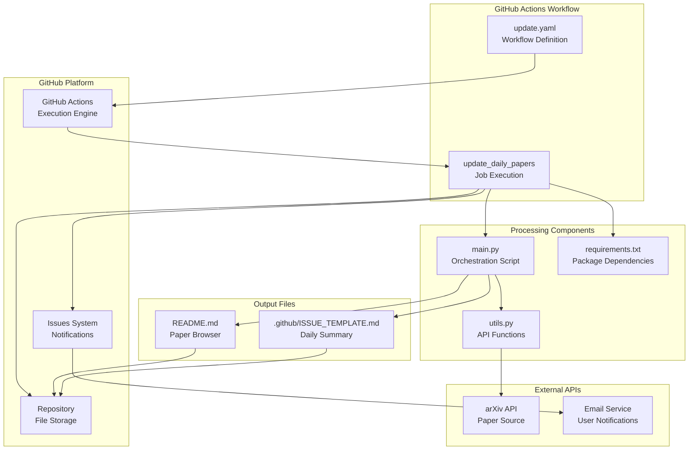

# GitHub Actions Workflow

<details>
<summary>Relevant source files</summary>

The following files were used as context for generating this wiki page:

- [.github/workflows/update.yaml](.github/workflows/update.yaml)

</details>


This document provides detailed documentation of the automated GitHub Actions workflow that orchestrates the daily paper aggregation process. The workflow is responsible for scheduling, executing, and deploying the paper collection pipeline, handling all automation aspects of the DailyArXiv system.

For information about the core processing logic executed by this workflow, see [Main Processing Pipeline](#4.1). For details about system dependencies managed by this workflow, see [Dependencies & Configuration](#5.2).

## Workflow Overview

The GitHub Actions workflow is defined in [.github/workflows/update.yaml:1-48]() and serves as the primary automation engine for the DailyArXiv system. It operates on a scheduled basis to fetch, process, and publish research papers automatically without manual intervention.

### Workflow Configuration

| Property | Value | Purpose |
|----------|-------|---------|
| **Name** | `Update` | Workflow identifier in GitHub Actions |
| **Runner** | `ubuntu-latest` | Execution environment |
| **Python Version** | `3.9` | Runtime version for processing scripts |
| **Schedule** | `30 16 * * 0-4` | Monday-Friday at 00:30 Beijing time |
| **Permissions** | `contents: write`, `issues: write` | Repository modification rights |

**Workflow Execution Timeline**

```mermaid
timeline
    title GitHub Actions Workflow Execution
    
    section Trigger Phase
        00:30 Beijing : Cron Schedule Activates
                     : "30 16 * * 0-4" UTC trigger
                     : Workflow "Update" starts
        
    section Environment Setup
        Step 1 : Checkout Repository
              : "actions/checkout@v3"
              : Clone master branch
        
        Step 2 : Python Environment
              : "actions/setup-python@v4" 
              : Install Python 3.9
        
        Step 3 : Dependencies
              : "pip install -r requirements.txt"
              : Load required packages
        
    section Core Processing
        Step 4 : Execute Pipeline
              : "python main.py"
              : Run paper collection
              : Generate output files
        
    section Deployment
        Step 5 : Commit Changes
              : "github-actions-x/commit@v2.9"
              : Push README.md updates
              : Push ISSUE_TEMPLATE.md updates
        
        Step 6 : User Notification
              : "JasonEtco/create-an-issue@v2"
              : Create GitHub issue
              : Trigger email notifications
```

Sources: [.github/workflows/update.yaml:1-48]()

## Trigger Mechanisms

The workflow supports two trigger mechanisms for different operational scenarios:

### Scheduled Execution

The primary trigger uses a cron schedule defined at [.github/workflows/update.yaml:7-8]():

```
schedule:
  - cron: '30 16 * * 0-4' # 00:30 Beijing time every Monday to Friday
```

This schedule translates to:
- **UTC Time**: 16:30 (4:30 PM)
- **Beijing Time**: 00:30 (12:30 AM next day)
- **Frequency**: Monday through Friday only
- **Weekend Behavior**: No automatic execution on weekends

### Manual Testing Trigger

A secondary trigger mechanism exists for testing purposes at [.github/workflows/update.yaml:4-6]():

```
label:
  types:
    - created # for test
```

This allows manual workflow execution when labels are created on issues or pull requests.

**Trigger Integration Diagram**



Sources: [.github/workflows/update.yaml:3-8]()

## Job Configuration and Permissions

### Security Permissions

The workflow requires specific permissions defined at [.github/workflows/update.yaml:10-12]():

| Permission | Scope | Purpose |
|------------|-------|---------|
| `contents: write` | Repository files | Modify README.md and ISSUE_TEMPLATE.md |
| `issues: write` | GitHub issues | Create notification issues |

### Job Definition

The single job `update_daily_papers` is configured at [.github/workflows/update.yaml:15-16]() with:
- **Runner**: `ubuntu-latest` for reliable Linux environment
- **Isolation**: Each execution runs in a fresh container
- **Concurrency**: Single job execution prevents conflicts

Sources: [.github/workflows/update.yaml:10-16]()

## Step-by-Step Execution Flow

### Step 1: Repository Checkout

[.github/workflows/update.yaml:18-19]() configures repository access:

```yaml
- name: Checkout repository
  uses: actions/checkout@v3
```

This step:
- Clones the repository to the runner filesystem
- Provides access to source code and configuration files
- Uses the stable `v3` version of the checkout action

### Step 2: Python Environment Setup

[.github/workflows/update.yaml:21-24]() establishes the runtime environment:

```yaml
- name: Set up Python
  uses: actions/setup-python@v4
  with:
    python-version: '3.9'
```

Key aspects:
- **Version Pinning**: Python 3.9 for consistent behavior
- **Package Manager**: pip is available for dependency installation
- **Virtual Environment**: Isolated from system packages

### Step 3: Dependency Installation

[.github/workflows/update.yaml:26-27]() installs required packages:

```yaml
- name: Install dependencies
  run: pip install -r requirements.txt
```

This step loads all Python packages needed for the processing pipeline as defined in the requirements.txt file.

### Step 4: Core Processing Execution

[.github/workflows/update.yaml:29-31]() runs the main processing logic:

```yaml
- name: Update papers
  run: |
    python main.py
```

This executes the core paper collection and processing pipeline documented in [Main Processing Pipeline](#4.1).

### Step 5: File Commitment and Deployment

[.github/workflows/update.yaml:33-42]() handles output file management:

```yaml
- name: Commit and push changes
  uses: github-actions-x/commit@v2.9
  with:
    github-token: ${{ secrets.GITHUB_TOKEN }}
    push-branch: 'master'
    commit-message: '✏️ Update papers automatically.'
    force-add: 'true'
    files: README.md .github/ISSUE_TEMPLATE.md
    name: Zezhishao
    email: 864453277@qq.com
```

Configuration details:
- **Target Branch**: `master` for production deployment
- **Files**: Only README.md and ISSUE_TEMPLATE.md are committed
- **Force Add**: Ensures files are included even if gitignored
- **Author Identity**: Consistent commit attribution

### Step 6: User Notification

[.github/workflows/update.yaml:44-47]() creates user notifications:

```yaml
- name: Create an issue to notify
  uses: JasonEtco/create-an-issue@v2
  env:
    GITHUB_TOKEN: ${{ secrets.GITHUB_TOKEN }}
```

This step creates a GitHub issue that triggers email notifications to repository watchers.

**Step Execution Flow Diagram**



Sources: [.github/workflows/update.yaml:17-48]()

## Integration with System Components

The GitHub Actions workflow serves as the orchestration layer that connects all system components:

### Input Dependencies

- **Source Code**: Main processing scripts accessed via checkout
- **Configuration**: requirements.txt and embedded parameters
- **Scheduling**: Cron-based timing for regular execution

### Output Targets

- **Repository Files**: README.md and ISSUE_TEMPLATE.md updates
- **Version Control**: Automatic git commits to master branch
- **User Interface**: GitHub issue creation for notifications

### External Service Integration

**System Integration Map**



Sources: [.github/workflows/update.yaml:1-48]()

## Error Handling and Monitoring

### Failure Modes

The workflow includes several points where failures can occur:

1. **Network Issues**: arXiv API unavailability during paper fetching
2. **Processing Errors**: Python script exceptions in main.py execution
3. **Git Conflicts**: Concurrent modifications to target files
4. **Permission Issues**: GitHub token or repository access problems

### Built-in Resilience

- **Atomic Operations**: Each step completes fully or fails completely
- **Clean Environment**: Fresh runner for each execution eliminates state issues
- **Force Add**: Ensures file updates succeed even with git conflicts
- **Token Authentication**: Automatic GitHub token management

### Monitoring Capabilities

GitHub Actions provides built-in monitoring through:
- **Execution Logs**: Detailed step-by-step output capture
- **Failure Notifications**: Email alerts for workflow failures
- **History Tracking**: Complete execution history and timing data
- **Manual Retry**: Ability to re-run failed workflows

Sources: [.github/workflows/update.yaml:33-42]()

---