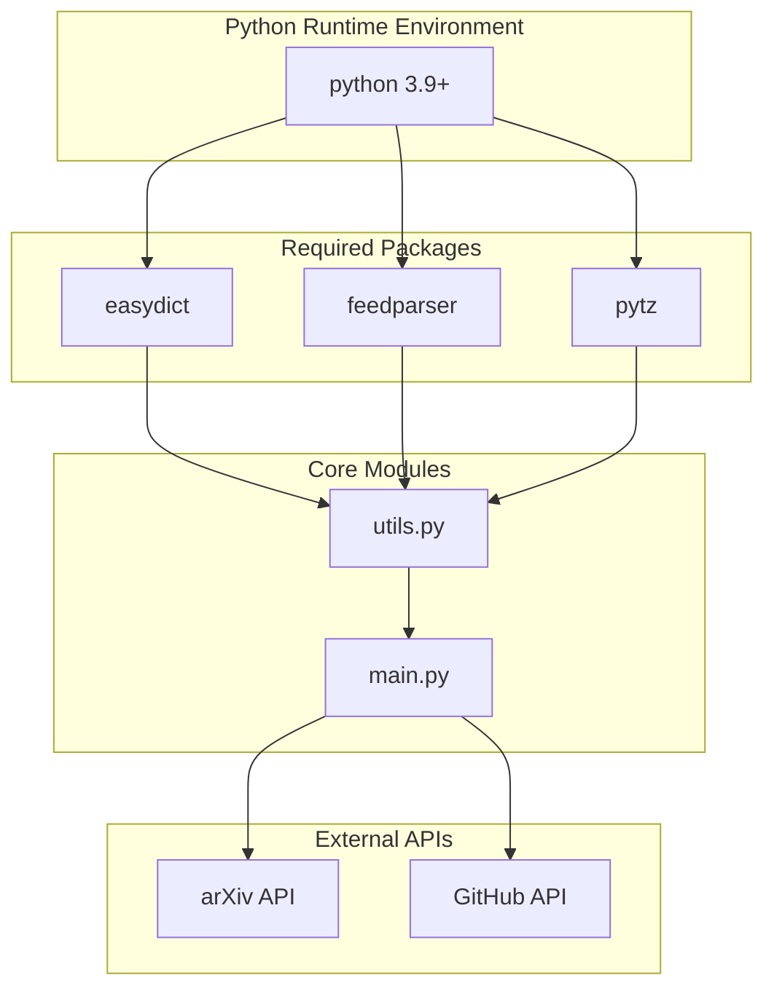
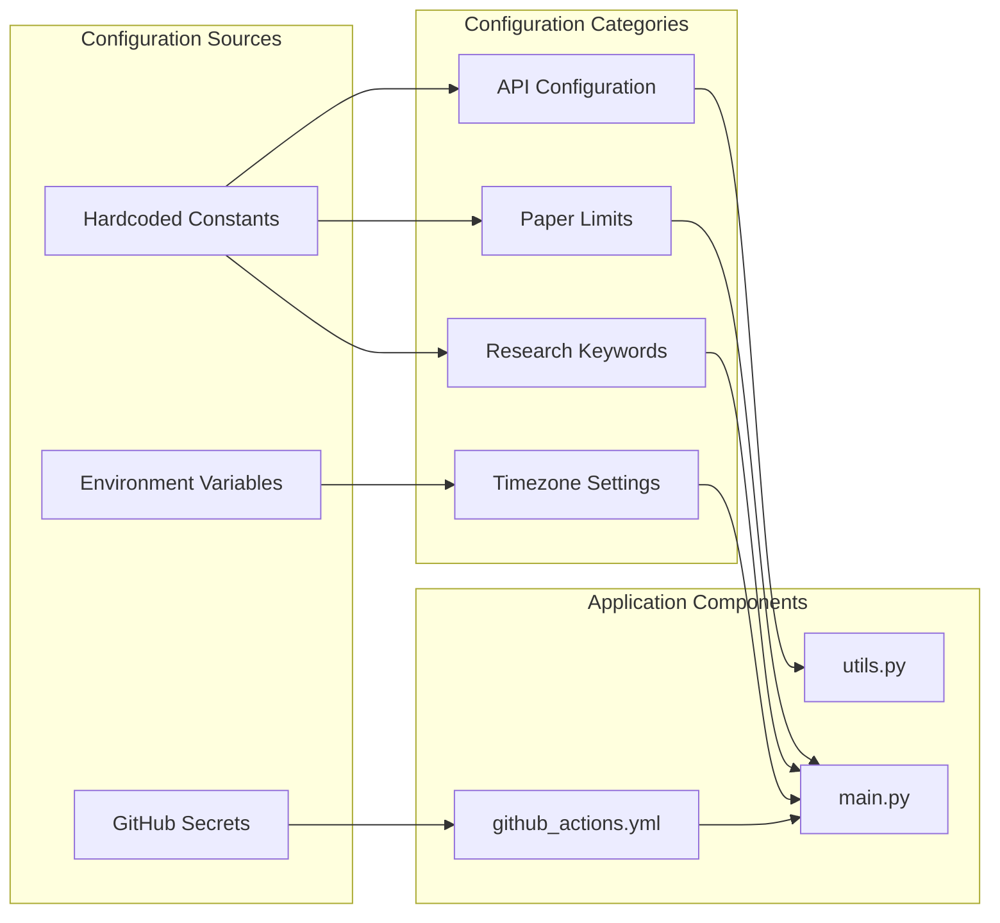
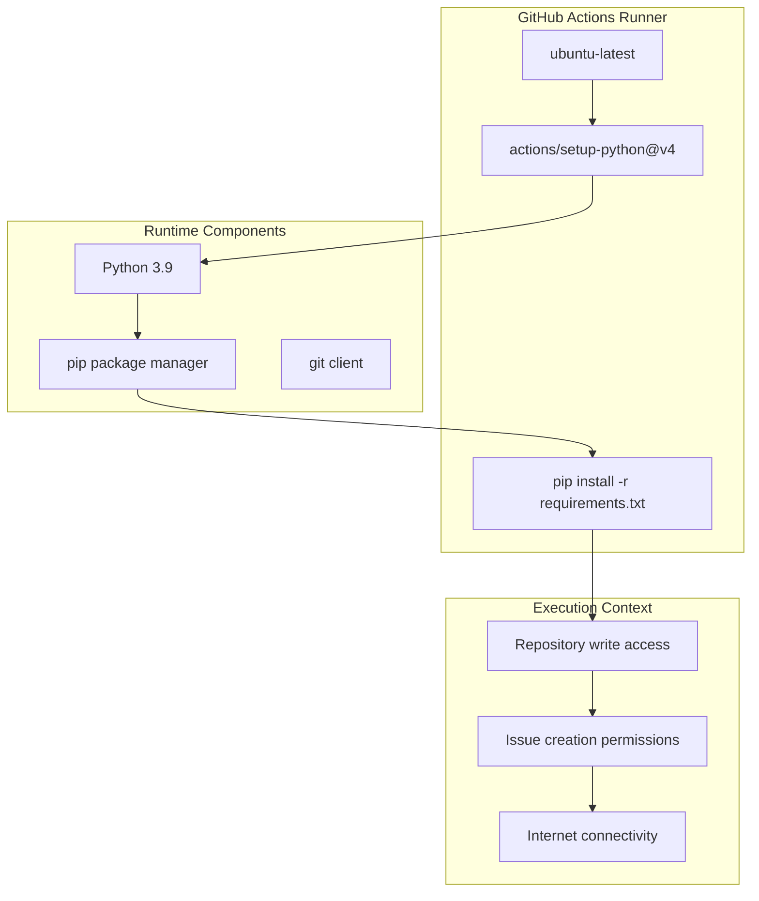
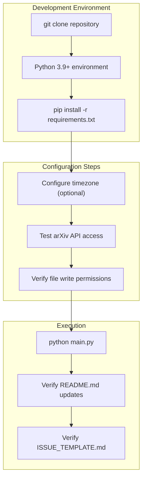

# Dependencies & Configuration

Relevant source files

The following files were used as context for generating this wiki page:

- [.gitignore](.gitignore)
- [requirements.txt](requirements.txt)

This document covers the system dependencies, Python package requirements, and configuration management for the DailyArXiv system. It details the minimal external dependencies required for the automated paper aggregation pipeline and explains how configuration is managed through hardcoded constants and environment setup.

For information about the automated deployment workflow, see [GitHub Actions Workflow](#5.1). For details about the core processing implementation, see [Core Implementation](#4).

## Python Dependencies

The DailyArXiv system maintains a minimal dependency footprint with only three external Python packages required for operation.

### Core Dependencies Overview

**Sources:** [requirements.txt:1-3]()

### Dependency Details

| Package | Version | Purpose | Usage Location |
|---------|---------|---------|----------------|
| `easydict` | Latest | Configuration object management | [utils.py]() for paper data structures |
| `feedparser` | Latest | XML/RSS parsing | [utils.py]() for arXiv API response processing |
| `pytz` | Latest | Timezone handling | [main.py]() for Beijing timezone operations |

The system intentionally avoids version pinning to ensure compatibility with the latest package releases and security updates in the GitHub Actions environment.

**Sources:** [requirements.txt:1-3]()

## Configuration Management

The DailyArXiv system uses embedded configuration constants rather than external configuration files. This approach simplifies deployment and reduces the number of files that need to be managed.

### Configuration Architecture

**Sources:** [main.py](), [utils.py](), [.github/workflows/]()

### Key Configuration Constants

The system configuration is distributed across the main processing files:

- **Paper Retrieval Limits**: Maximum number of papers per keyword (`max_result`, `issues_result`)
- **Research Keywords**: Predefined list of research areas (Time Series, Trajectory, Graph Neural Networks)
- **API Endpoints**: arXiv API base URL and query parameters
- **Timezone Settings**: Beijing timezone for scheduling alignment
- **File Paths**: Output file locations for README.md and ISSUE_TEMPLATE.md

**Sources:** [main.py](), [utils.py]()

## Runtime Environment

The system is designed to run in a containerized GitHub Actions environment with minimal setup requirements.

### Environment Requirements

**Sources:** [.github/workflows/](), [requirements.txt:1-3]()

### Execution Environment Setup

The system requires:
- **Python Version**: 3.9 or higher
- **Package Manager**: pip for dependency installation
- **Git Access**: Repository write permissions for file updates
- **Network Access**: Outbound HTTPS connections to arXiv API
- **GitHub Permissions**: Issue creation and repository modification rights

**Sources:** [.github/workflows/]()

## Development Setup

For local development and testing, the system can be set up with minimal configuration.

### Local Development Configuration

**Sources:** [requirements.txt:1-3](), [main.py](), [utils.py]()

### Development Dependencies

Local development requires only the three packages specified in `requirements.txt`. No additional development-specific dependencies are needed as the system uses only Python standard library features beyond the core requirements.

**Sources:** [requirements.txt:1-3]()

## Version Control Configuration

The repository includes a comprehensive `.gitignore` file to prevent tracking of unnecessary files and maintain a clean repository structure.

### Ignored File Categories

| Category | Purpose | Examples |
|----------|---------|----------|
| Python artifacts | Compiled bytecode and cache | `__pycache__/`, `*.pyc`, `*.py[cod]` |
| Data files | Research data and exports | `*.npz`, `*.npy`, `*.csv`, `*.pkl` |
| Environment files | Virtual environments and configs | `.venv/`, `.env`, `venv/` |
| IDE artifacts | Editor-specific files | `.vscode/`, `.spyderproject` |
| Distribution files | Build and packaging outputs | `build/`, `dist/`, `*.egg-info/` |

**Sources:** [.gitignore:1-174]()

### Repository File Management

The `.gitignore` configuration ensures that only source code, documentation, and configuration files are tracked in version control. This prevents the repository from becoming cluttered with temporary files, compiled artifacts, or environment-specific configurations.

Notable exclusions include:
- All data file formats commonly used in research (`*.npz`, `*.npy`, `*.csv`, `*.pkl`, `*.h5`, `*.pt`)
- Python compilation artifacts and virtual environments
- IDE and editor configuration directories
- Build and distribution artifacts

**Sources:** [.gitignore:6-16](), [.gitignore:137-144]()