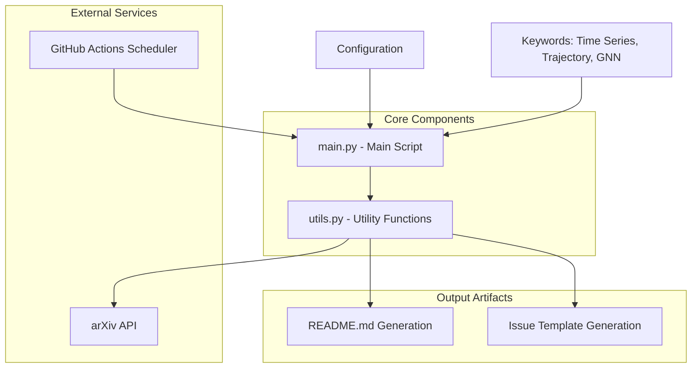

The DailyArXiv project is an automated paper aggregation system that fetches the latest research papers from arXiv based on predefined keywords and presents them in an organized, readable format. This project serves as a personalized research assistant for developers and researchers who want to stay updated with the latest developments in specific technical domains.

## Project Architecture

The system follows a modular architecture with clear separation of concerns:



## Core Features

| Feature | Description | Implementation |
|---------|-------------|----------------|
| **Automated Paper Fetching** | Retrieves latest papers from arXiv API based on keywords | [utils.py#L16-L48](utils.py#L16-L48) |
| **Keyword-Based Filtering** | Supports multiple research domains with configurable keywords | [main.py#L25](main.py#L25) |
| **Content Generation** | Creates formatted README.md and GitHub Issues with paper tables | [utils.py#L80-L127](utils.py#L80-L127) |
| **Retry Logic** | Handles API failures with automatic retries | [utils.py#L60-L69](utils.py#L60-L69) |
| **Backup System** | Safeguards existing files during updates | [utils.py#L128-L140](utils.py#L128-L140) |

## Project Structure

```
DailyArXiv/
├── main.py                 # Main execution script
├── utils.py               # Core utility functions
├── requirements.txt       # Python dependencies
├── README.md             # Generated paper listings
├── ISSUE_TEMPLATE.md     # GitHub issue template
└── workflows/
    └── update.yaml       # GitHub Actions workflow
```

## Key Components

### Main Script (`main.py`)
The orchestrator that coordinates the entire paper fetching and content generation process. It manages keyword processing, API calls, and file operations with built-in error handling and recovery mechanisms.

### Utility Functions (`utils.py`)
Contains the core business logic including:
- **API Integration**: Direct communication with arXiv's REST API [utils.py#L16-L48](utils.py#L16-L48)
- **Data Processing**: Paper filtering, deduplication, and formatting
- **Table Generation**: Markdown table creation for different output formats [utils.py#L80-L127](utils.py#L80-L127)
- **File Management**: Backup and restore operations for safety

### Dependencies
The project uses minimal, focused dependencies:
- `easydict`: Simplified dictionary access
- `feedparser`: RSS/Atom feed parsing for arXiv responses
- `pytz`: Timezone handling for Beijing-based scheduling

## Research Domains

Currently configured to monitor three key research areas:

| Domain | Description | Paper Limit |
|--------|-------------|-------------|
| Time Series | Time series analysis, forecasting, and temporal data modeling | 100 papers |
| Trajectory | Motion analysis, path planning, and trajectory optimization | 100 papers |
| Graph Neural Networks | GNN architectures, graph representation learning | 100 papers |

## Output Formats

The system generates two complementary outputs:

1. **README.md**: Comprehensive listings with full abstracts and details
2. **GitHub Issues**: Summarized versions suitable for email notifications

> [!TIP]
> The project uses Beijing timezone (Asia/Shanghai) for scheduling and date formatting, ensuring consistent daily updates regardless of the server's geographic location.

## Next Steps

To get started with DailyArXiv, continue with:
- [Quick Start](2-quick-start) for immediate setup and usage
- [Installation and Dependencies](3-installation-and-dependencies) for detailed environment setup
- [Configuration and Customization](4-configuration-and-customization) to tailor the system to your research needs

> [!TIP]
> The system includes built-in rate limiting (5-second delays between API calls) to prevent being blocked by arXiv's servers during bulk paper fetching operations.