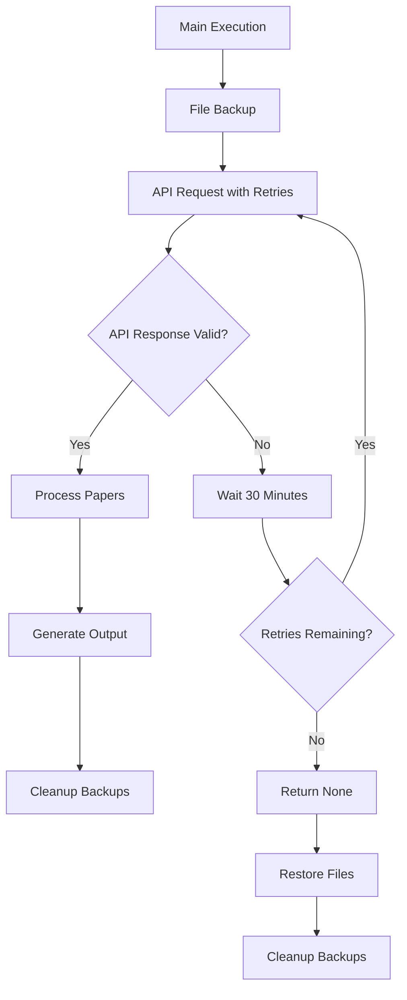

The DailyArXiv project implements a robust error handling and retry mechanism to ensure reliable paper fetching from the arXiv API. This documentation examines the architectural patterns and implementation details of the system's resilience strategies.

## Architecture Overview

The error handling system follows a layered approach with retry logic at the API interaction level and file system safeguards for data integrity:



## Core Retry Mechanism

The primary retry logic is implemented in the `get_daily_papers_by_keyword_with_retries` function, which handles the intermittent empty list responses from the arXiv API [utils.py#L60-L68](utils.py#L60-L68):

```python
def get_daily_papers_by_keyword_with_retries(keyword: str, column_names: List[str], max_result: int, link: str = "OR", retries: int = 6) -> List[Dict[str, str]]:
    for _ in range(retries):
        papers = get_daily_papers_by_keyword(keyword, column_names, max_result, link)
        if len(papers) > 0: return papers
        else:
            print("Unexpected empty list, retrying...")
            time.sleep(60 * 30) # wait for 30 minutes
    # failed
    return None
```

### Retry Strategy Parameters

| Parameter | Default Value | Purpose |
|-----------|---------------|---------|
| `retries` | 6 | Maximum number of retry attempts |
| `wait_time` | 30 minutes | Delay between retry attempts |
| `success_condition` | `len(papers) > 0` | Validates API response contains data |

The system implements a **backoff strategy** with fixed 30-minute intervals between attempts, designed to handle temporary API availability issues while avoiding excessive request rates.

## API-Level Error Handling

The base API request function includes input validation and structured error handling [utils.py#L16-L47](utils.py#L16-L47):

```python
def request_paper_with_arXiv_api(keyword: str, max_results: int, link: str = "OR") -> List[Dict[str, str]]:
    assert link in ["OR", "AND"], "link should be 'OR' or 'AND'"
    # URL construction and request handling
    url = "http://export.arxiv.org/api/query?search_query=ti:{0}+{2}+abs:{0}&max_results={1}&sortBy=lastUpdatedDate".format(keyword, max_results, link)
    response = urllib.request.urlopen(url).read().decode('utf-8')
    feed = feedparser.parse(response)
```

### Input Validation
- **Link Parameter**: Enforced to be either "OR" or "AND" using assertion
- **URL Encoding**: Proper encoding of special characters to prevent request failures
- **Response Parsing**: Safe parsing using feedparser library

## File System Safeguards

The project implements a comprehensive backup and restore system to protect against data corruption during execution:

### Backup Operations
The system creates temporary backups before modifying critical files [utils.py#L128-L131](utils.py#L128-L131):

```python
def back_up_files():
    # back up README.md and ISSUE_TEMPLATE.md
    shutil.move("README.md", "README.md.bk")
    shutil.move(".github/ISSUE_TEMPLATE.md", ".github/ISSUE_TEMPLATE.md.bk")
```

### Recovery Mechanisms
Two recovery paths are available depending on execution outcome:

**Successful Execution** [utils.py#L138-L141](utils.py#L138-L141):
```python
def remove_backups():
    # remove README.md and ISSUE_TEMPLATE.md
    os.remove("README.md.bk")
    os.remove(".github/ISSUE_TEMPLATE.md.bk")
```

**Failed Execution** [utils.py#L133-L136](utils.py#L133-L136):
```python
def restore_files():
    # restore README.md and ISSUE_TEMPLATE.md
    shutil.move("README.md.bk", "README.md")
    shutil.move(".github/ISSUE_TEMPLATE.md.bk", ".github/ISSUE_TEMPLATE.md")
```

## Error Scenarios and Handling

| Error Type | Detection Method | Recovery Strategy |
|------------|------------------|-------------------|
| API Empty Response | `len(papers) == 0` | Retry with 30-minute delay |
| API Invalid Link | `assert link in ["OR", "AND"]` | Immediate failure with assertion |
| File System Error | Exception during file operations | Restore from backup |
| Network Timeout | Request failure | Retry mechanism handles transparently |

## Implementation Best Practices

> [!TIP]
> The retry logic specifically targets the documented issue where "arXiv API seems to sometimes return an unexpected empty list" [main.py#L12](main.py#L12). This targeted approach avoids over-engineering while addressing the most common failure mode.

> [!TIP]
> The file backup system uses atomic move operations rather than copy operations, ensuring that either the complete original file or the complete new file exists at any time, preventing partial file states.

## Integration Points

The error handling system integrates with the main workflow through these key points:

1. **Initialization**: `back_up_files()` called at workflow start [main.py#L35](main.py#L35)
2. **Data Fetching**: Retry wrapper used for each keyword processing 
3. **Cleanup**: Conditional restore or remove based on execution success [main.py#L70-L72](main.py#L70-L72)

This comprehensive error handling architecture ensures the DailyArXiv system can gracefully handle API inconsistencies and maintain data integrity throughout the automated paper fetching process.

## Next Steps

For understanding how this error handling integrates with the broader system architecture, see [Automated Workflow Management](9-automated-workflow-management). To learn about the core API functionality that these error handling patterns protect, refer to [ArXiv API Integration](6-arxiv-api-integration).