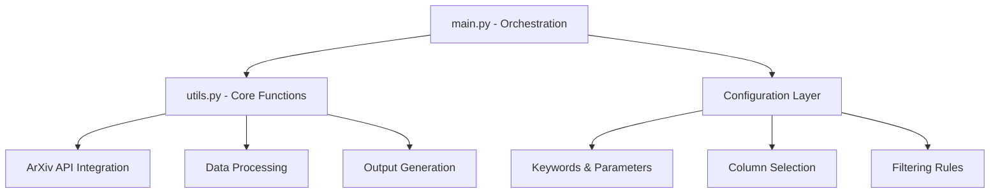

This comprehensive guide explores the advanced customization capabilities and extension patterns available in the DailyArXiv system. The project is designed with a modular architecture that enables developers to tailor paper fetching, filtering, and output generation to their specific research domains and workflow requirements.

## Architecture Overview

The DailyArXiv system follows a clean separation of concerns with two main modules:



The core execution flow is orchestrated through [main.py](main.py#L50-L68), which iterates through configured keywords and applies consistent processing pipelines to generate both README content and GitHub issues.

> [!TIP]
> The system uses a backup/restore mechanism for file operations ([utils.py#L128-L141](utils.py#L128-L141)), ensuring data integrity during automated updates and providing a safety net for custom modifications.

## Keyword Configuration

### Search Keywords

The primary customization point is the keyword configuration in [main.py#L25](main.py#L25):

```python
keywords = ["Time Series", "Trajectory", "Graph Neural Networks"]
```

Each keyword defines a research domain section in the output. The system automatically determines the search strategy based on keyword complexity:

- **Single-word keywords**: Use "AND" logic to search both title and abstract ([main.py#L53](main.py#L53))
- **Multi-word keywords**: Use "OR" logic for broader coverage ([main.py#L54](main.py#L54))

### Advanced Search Strategies

The search logic is implemented in [utils.py#L16-L47](utils.py#L16-L47) through the `request_paper_with_arXiv_api` function. The URL construction supports complex queries:

```python
url = "http://export.arxiv.org/api/query?search_query=ti:{0}+{2}+abs:{0}&max_results={1}&sortBy=lastUpdatedDate"
```

Custom search strategies can be implemented by modifying the URL pattern or extending the function to accept additional parameters like date ranges, specific categories, or author filters.

## Column Customization

### Available Data Fields

The system extracts comprehensive paper metadata from the ArXiv API ([utils.py#L25-L46](utils.py#L25-L46)):

| Field | Description | Processing |
|-------|-------------|------------|
| Title | Paper title | Linked to ArXiv URL |
| Authors | Author list | First author + "et al." |
| Abstract | Paper summary | Collapsible display |
| Link | ArXiv URL | Integrated with title |
| Tags | Category tags | Collapsible if long |
| Comment | ArXiv comments | Collapsible if long |
| Date | Update timestamp | Formatted as YYYY-MM-DD |

### Column Selection

Configure display columns in [main.py#L33](main.py#L33):

```python
column_names = ["Title", "Link", "Abstract", "Date", "Comment"]
```

> [!TIP]
> The system automatically handles column formatting in [utils.py#L80-L126](utils.py#L80-L126), including special processing for titles (bold + links), dates (formatting), and long content (collapsible sections).

## Filtering and Processing Extensions

### Tag-Based Filtering

The current implementation filters papers to computer science and statistics fields ([utils.py#L49-L58](utils.py#L49-L58)):

```python
def filter_tags(papers: List[Dict[str, str]], target_fileds: List[str]=["cs", "stat"]) -> List[Dict[str, str]]:
```

Custom filtering rules can be implemented by:
- Modifying `target_fields` to include specific ArXiv categories
- Adding custom logic for paper relevance scoring
- Implementing date-based or citation-based filtering

### Retry Logic and Error Handling

The system includes robust retry mechanisms for API reliability ([utils.py#L60-L68](utils.py#L60-L68)):

- **Default retries**: 6 attempts with 30-minute intervals
- **Failure handling**: Graceful degradation with file restoration
- **Rate limiting**: Built-in delays between keyword processing ([main.py#L68](main.py#L68))

## Output Format Customization

### Table Generation

The `generate_table` function ([utils.py#L80-L126](utils.py#L80-L126)) creates Markdown tables with sophisticated formatting:

- **Headers**: Bold formatting with separator lines
- **Content**: Automatic column processing and formatting
- **Collapsible sections**: `<details>` tags for long content
- **Links**: Integrated title-ArXiv URL combinations

### Template Customization

Output templates are defined in [main.py#L37-L48](main.py#L37-L48):

#### README Template
```python
f_rm.write("# Daily Papers\n")
f_rm.write("The project automatically fetches the latest papers from arXiv based on keywords.\n\n...")
```

#### Issue Template
```python
f_is.write("---\n")
f_is.write("title: Latest {0} Papers - {1}\n".format(issues_result, get_daily_date()))
f_is.write("labels: documentation\n")
f_is.write("---\n")
```

## Extension Patterns

### Adding New Data Sources

To integrate additional academic databases:

1. **Create new API functions** following the pattern of `request_paper_with_arXiv_api`
2. **Implement data normalization** to match the existing paper structure
3. **Add configuration options** for source selection
4. **Extend filtering logic** for source-specific requirements

### Custom Processing Pipelines

Implement specialized processing by extending the core workflow:

```python
# Example: Custom relevance scoring
def score_paper_relevance(paper: Dict, custom_criteria: Dict) -> float:
    # Implement custom scoring logic
    pass

# Integration point in main workflow
papers = [p for p in papers if score_paper_relevance(p, criteria) > threshold]
```

### Output Channel Extensions

Beyond README and GitHub issues, consider adding:

- **Email notifications**: Integrate with SMTP services
- **RSS feeds**: Generate XML feeds for subscription services
- **Database storage**: Persist papers for historical analysis
- **Web dashboards**: Create interactive browsing interfaces

## Configuration Management

### Parameter Overrides

Key configuration parameters in [main.py](main.py#L27-L33):

| Parameter | Purpose | Default | Customization Impact |
|-----------|---------|---------|---------------------|
| `max_result` | API results per keyword | 100 | Controls paper volume |
| `issues_result` | Papers per issue | 15 | Issue content length |
| `column_names` | Display columns | Custom selection | Output format |
| `keywords` | Search domains | Research-specific | Content scope |

### Environment-Based Configuration

For deployment flexibility, consider externalizing configuration:

```python
# Example: Environment-based configuration
import os

keywords = os.getenv('ARXIV_KEYWORDS', 'Time Series,Trajectory').split(',')
max_result = int(os.getenv('MAX_RESULTS', '100'))
```

## Next Steps

For comprehensive understanding of the system architecture and implementation details, refer to:

- [ArXiv API Integration](6-arxiv-api-integration) for detailed API usage patterns
- [Paper Fetching and Filtering](7-paper-fetching-and-filtering) for advanced filtering techniques
- [Content Generation and Formatting](8-content-generation-and-formatting) for output customization
- [Automated Workflow Management](9-automated-workflow-management) for deployment strategies

The modular design of DailyArXiv ensures that customizations can be implemented with minimal code changes while maintaining system reliability and performance.