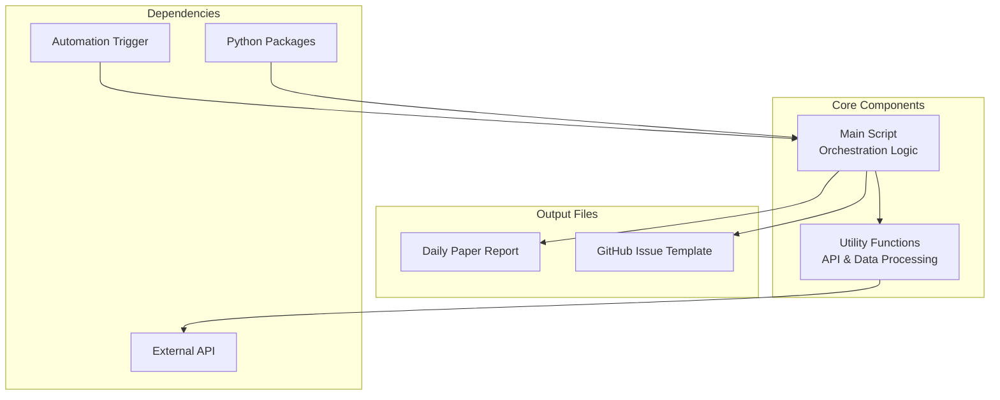

DailyArXiv is an automated paper aggregation system that fetches the latest academic papers from arXiv based on predefined keywords and generates daily reports. This quick start guide will help you get the system running in minutes.

## System Architecture Overview

The project follows a simple yet effective architecture with clear separation of concerns:



## Prerequisites and Setup

### System Requirements
- Python 3.7 or higher
- Git repository with GitHub Actions enabled
- Internet connection for arXiv API access

### Installation Steps

1. **Clone the repository** and navigate to the project directory
2. **Install dependencies** using the requirements file:
   ```bash
   pip install -r requirements.txt
   ```

The required packages are minimal and focused:
- `easydict`: For simplified dictionary access
- `feedparser`: For parsing arXiv RSS feeds
- `pytz`: For timezone handling

### Project Structure

```
DailyArXiv/
├── main.py                 # Main orchestration script
├── utils.py               # Core utility functions
├── requirements.txt       # Python dependencies
├── README.md             # Generated daily paper report
├── ISSUE_TEMPLATE.md     # GitHub issue template
└── workflows/
    └── update.yaml       # GitHub Actions workflow
```

## Running Your First Paper Fetch

### Manual Execution

Execute the main script to fetch papers immediately:

```bash
python main.py
```

This will:
1. Fetch papers for each configured keyword ([main.py#L25](main.py#L25))
2. Generate a README.md with paper tables
3. Create an issue template for GitHub
4. Handle API failures with automatic retries ([utils.py#L60](utils.py#L60))

### Automated Daily Execution

For continuous paper updates, the system integrates with GitHub Actions. The workflow automatically runs daily, fetching the latest papers and updating your repository.

## Configuration Options

### Keyword Customization

Modify the search keywords in [main.py#L25](main.py#L25):

```python
keywords = ["Time Series", "Trajectory", "Graph Neural Networks"]
```

### Result Limits

Adjust the number of papers fetched:
- `max_result = 100` - Maximum papers per keyword from API ([main.py#L27](main.py#L27))
- `issues_result = 15` - Papers included in GitHub issues ([main.py#L28](main.py#L28))

### Output Columns

Customize displayed information by modifying [main.py#L33](main.py#L33):

```python
column_names = ["Title", "Link", "Abstract", "Date", "Comment"]
```

Available columns include: Title, Authors, Abstract, Link, Tags, Comment, Date

## Expected Output

After successful execution, you'll find:

1. **README.md**: Organized paper tables by keyword with full abstracts
2. **ISSUE_TEMPLATE.md**: Formatted template for daily GitHub issues (15 papers per keyword)
3. **Console output**: Progress indicators and error messages

> [!TIP]
> The system includes robust error handling with automatic retries (up to 6 attempts) for arXiv API failures, ensuring reliable daily updates even with temporary network issues.

## Next Steps

For deeper customization and advanced features, explore:
- **[Installation and Dependencies](3-installation-and-dependencies)** - Detailed setup instructions
- **[Configuration and Customization](4-configuration-and-customization)** - Advanced configuration options
- **[GitHub Actions Integration](5-github-actions-integration)** - Automation setup guide

The system is designed for immediate use with sensible defaults while offering extensive customization for specific research needs.