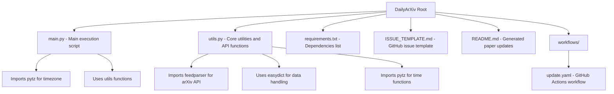

This guide covers the complete setup process for DailyArXiv, including Python environment requirements, dependency installation, and system prerequisites for running the arXiv paper automation system.

## System Requirements

DailyArXiv is a Python-based application designed to run on most modern operating systems. The project has minimal system requirements but depends on specific Python libraries for arXiv API integration and data processing.

### Python Version
- **Minimum**: Python 3.6+
- **Recommended**: Python 3.8 or later
- **Required modules**: Standard library modules including `datetime`, `urllib`, `time`, `os`, and `shutil`

### Operating System Support
- **Linux**: Full compatibility (Ubuntu, CentOS, Debian, etc.)
- **macOS**: Full compatibility
- **Windows**: Compatible with Python 3.8+ (may require additional setup for certain dependencies)

## Dependency Installation

The project uses three core external libraries that are essential for its functionality:

### Core Dependencies

| Library | Version | Purpose | Installation |
|---------|---------|---------|-------------|
| `easydict` | Latest | Dictionary access with dot notation for cleaner code | `pip install easydict` |
| `feedparser` | Latest | Parse RSS/Atom feeds from arXiv API responses | `pip install feedparser` |
| `pytz` | Latest | Timezone handling for Beijing time calculations | `pip install pytz` |

### Installation Methods

#### Method 1: Using requirements.txt (Recommended)
```bash
# Clone the repository
git clone https://github.com/zezhishao/DailyArXiv.git
cd DailyArXiv

# Install all dependencies
pip install -r requirements.txt
```

#### Method 2: Individual Installation
```bash
pip install easydict feedparser pytz
```

#### Method 3: Virtual Environment (Best Practice)
```bash
# Create virtual environment
python -m venv dailyarxiv-env

# Activate environment
# On Linux/macOS:
source dailyarxiv-env/bin/activate
# On Windows:
dailyarxiv-env\Scripts\activate

# Install dependencies
pip install -r requirements.txt
```

## Project Structure Overview

Understanding the project structure is crucial for proper setup and customization:



## Key Dependencies Explained

### feedparser - arXiv API Integration
The `feedparser` library is essential for parsing XML responses from the arXiv API. It handles the complex RSS/Atom feed structure returned by arXiv's query system [utils.py#L16-L48]. This dependency enables the project to:

- Parse arXiv API responses efficiently
- Handle XML feed parsing with robust error handling
- Extract paper metadata including titles, abstracts, and links

### pytz - Timezone Management
`pytz` is used for timezone-aware datetime operations, specifically for Beijing time calculations [main.py#L10], [main.py#L15]. This ensures:

- Accurate date formatting for paper updates
- Consistent timezone handling across different environments
- Proper scheduling for automated workflows

### easydict - Data Structure Management
The `easydict` library provides dictionary access using dot notation, making the code more readable and maintainable [utils.py#L18], [utils.py#L30]. It simplifies:

- Access to nested paper metadata
- Code readability and maintenance
- Data structure manipulation

## Verification and Testing

After installation, verify your setup with these steps:

### 1. Dependency Verification
```bash
# Check installed packages
pip list | grep -E "(easydict|feedparser|pytz)"

# Test Python imports
python -c "import feedparser, pytz, easydict; print('All dependencies imported successfully')"
```

### 2. Basic Functionality Test
```python
# Test basic imports and timezone functionality
import pytz
from datetime import datetime

beijing_timezone = pytz.timezone('Asia/Shanghai')
current_date = datetime.now(beijing_timezone).strftime("%Y-%m-%d")
print(f"Current Beijing date: {current_date}")
```

## Common Installation Issues

### Issue 1: pip Installation Fails
**Solution**: Upgrade pip and use wheel
```bash
pip install --upgrade pip
pip install wheel
pip install -r requirements.txt
```

### Issue 2: Windows Compatibility
**Solution**: Use Windows-specific package installation
```bash
# On Windows, you may need:
pip install --upgrade setuptools
pip install -r requirements.txt --no-cache-dir
```

### Issue 3: Permission Errors
**Solution**: Use user installation or virtual environment
```bash
# User installation
pip install --user -r requirements.txt

# Or use virtual environment (recommended)
python -m venv venv
source venv/bin/activate  # On Windows: venv\Scripts\activate
pip install -r requirements.txt
```

## Next Steps

After successful installation, proceed to [Configuration and Customization](4-configuration-and-customization) to:

- Set up your arXiv search keywords
- Configure paper filtering criteria
- Customize output formatting
- Set up automated workflows

For a complete overview of the project architecture and capabilities, visit [Overview](1-overview) or jump directly to [Quick Start](2-quick-start) for immediate usage instructions.