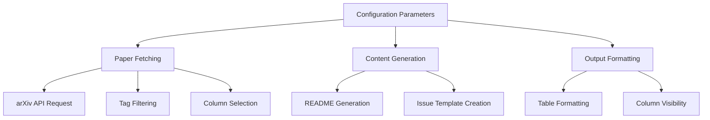

This guide explains how to configure and customize the DailyArXiv project to match your specific research interests and workflow requirements. The project offers several configuration options that control paper fetching behavior, output formatting, and automation settings.

## Core Configuration Options

The main configuration parameters are defined in [`main.py`](main.py#L25-L33) and control the fundamental behavior of the paper fetching system:

```python
keywords = ["Time Series", "Trajectory", "Graph Neural Networks"]  # Research keywords
max_result = 100  # Maximum query results from arXiv API for each keyword
issues_result = 15  # Maximum papers to be included in GitHub issues
column_names = ["Title", "Link", "Abstract", "Date", "Comment"]  # Display columns
```

### Keyword Configuration

The `keywords` list defines your research interests. Each keyword creates a separate section in the README and GitHub issues. The system supports both single-word and multi-word keywords:

- **Single-word keywords**: Use "AND" logic (search in both title and abstract)
- **Multi-word keywords**: Use "OR" logic (search in title OR abstract)

### Result Limits

Two important parameters control the number of papers processed:

| Parameter | Purpose | Default | Recommended Range |
|-----------|---------|---------|------------------|
| `max_result` | Maximum papers fetched per keyword from arXiv API | 100 | 50-200 |
| `issues_result` | Maximum papers displayed in GitHub issues | 15 | 10-30 |

> [!TIP]
> Setting `max_result` too high may result in API rate limiting. The built-in retry mechanism in [`utils.py`](utils.py#L60-L68) handles temporary failures but extended delays may occur.

## Column Display Configuration

The `column_names` parameter controls which paper information is displayed. Available columns include:

- **Title**: Paper title
- **Authors**: Author list
- **Abstract**: Paper abstract
- **Link**: arXiv URL
- **Tags**: Subject categories
- **Comment**: arXiv comments
- **Date**: Last updated date

Current configuration omits Authors in GitHub issues for better readability, as seen in [`main.py`](main.py#L63).

## Workflow Architecture

The configuration system follows a modular architecture:



## Advanced Customization

### Tag Filtering

The system automatically filters papers by subject categories in [`utils.py`](utils.py#L49-L58). By default, it includes papers from "cs" (Computer Science) and "stat" (Statistics) fields. You can modify the `target_fields` parameter to include other disciplines.

### Retry Logic

The retry mechanism in [`utils.py`](utils.py#L60-L68) provides robust error handling:

- **Default retries**: 6 attempts
- **Wait time**: 30 minutes between retries
- **Trigger**: Empty result lists from arXiv API

> [!TIP]
> The retry logic handles arXiv API instability but increases execution time when triggered. Monitor GitHub Actions logs to identify patterns of API failures.

## Project Structure

```
DailyArXiv/
├── main.py              # Main configuration and execution logic
├── utils.py             # API integration and data processing
├── workflows/
│   └── update.yaml      # GitHub Actions automation
├── requirements.txt     # Python dependencies
├── README.md           # Generated paper listings
└── ISSUE_TEMPLATE.md   # Generated issue templates
```

## Next Steps

After configuring your keywords and display preferences, proceed to [GitHub Actions Integration](5-github-actions-integration) to set up automated daily updates. For deeper understanding of the paper fetching mechanism, see [ArXiv API Integration](6-arxiv-api-integration).