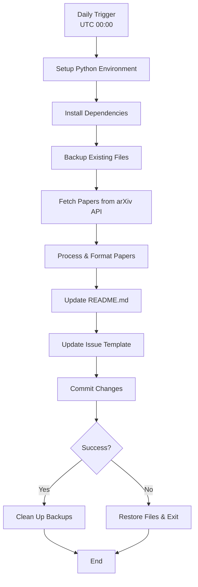

The DailyArXiv project leverages GitHub Actions to automate the daily fetching and publishing of academic papers from arXiv. This integration ensures that your repository stays up-to-date with the latest research papers in your specified fields without manual intervention.

## Workflow Architecture

The automation system is built around a single GitHub Actions workflow that orchestrates the entire paper fetching and publishing process. Here's the complete workflow architecture:



## Core Components

### Main Application Logic

The automation is driven by [`main.py`](main.py#L1-L73), which serves as the orchestrator for the entire workflow. Key responsibilities include:

- **Date Management**: Tracks current and last update dates using Beijing timezone ([`pytz.timezone('Asia/Shanghai')`](main.py#L8))
- **Keyword Configuration**: Defines search keywords ["Time Series", "Trajectory", "Graph Neural Networks"]([`main.py#L15-L16])
- **Result Limiting**: Sets maximum 100 papers per keyword, 15 for issues ([`main.py#L17-L18`](main.py#L17-L18))
- **File Management**: Handles backup and restoration of README and issue template files

### Utility Functions

The [`utils.py`](utils.py#L1-L148) module provides core functionality for:

- **arXiv API Integration**: [`request_paper_with_arXiv_api()`](utils.py#L9-L39) handles API communication with proper URL encoding and response parsing
- **Data Processing**: [`filter_tags()`](utils.py#L41-L49) filters papers by academic fields (cs, stat)
- **Retry Logic**: [`get_daily_papers_by_keyword_with_retries()`](utils.py#L51-L58) implements robust error handling with 30-minute retry intervals
- **Table Generation**: [`generate_table()`](utils.py#L60-L98) creates formatted markdown tables with collapsible abstracts
- **File Operations**: Backup/restore functions for safe file management

### Dependencies

The workflow requires minimal dependencies specified in [`requirements.txt`](requirements.txt#L1-L3):

| Package | Purpose |
|---------|---------|
| `easydict` | Dictionary access with dot notation for cleaner code |
| `feedparser` | Parse arXiv RSS/Atom feeds |
| `pytz` | Timezone handling for Beijing time |

> [!TIP]
> The workflow implements a sophisticated retry mechanism that waits 30 minutes between attempts when the arXiv API returns unexpected empty results, ensuring reliability during API rate limiting or temporary issues.

## Output Generation

### README.md Updates

The workflow generates comprehensive updates to [`README.md`](README.md#L1-L200) with:

- **Keyword Sections**: Each search keyword creates a dedicated section
- **Formatted Tables**: Papers displayed with title links, dates, collapsible abstracts, and comments
- **Automatic Linking**: Paper titles are automatically linked to their arXiv URLs
- **Date Tracking**: "Last update" field maintains the current Beijing date

### Issue Template Generation

Creates daily issue templates with:
- **Dynamic Titles**: "Latest X Papers - Date" format
- **Subset Display**: Shows top 15 papers per keyword without abstracts for cleaner issue view
- **Consistent Formatting**: Maintains the same professional presentation as README

## Project Structure

```
项目结构（.）
├── ISSUE_TEMPLATE.md          # Generated daily issue template
├── README.md                  # Main paper listing (auto-updated)
├── main.py                    # Main orchestration script
├── requirements.txt           # Python dependencies
├── utils.py                   # Core utility functions
└── workflows/
    └── update.yaml            # GitHub Actions workflow
```

> [!TIP]
> The backup/restore system ensures that if the paper fetching fails, the repository is automatically restored to its previous state, preventing corruption of existing content.

## Integration Benefits

This GitHub Actions integration provides:

- **Automated Updates**: Daily paper fetching without manual intervention
- **Reliability**: Built-in retry logic and error handling
- **Consistency**: Standardized formatting across all outputs
- **Scalability**: Easy to add new keywords or modify search parameters
- **Version Control**: All changes are tracked through Git commits

## Next Steps

To fully understand the system, continue with:
- [ArXiv API Integration](6-arxiv-api-integration) for detailed API interaction patterns
- [Paper Fetching and Filtering](7-paper-fetching-and-filtering) for data processing logic
- [Automated Workflow Management](9-automated-workflow-management) for advanced scheduling options

The GitHub Actions integration serves as the foundation for a fully automated academic paper curation system that keeps your repository current with minimal maintenance overhead.