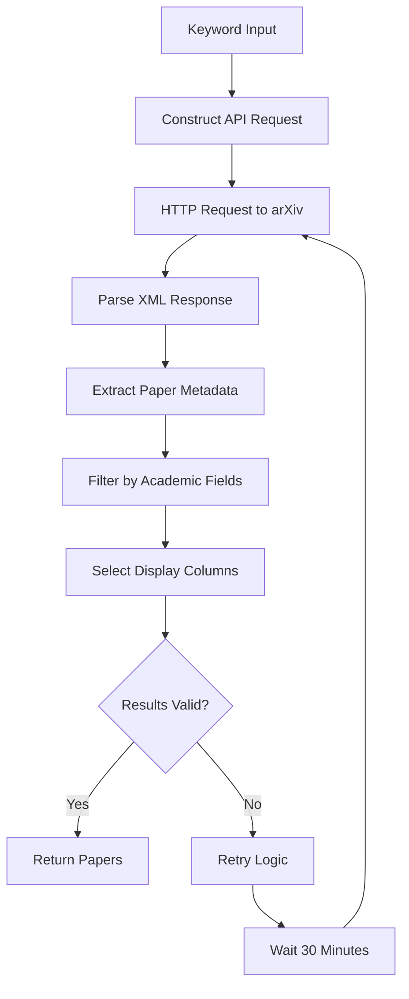

The DailyArXiv project leverages the official arXiv API to systematically fetch and process academic papers based on specified keywords. This integration forms the core data acquisition layer, enabling automated daily paper collection with robust error handling and filtering capabilities.

## API Request Architecture

The arXiv API integration is built around the `request_paper_with_arXiv_api` function, which constructs HTTP requests to arXiv's REST endpoint and parses the XML response into structured data. The function implements a comprehensive paper extraction pipeline that handles multiple metadata fields.

```python
def request_paper_with_arXiv_api(keyword: str, max_results: int, link: str = "OR") -> List[Dict[str, str]]:
```

The API request follows this standardized URL pattern:
```
http://export.arxiv.org/api/query?search_query=ti:{keyword}+{operator}+abs:{keyword}&max_results={max_results}&sortBy=lastUpdatedDate
```

> [!TIP]
> The search query combines title (`ti:`) and abstract (`abs:`) searches using configurable logical operators (OR/AND), ensuring comprehensive coverage of relevant papers.

## Data Extraction Pipeline

The parsing process extracts seven core metadata fields from each arXiv entry:

| Field | Source | Processing |
|-------|--------|------------|
| Title | `entry.title` | Space normalization and newline removal |
| Abstract | `entry.summary` | Space normalization and newline removal |
| Authors | `entry.authors` | List of author names with space normalization |
| Link | `entry.link` | Direct arXiv paper URL |
| Tags | `entry.tags` | Academic subject classifications |
| Comment | `entry.arxiv_comment` | Optional author comments |
| Date | `entry.updated` | Last updated timestamp |

The extraction uses the `feedparser` library to parse XML responses and `EasyDict` for flexible attribute access [utils.py#L23-L46].

## Intelligent Filtering System

After raw data extraction, papers undergo a two-stage filtering process:

### Tag-Based Field Filtering
The `filter_tags` function restricts results to specific academic domains:
```python
def filter_tags(papers: List[Dict[str, str]], target_fileds: List[str]=["cs", "stat"]) -> List[Dict[str, str]]:
```

This filters papers by examining the primary field prefix in arXiv tags (e.g., "cs.AI", "stat.ML") [utils.py#L49-L58].

### Column Selection
The final processing step selects only the columns specified for display:
```python
papers = [{column_name: paper[column_name] for column_name in column_names} for paper in papers]
```

## Retry Mechanism and Error Handling

The integration includes robust error handling through the `get_daily_papers_by_keyword_with_retries` function, which implements an exponential backoff strategy:

```python
def get_daily_papers_by_keyword_with_retries(keyword: str, column_names: List[str], max_result: int, link: str = "OR", retries: int = 6) -> List[Dict[str, str]]:
```

> [!TIP]
> When arXiv API returns unexpected empty lists, the system automatically retries up to 6 times with 30-minute intervals between attempts [utils.py#L60-L68].

## Integration Flow



## Configuration Parameters

The API integration supports several configurable parameters:

| Parameter | Type | Default | Description |
|-----------|------|---------|-------------|
| `keyword` | str | - | Search term for paper matching |
| `max_results` | int | 100 | Maximum papers per request |
| `link` | str | "OR" | Logical operator between title/abstract search |
| `retries` | int | 6 | Number of retry attempts on failure |
| `target_fields` | List[str] | ["cs", "stat"] | Academic fields to include |

The system is designed to handle concurrent keyword searches, as evidenced by the main workflow that processes multiple keywords in sequence [main.py#L25].

## Next Steps

For understanding how the fetched papers are processed and formatted, continue to [Paper Fetching and Filtering](7-paper-fetching-and-filtering). To learn about the automated execution workflow, see [Automated Workflow Management](9-automated-workflow-management).