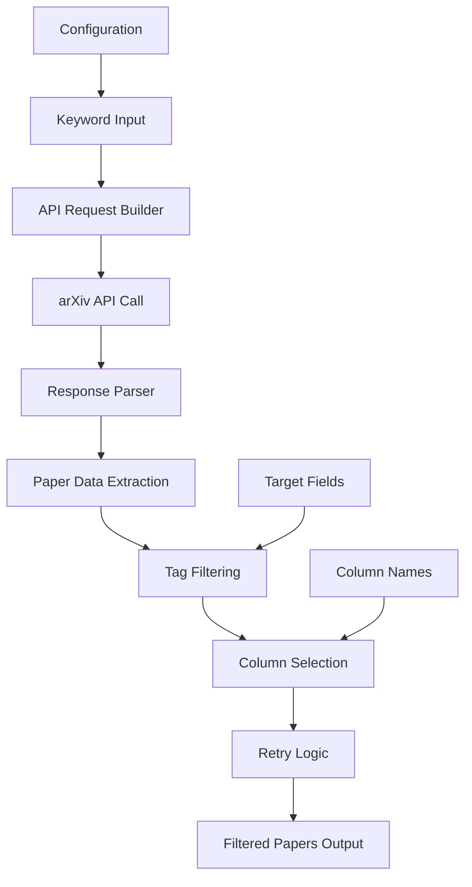

The DailyArXiv project implements a sophisticated paper fetching and filtering system that automatically retrieves relevant academic papers from arXiv based on predefined keywords. This system combines API integration, intelligent filtering, and retry mechanisms to ensure reliable daily updates of research papers.

## Architecture Overview

The paper fetching process follows a structured pipeline that transforms raw arXiv API responses into organized, filtered paper collections. The system is designed to handle API limitations and ensure data consistency through multiple layers of processing.



## Core Fetching Mechanism

### API Integration

The system connects to arXiv's public API through the `request_paper_with_arXiv_api` function in [utils.py](utils.py#L16-L47). This function constructs sophisticated search queries that search both titles and abstracts:

```python
url = "http://export.arxiv.org/api/query?search_query=ti:{0}+{2}+abs:{0}&max_results={1}&sortBy=lastUpdatedDate"
```

The API query supports two logical operators:
- **OR**: Used for multi-word keywords, finding papers containing any part of the keyword phrase
- **AND**: Used for single-word keywords, requiring presence in both title and abstract

### Data Extraction and Processing

Each API response undergoes comprehensive data extraction, capturing seven key fields:
- **Title**: Paper title with whitespace normalization
- **Authors**: List of author names with proper formatting
- **Abstract**: Research abstract with cleaned whitespace
- **Link**: Direct URL to the arXiv paper
- **Tags**: Subject classification tags (e.g., "cs.AI", "stat.ML")
- **Comment**: Additional author comments if available
- **Date**: Last updated timestamp

> [!TIP]
> The system uses `remove_duplicated_spaces()` function to ensure consistent text formatting across all paper data, preventing display issues in generated tables.

## Intelligent Filtering System

### Tag-Based Field Filtering

The `filter_tags` function [utils.py](utils.py#L49-L58) implements a sophisticated filtering mechanism that categorizes papers by academic disciplines. By default, the system targets computer science (`cs`) and statistics (`stat`) fields:

```python
if tag.split(".")[0] in target_fileds:
    results.append(paper)
    break
```

This approach ensures that only papers from relevant academic domains are included in the final output, automatically filtering out papers from unrelated fields like physics (`physics`), mathematics (`math`), or quantitative biology (`q-bio`).

### Column Selection and Display

The system provides flexible column selection through the `column_names` configuration in [main.py](main.py#L33). The default configuration includes:
- Title (for quick identification)
- Link (for direct access)
- Abstract (for content preview)
- Date (for temporal context)
- Comment (for additional insights)

> [!TIP]
> Different output formats use different column sets - README files include abstracts for comprehensive reading, while GitHub Issues exclude abstracts to maintain readability.

## Retry and Error Handling

### Robust Retry Mechanism

The system implements a sophisticated retry strategy through `get_daily_papers_by_keyword_with_retries` [utils.py](utils.py#L60-L68). This addresses the noted instability of the arXiv API [main.py](main.py#L12):

- **Maximum 6 retry attempts** per keyword
- **30-minute delay** between retries to avoid rate limiting
- **Graceful failure handling** with file restoration capabilities

### Configuration Parameters

The fetching behavior is controlled by several key parameters in [main.py](main.py#L25-L33):

| Parameter | Default Value | Purpose |
|-----------|---------------|---------|
| `keywords` | `["Time Series", "Trajectory", "Graph Neural Networks"]` | Search terms for paper discovery |
| `max_result` | `100` | Maximum papers per keyword from API |
| `issues_result` | `15` | Papers displayed in GitHub Issues |
| `column_names` | `["Title", "Link", "Abstract", "Date", "Comment"]` | Display columns for output |

## Integration with Workflow System

The paper fetching system is designed to work seamlessly with the automated workflow management. The main execution loop in [main.py](main.py#L50-L68) processes each keyword sequentially:

1. **Keyword-specific query optimization** (single words use AND, multi-word use OR)
2. **Retry-enabled paper fetching** with failure protection
3. **Dual output generation** (README and Issues templates)
4. **Rate limiting** with 5-second delays between API calls

The system maintains data integrity through backup and restore mechanisms, ensuring that failed attempts don't corrupt existing content.

## Next Steps

For a complete understanding of the paper processing pipeline, continue to [Content Generation and Formatting](8-content-generation-and-formatting) which details how the fetched papers are transformed into readable markdown tables and formatted for different output channels. To understand how this fetching system operates within the broader automation framework, review [Automated Workflow Management](9-automated-workflow-management).