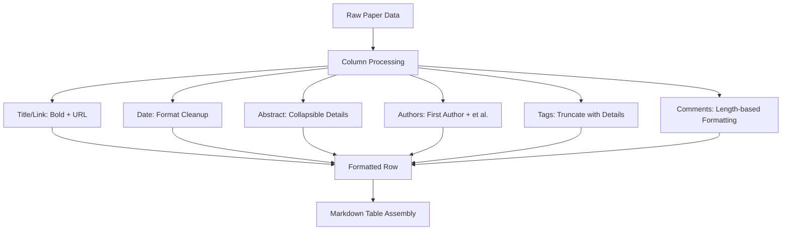

The DailyArXiv project implements a sophisticated content generation and formatting system that transforms raw arXiv paper data into structured, readable Markdown documents. This system handles the conversion of API responses into formatted tables, manages different output formats for various use cases, and ensures consistent presentation across generated content.

## Table Generation Engine

The core of the content formatting system is the `generate_table()` function in [utils.py](utils.py#L80-L126), which transforms paper data into structured Markdown tables. This function implements intelligent formatting rules to optimize readability while preserving essential information.

### Column Processing Logic

The table generation follows a hierarchical processing approach:

1. **Title and Link Integration**: Combines paper titles with their arXiv URLs into clickable Markdown links with bold formatting for emphasis
2. **Date Normalization**: Converts ISO date format (e.g., "2021-08-01T00:00:00Z") to clean date format ("2021-08-01")
3. **Content-Specific Formatting**: Applies different formatting rules based on column type

### Smart Content Handling

The system implements several intelligent content handling strategies:

- **Abstract Management**: Abstracts are wrapped in collapsible `
` elements to maintain page cleanliness while allowing full access to content [utils.py#L96-L97]
- **Author Display**: Only the first author is displayed with "et al." suffix for multi-author papers [utils.py#L99-L100]
- **Tag Processing**: Long tag lists are truncated with expandable details for better table formatting [utils.py#L101-L106]
- **Comment Formatting**: Comments longer than 20 characters are similarly handled with collapsible sections [utils.py#L107-L113]

> [!TIP]
> The formatting system uses conditional length checks (20 characters for comments, 10 characters for tags) to determine when to apply collapsible formatting, ensuring optimal table readability across different content types.

## Dual Output Generation

The system generates two distinct output formats tailored for different purposes:

### README.md Generation

The main documentation file receives complete paper data including abstracts, providing comprehensive information for readers browsing the repository [main.py#L50-L67]. This format prioritizes information completeness.

### Issue Template Generation

The GitHub Issue template receives a subset of papers (limited by `issues_result`) with abstracts excluded [main.py#L63]. This creates a cleaner, more focused format suitable for GitHub Issue notifications while directing users to the main repository for detailed viewing.

## File Management System

Content generation incorporates robust file management to prevent data loss during updates:

1. **Backup Creation**: Existing files are backed up before modification [utils.py#L128-L132]
2. **Atomic Writing**: New content is written to fresh file instances [main.py#L38-L43]
3. **Cleanup**: Backup files are removed after successful generation [utils.py#L138-L142]
4. **Recovery**: Failed operations trigger file restoration from backups [main.py#L60]

## Dynamic Content Assembly

The content generation process iterates through configured keywords, creating structured sections for each research area [main.py#L50-L68]. For each keyword, the system:

- Determines search strategy (AND/OR logic) based on keyword complexity
- Fetches papers using the retry-enabled API function
- Generates appropriately formatted tables for both output formats
- Implements rate limiting between API calls to prevent blocking

> [!TIP]
> The system uses a 5-second sleep interval between keyword processing cycles [main.py#L68] to respect arXiv API rate limits and ensure reliable operation across multiple keyword queries.

## Integration Points

The content generation system seamlessly integrates with the broader DailyArXiv architecture:

- **Data Input**: Consumes filtered paper data from the [Paper Fetching and Filtering](7-paper-fetching-and-filtering) system
- **Configuration**: Utilizes column definitions and formatting parameters from the main configuration
- **Output**: Produces files that trigger [Automated Workflow Management](9-automated-workflow-management) processes

The modular design ensures that content generation can be customized independently from data fetching and workflow management, allowing for flexible formatting adaptations without disrupting core functionality.

For understanding how papers are initially retrieved and processed, refer to [Paper Fetching and Filtering](7-paper-fetching-and-filtering). To see how the generated content integrates with automated workflows, explore [Automated Workflow Management](9-automated-workflow-management).