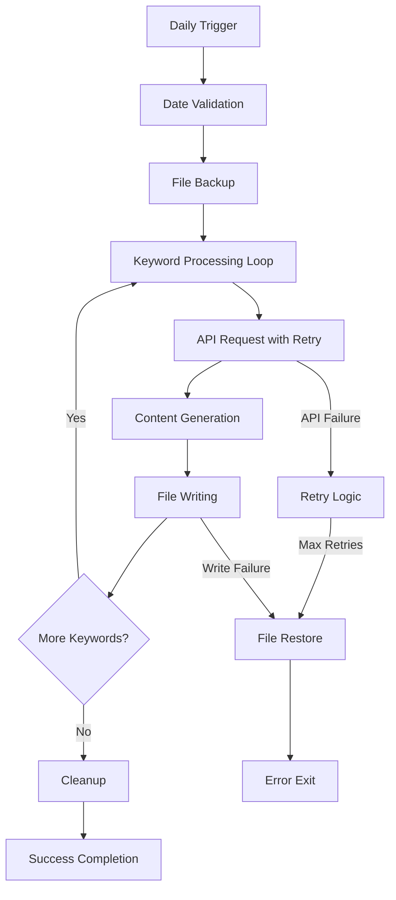

The DailyArXiv project implements a sophisticated automated workflow management system that orchestrates daily paper fetching, processing, and content generation. This system operates through a combination of scheduled execution, error recovery mechanisms, and atomic file operations to ensure reliable daily updates without manual intervention.

## Workflow Architecture Overview

The automated workflow follows a sequential execution pattern with built-in resilience and recovery capabilities:



## Core Automation Components

### Date Management and Validation

The workflow begins with date validation to prevent duplicate daily runs. The system compares the current Beijing timezone date against the last update timestamp stored in README.md [main.py#L9-L18](main.py#L9-L18):

```python
# Get current beijing time date in the format of "2021-08-01"
current_date = datetime.now(beijing_timezone).strftime("%Y-%m-%d")
# Get last update date from README.md
with open("README.md", "r") as f:
    while True:
        line = f.readline()
        if "Last update:" in line: break
    last_update_date = line.split(": ")[1].strip()
```

### Atomic File Operations

The system implements a critical backup-and-restore mechanism to ensure data integrity during updates [utils.py#L119-L132](utils.py#L119-L132):

- **Backup Phase**: Before any modifications, `back_up_files()` creates temporary copies of README.md and ISSUE_TEMPLATE.md
- **Restore Phase**: If any step fails, `restore_files()` recovers the original files
- **Cleanup Phase**: After successful completion, `remove_backups()` removes the temporary copies

This atomic operation pattern prevents partial updates that could leave the repository in an inconsistent state.

### Keyword-Based Processing Pipeline

The workflow processes research papers through a configurable keyword system [main.py#L21-L23](main.py#L21-L23):

```python
keywords = ["Time Series", "Trajectory", "Graph Neural Networks"]
max_result = 100  # maximum query results from arXiv API for each keyword
issues_result = 15  # maximum papers to be included in the issue
```

For each keyword, the system:

1. Determines the appropriate search logic (AND/OR) based on keyword complexity [main.py#L34-L35](main.py#L34-L35)
2. Executes API requests with retry logic through `get_daily_papers_by_keyword_with_retries()` [utils.py#L67-L75](utils.py#L67-L75)
3. Generates formatted content for both README.md and GitHub Issues
4. Implements rate limiting with 5-second delays between API calls [main.py#L48](main.py#L48)

## Error Handling and Recovery Strategies

### Multi-Level Retry Mechanism

The system implements a sophisticated retry strategy at multiple levels:

**API Level Retries**: The `get_daily_papers_by_keyword_with_retries()` function provides up to 6 retry attempts with 30-minute delays between failures [utils.py#L67-L75](utils.py#L67-L75):

```python
for _ in range(retries):
    papers = get_daily_papers_by_keyword(keyword, column_names, max_result, link)
    if len(papers) > 0: return papers
    else:
        print("Unexpected empty list, retrying...")
        time.sleep(60 * 30)  # wait for 30 minutes
```

**Workflow Level Recovery**: If any keyword processing fails, the entire workflow triggers file restoration and exits gracefully [main.py#L40-L45](main.py#L40-L45):

```python
if papers is None:  # failed to get papers
    print("Failed to get papers!")
    f_rm.close()
    f_is.close()
    restore_files()
    sys.exit("Failed to get papers!")
```

> [!TIP]
> The dual-level retry mechanism handles both transient API failures and persistent data issues, ensuring the system can recover from temporary network problems while avoiding infinite loops on permanent failures.

## Content Generation Automation

### Dual-Output Generation

The workflow simultaneously generates two different output formats:

1. **README.md Updates**: Full paper listings with abstracts for comprehensive documentation [main.py#L26-L33](main.py#L26-33)
2. **GitHub Issues**: Curated summaries with limited papers for daily notifications [main.py#L35-L38](main.py#L35-38)

The system uses the `generate_table()` function to create formatted markdown tables with collapsible abstracts and processed metadata [utils.py#L77-L118](utils.py#L77-L118).

### Dynamic Content Formatting

The automated formatting includes:

- **Title Processing**: Converts paper titles into markdown links with bold formatting
- **Author Truncation**: Displays first author with "et al." for multi-author papers
- **Abstract Collapsing**: Uses HTML details/summary tags for expandable abstracts
- **Date Standardization**: Converts ISO timestamps to readable date formats
- **Tag Management**: Handles long tag lists with collapsible formatting

## Configuration and Customization

The workflow supports easy customization through key parameters:

| Parameter | Purpose | Default Value | Location |
|-----------|---------|---------------|----------|
| `keywords` | Research topics to fetch | ["Time Series", "Trajectory", "Graph Neural Networks"] | [main.py#L21](main.py#L21) |
| `max_result` | Papers per keyword from API | 100 | [main.py#L22](main.py#L22) |
| `issues_result` | Papers for GitHub Issues | 15 | [main.py#L23](main.py#L23) |
| `column_names` | Display columns for output | ["Title", "Link", "Abstract", "Date", "Comment"] | [main.py#L25](main.py#L25) |

> [!TIP]
> The system's modular design allows easy extension - adding new keywords requires only updating the keywords list, while modifying output formats involves changing the column_names configuration.

## Integration with External Systems

### ArXiv API Integration

The workflow interfaces with the arXiv API through the `request_paper_with_arXiv_api()` function [utils.py#L11-L35](utils.py#L11-L35), which:

- Constructs search queries with proper URL encoding
- Handles both single-word and multi-word keywords with appropriate AND/OR logic
- Parses XML responses using feedparser
- Extracts and normalizes paper metadata

### GitHub Actions Compatibility

While the current implementation appears to be a standalone Python script, the architecture is designed for easy integration with GitHub Actions or other CI/CD systems. The atomic file operations and comprehensive error handling make it suitable for scheduled execution environments.

## Monitoring and Observability

The workflow provides basic monitoring through:

- Console output for retry attempts and failures
- Date-based execution tracking in README.md
- File system state management through backup/restore operations

For production deployment, additional logging and alerting mechanisms could be integrated to provide real-time workflow status monitoring.

---

The DailyArXiv automated workflow management system demonstrates robust software engineering practices with its comprehensive error handling, atomic operations, and modular design. This architecture ensures reliable daily updates while maintaining flexibility for customization and extension.

For deeper understanding of the paper fetching mechanisms, see [ArXiv API Integration](6-arxiv-api-integration), and for details on content formatting, refer to [Content Generation and Formatting](8-content-generation-and-formatting).